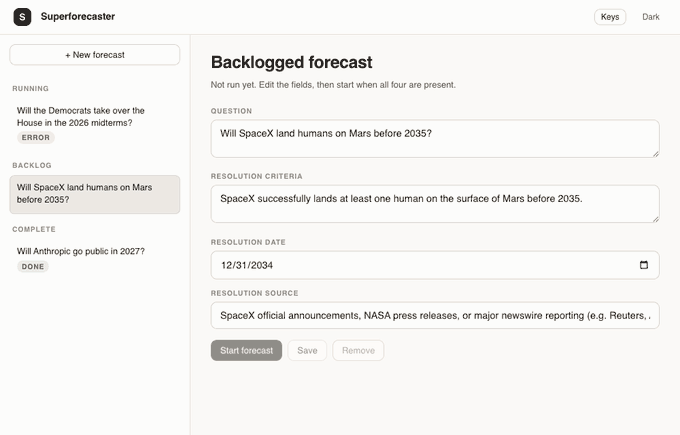
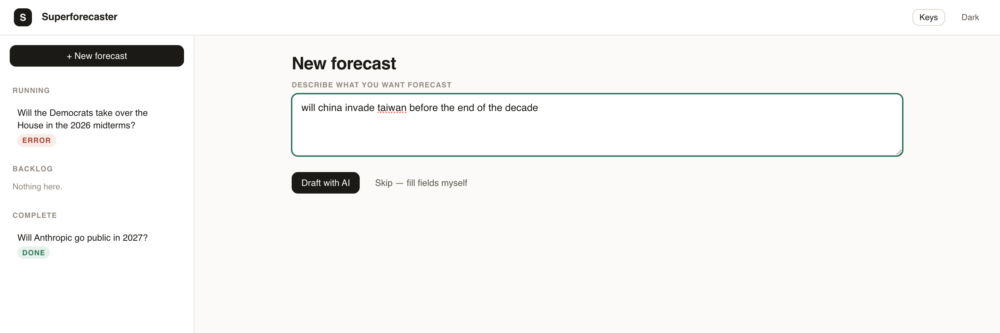
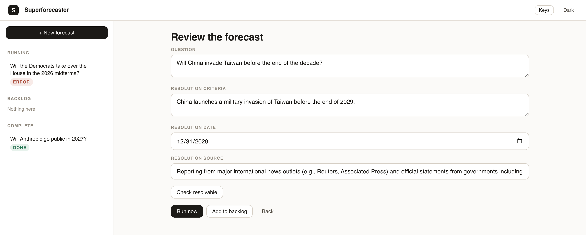
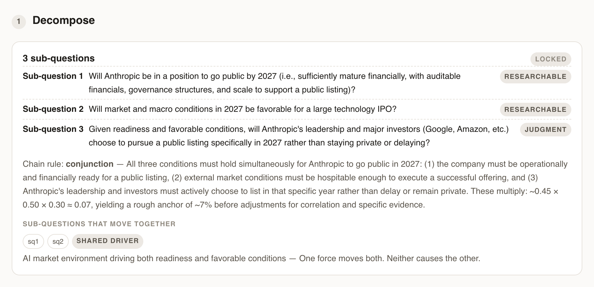
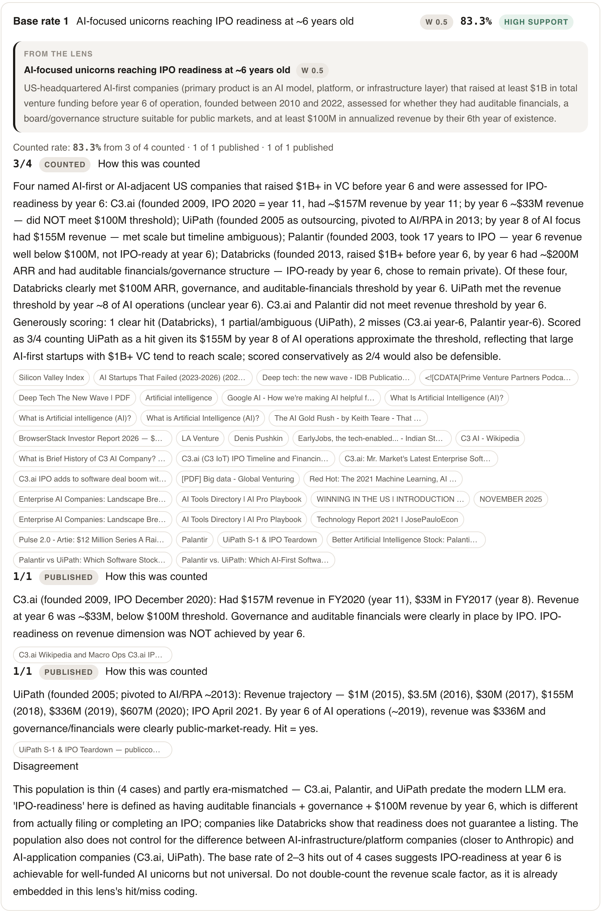
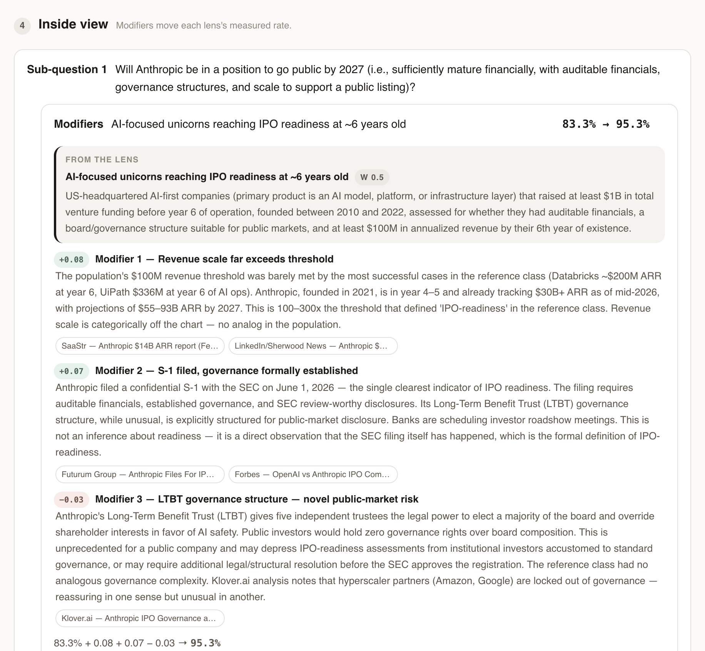
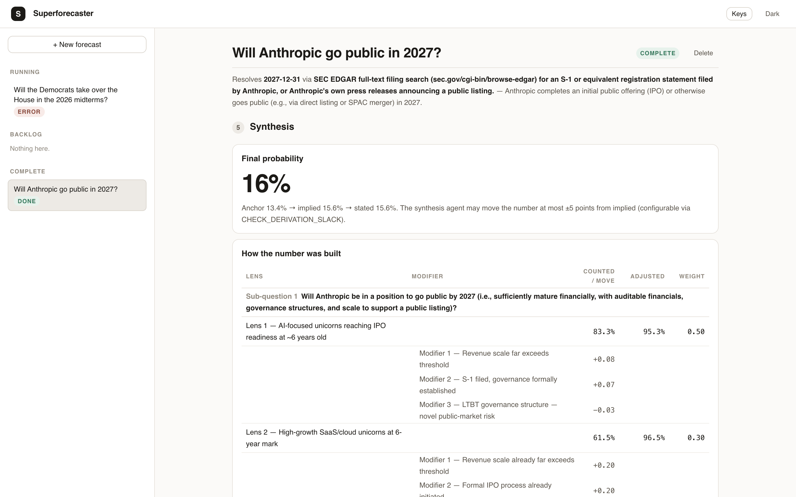
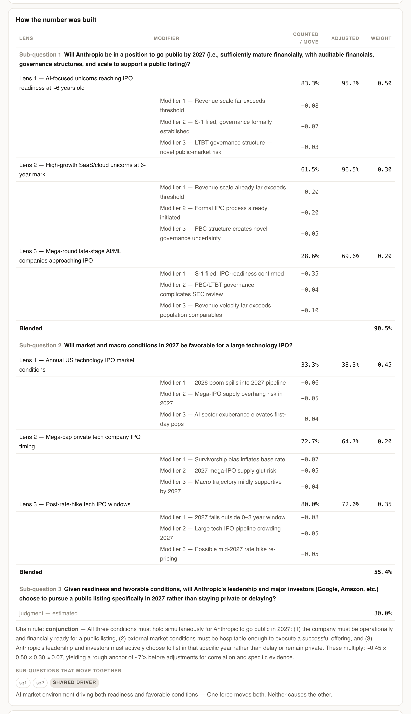

# Superforecaster

Make testable forecasts about the future.

Built on PydanticAI and based on Philip Tetlock's Superforecasting methodology.



Explainable forecasts to teach you how to distinguish signal from noise and predict the unknowable.

You write a question in plain prose. The AI drafts it into a resolvable question, then a
gated pipeline breaks it into sub-questions, counts a base rate for each reference
population, adjusts each from its own evidence, and commits to a probability — one stage
per click, showing the whole walk from anchor to answer, with every step persisted.

---

## Run it

```bash
make docker dev
```

You need [uv](https://docs.astral.sh/uv/), Node, and three keys:

| | | |
|---|---|---|
| **LLM** | [console.anthropic.com](https://console.anthropic.com/) | the model |
| **Tavily** | [tavily.com](https://tavily.com) | web search — free tier is enough |
| **Wikipedia** | [wikipedia.com](https://pypi.org/project/Wikipedia-API/) | general knowledge |

```bash
make install
make dev
```

Open **http://localhost:5173**, click **Keys** in the header, and paste them in. That is
the whole setup — no file to write, no admin token to invent, no database to create.

Keys set in that panel live in the server process and are dropped when it restarts. To
have them survive, set `ANTHROPIC_API_KEY` and `TAVILY_API_KEY` in the environment you
start from — see [Configuration](#configuration) for every variable that matters.

The startup banner tells you exactly what you got:

```
Superforecaster
  model         anthropic:claude-sonnet-4-6
  web search    Tavily
  admin auth    local mode — unauthenticated requests from localhost only
  database      ./superforecaster.db
```

and `make config` shows every setting, where its value came from, and which one is
shadowing which — with the secrets redacted.

<details>
<summary>Running without a Tavily key</summary>

It still works — the agents fall back to Wikipedia alone. The run completes and the checks
still hold, but the reference classes come out noticeably thinner, which is the difference
between a base rate and a guess with a citation. The header shows a **no web search** chip
and the startup banner says the same, so you never get that silently.
</details>

<details>
<summary>Using the Logfire Gateway instead of Anthropic directly</summary>

Set `PYDANTIC_AI_GATEWAY_API_KEY` in the environment, from
[logfire.pydantic.dev](https://logfire.pydantic.dev) → your org → **Gateway**. It takes
precedence over `ANTHROPIC_API_KEY`. Legacy `paig_...` keys no longer work, and this is
for LLM calls only — it does not send traces.

The Keys panel follows whichever variable credentials the model, so it names the gateway
key once one is set and `ANTHROPIC_API_KEY` otherwise. It cannot switch you *onto* the
gateway — that first key has to come from the environment. `make config` says which one
is in play.
</details>

---

## What a run looks like

A run is a **persisted machine of gated stages** — nothing executes unless you click next,
and every stage output lands in SQLite the moment it exists.

```
 1  Decompose      one agent, live tail          → 3–5 sub-questions   [review, next]
 2  Find lenses    one agent per sub-question    → 1–3 populations each [all must finish]
 3  Base rates     one agent per (sub-Q, lens)   → a COUNTED rate Σhits/Σn  [per-cell next]
 4  Inside view    one agent per (sub-Q, lens)   → signed modifiers on THAT lens's rate
 5  Synthesis      arithmetic (not agentic), then reflect + synthesize + pure critique
```

### You write a sentence. The app writes the question.



A drafting agent turns that line into a question that can resolve — criteria, a date, and
the source that will settle it. Every field stays editable, and **Check resolvable** tells
you what is still ambiguous before you spend a run on it.



### 1 · Decompose — the question becomes a chain



Each sub-question carries its type. A **researchable** one goes to the research agents. A
**judgment** one stays a stated number and says so. The chain rule states how the parts
combine, and the correlation block names the sub-questions that move together, so a
conjunction of three near-certainties cannot quietly multiply itself into a small number.

### 3 · Base rates — counted, not recalled



A lens is a reference population, written down before anything is counted. The agent then
counts hits against it and shows the count: **3 of 4**, the four companies by name, why
each one was scored as it was, the sources, and — under **Disagreement** — the reasons the
number may be wrong. A rate no one can audit is a guess with a citation.

Every measured cell restates its lens in the **from the lens** block at the top. What came
from the population stays separate from what the cell found.

### 4 · Inside view — one signed modifier at a time



Modifiers move the rate of **their own lens**, never the final answer. Each one is signed,
sourced, and sized, and the card shows the addition that produced the adjusted rate.

### 5 · Synthesis — the arithmetic is not agentic

The blend, the chain rule, and the correlation adjustment are code, not an agent. The
anchor is the **chain** the decomposition describes — the product of the per-column rates
for a conjunction, not an average of lenses pointed at different questions. The agent
writes the rationale, and it may move the number by at most ±5 points from the implied
one (`CHECK_DERIVATION_SLACK`).



A finished run leads with its answer. Every number on this screen is traceable to the
count that produced it — the probability is not the model's opinion of the question, it is
the arithmetic of the rows below it.

<details>
<summary><b>The whole table — every lens, every modifier, in one place</b></summary>



</details>

### Gates, streaming, and recovery

Each cell streams its searches inside its own card while it works. Every stage collapses,
and a finished run leads with its answer.

The connection is the agent's lifetime: close the laptop and the in-flight step stops,
lands as `cancelled`, and is one click to re-run. A step that fails is retryable from the
database — there is no separate checkpoint system. `make forecast` runs the same stages
back-to-back with no gates.

---

## Commands

`make` on its own lists all of them.

| | |
|---|---|
| `make install` | backend and frontend dependencies |
| `make dev` | backend :8099 + frontend :5173, both hot-reloading, one Ctrl+C stops both |
| `make backend` / `make frontend` | either one alone |
| `make serve` | builds the frontend, then serves the whole app as one process on :8000 |
| `make build` | the frontend into `frontend/dist` |
| `make test` | the backend suite — no network, no API keys |
| `make eval decompose` | score one agent against its eval cases — real model, real money |
| `make clean` | build output, `node_modules`, and the venv |

`make eval` runs one agent on a fixed set of questions and reports both mechanical
assertions and a score from a judging model. Only `decompose` has cases so far. Pass
flags through `ARGS`:

```bash
make eval decompose ARGS="--model gateway/anthropic:claude-haiku-4-5 --budget 0.05,40000,0,3"
```

`--model` swaps the model under test, `--budget` overrides what one run may spend
(`COST,TOKENS,TOOL_CALLS,ITERATIONS`), and `--judge-model` swaps the grader. The grader
does **not** follow `--model`: a model asked to grade its own work passes itself.

The CLI runs the same stages without the browser:

| | |
|---|---|
| `make forecast` | one forecast, interactive prompts, saved to SQLite |
| `make smoke` | a bundled question, shallow research, nothing saved — the cheap end-to-end check |
| `make config` | every setting and **where its value came from** — secrets redacted |
| `make diagram` | the pipeline shape, as mermaid |
| `make refresh ID=<uuid>` | re-check a saved forecast against new evidence |
| `make resolve ID=<uuid>` | has it resolved yet? |
| `make cli ARGS="--help"` | everything else |

The CLI is the `superforecaster` console script (`app.cli:main`). `python -m
superforecaster` no longer works — the package is a library and the CLI lives in `app`.

**Docker**, if you would rather not install `uv` and Node at all. Set your keys **and**
an `ADMIN_API_KEY` in the environment first — a container is not localhost, so the Keys
panel cannot authenticate you into one that has no admin key:

| | |
|---|---|
| `make docker` | the whole app in one container on :8000 |
| `make docker-dev` | containerized hot-reload: frontend :5173, api :8000 |
| `make docker-down` | stop the stack |

`make docker` needs no separate build step. The image builds the frontend in a Node stage
and copies `dist/` in, then serves it from FastAPI, SQLite in the `sqlite_data` volume.
Still ADR 47's "one process serving everything" — the frontend build just moved from your
machine into the image, so a fresh clone with nothing installed but Docker works.
`make docker-dev` adds a Vite container proxying to the API over the compose network; it
is opt-in, so the production path stays the single-process deploy.

---

## Configuration

Beyond the two keys, nothing here is required. Every setting is an environment variable,
and `make config` prints all of them with their origins.

| Variable | Why you would set it |
|---|---|
| `ANTHROPIC_API_KEY` | The model. Or `PYDANTIC_AI_GATEWAY_API_KEY` to route through Logfire |
| `TAVILY_API_KEY` | Web search for every research agent |
| `WIKIPEDIA_API_KEY` | Optional. Raises the Wikimedia rate limit; nothing needs it |
| `ADMIN_API_KEY` | **Required to serve this anywhere but your own machine** — see below |
| `AGENT_MODEL` | Override the model for every agent, e.g. `anthropic:claude-sonnet-4-6` |
| `LOGFIRE_TOKEN` | A `pylf_v1_...` *write* token for cloud traces. Different from the gateway key |
| `BUDGET_<AGENT>` | Override one agent's four ceilings — see **Agent budgets** below |
| `DATABASE_PATH` | Default `./superforecaster.db`; Docker uses `/app/data/` |

Every check threshold is an environment variable too — see
[`spec/CURRENT_STATE.md`](spec/CURRENT_STATE.md).

The LLM, Tavily, and Wikipedia keys can also be set from the **Keys** panel in the header.
Those apply on the next request and are dropped when the process restarts; no route ever
returns a key's value, only where it came from.

### Admin auth

Starting a forecast is an admin action. With `ADMIN_API_KEY` unset, the API accepts
unauthenticated admin requests **from 127.0.0.1 only**, and refuses them everywhere else
with a message saying why. That is what makes the two-key setup work: on a laptop, where
the only thing that can reach the port is the person who started the process, a token
protects nothing and costs the entire first-run experience.

A request carrying any proxy header (`X-Forwarded-For` and friends) is never treated as
local — a reverse proxy in front of this is the shape of a real deployment, and anything
upstream can rewrite the origin. **Set `ADMIN_API_KEY` before exposing the port.** Once
set, paste the same value into the **Keys** panel.

### Agent budgets

Every agent has four ceilings, because an agent runs away in four different ways. A
tool-call cap does not stop a model that re-reads a growing transcript, and a token cap
does not stop a model that searches forty times for cheap results.

| Ceiling | Unit | Enforced by |
|---|---|---|
| cost | US dollars, from published per-token prices | `agents.attach_budget` |
| tokens | input + output, cumulative over the run | Pydantic AI |
| tool calls | searches | Pydantic AI |
| iterations | model requests | Pydantic AI |

The defaults are one row per agent in `backend/superforecaster/config.py` (`BUDGETS`). Override one with
`BUDGET_<AGENT>="cost,tokens,tool_calls,iterations"` — for example
`BUDGET_CRITIC="0.10,60000,3,6"`.

Before every model request the agent is told what it has left:

```
BUDGET LEFT — 4 of 6 turns, 71,320 of 100,000 tokens, $0.62 of $1.00.
2 of 3 searches left. Prefer a few well-chosen searches over exhaustive looping.
```

The numbers are re-read on each request rather than written once, so they are current at
the moment the agent decides whether to spend more. A research cell that blows a ceiling
degrades to no result and the run continues — one greedy column no longer costs the others
their work. `max_iterations`, the search-depth knob on a run, scales all four numbers
together.

---

## Where things are

`backend/` holds three packages, and imports run one way: `api → app → superforecaster`.

| | |
|---|---|
| `backend/superforecaster/` | the methodology — models, checks, scoring, the eleven agents, the stages, the update cycle. Installable and importable on its own; no database, no CLI, no web framework |
| `backend/app/` | what runs it — SQLite, the gated-run state machine, the scheduler, the CLI, the evals, `.env` loading, Logfire configuration |
| `backend/api/` | the FastAPI routes |

Using the library on its own:

```python
from superforecaster import ForecastInput, run_all

forecast, violations = await run_all(ForecastInput(...))
```

- **What exists and what it does** → [`spec/CURRENT_STATE.md`](spec/CURRENT_STATE.md)
- **Why it is shaped this way** → [`spec/ADR.md`](spec/ADR.md)
- **What the agents are supposed to do** → [`spec/superforecasting_methodology.md`](spec/superforecasting_methodology.md)

---

## Observability

With a `LOGFIRE_TOKEN` set, runs send structured traces to
[logfire.pydantic.dev](https://logfire.pydantic.dev) — filter by service `superforecaster`
and expand the per-column research spans. Without one, `make cli ARGS="forecast --verbose"`
prints the same tool calls and results to the terminal.

---

## References

- Tetlock, P. E., & Gardner, D. (2015). *Superforecasting: The Art and Science of Prediction*
- [Pydantic AI](https://ai.pydantic.dev/)

## License

MIT
