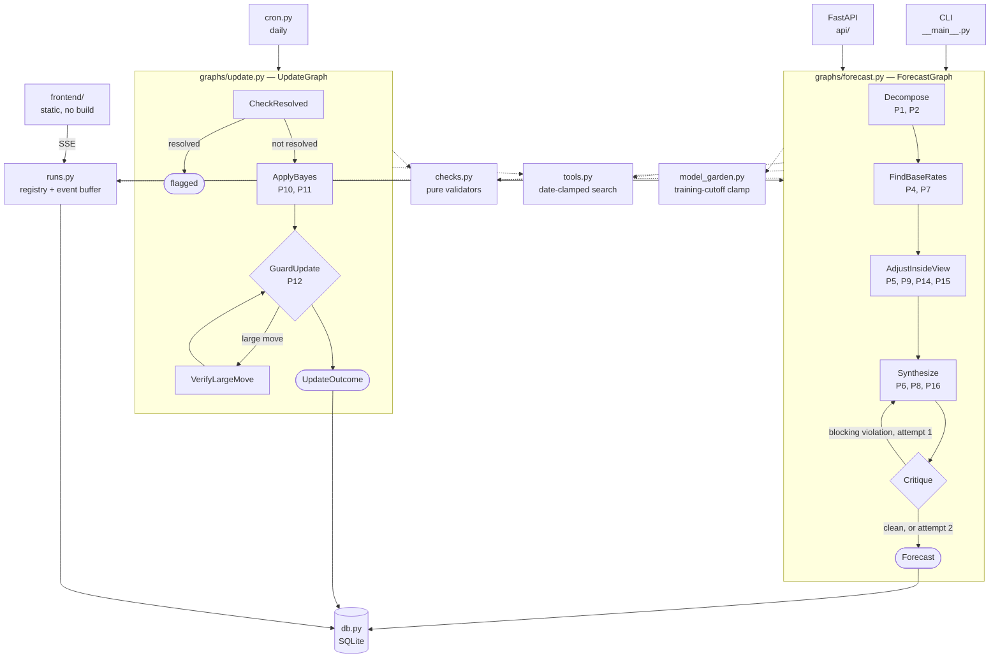

# Current State

Every module, function, and model that exists today. Generated against the code, not memory.

Read this to answer "what is there and what does it do." Read `spec/ADR.md` for *why* it is
shaped this way. Read `spec/superforecasting_methodology.md` for the 16 principles the code
implements — `P<n>` throughout this document refers to them.

---

## What changed most recently (2026-08-05)

**Research fans out per sub-question.** Decompose fixes a grid — rows are stages, columns are
sub-questions. `FindBaseRates` and `AdjustInsideView` each run one agent per column concurrently
and merge at a barrier, inside `run_outside_view` / `run_inside_view`. No graph node was added.
New per-cell output types `SubClaimBaseRates` and `SubClaimAdjustments`; the merge stamps
`sub_claim_ids` unconditionally, so a reference class belonging to no column is now impossible
and `group_by_sub_claim`'s trailing "unattributed" group is deleted. See ADR 30.

**P14 and P15 moved to a new `agents/reflect.py`**, a no-tools pass after the inside-view
barrier. Five columns cannot produce exactly five bias checks, and three of the five are only
askable of a final probability a column does not have. See ADR 31.

**The anchor is the chain, not a mean.** `Decomposition.chain_rule` is typed
(`conjunction` | `disjunction` | `custom`), and `aggregate_base_rate` is that rule applied to the
per-column rates via `checks.anchor_from` — the product for a conjunction. The old weighted mean
across all classes inflated every conjunctive question by construction. P7's spread is now
measured *within* a column (`sub_claim_spreads`), because across columns it measures nothing.
See ADR 33.

**The search budget is a gradient, per cell.** `SearchBudget` on `ForecastDeps` carries
`soft_depth` (the cline, where the agent is pushed to converge) and `hard_depth` (the wall).
Two channels apply the pressure: a notice appended to every tool return, and a dynamic
`@agent.instructions` function re-fetched per model request. A cell that crosses the wall
degrades to no result and the run continues. See ADR 32.

**Every event carries a `sub_claim` tag**, and two new types — `column` (opens a card at the top
of a row, before any agent) and `exhausted`. The frontend renders each research row as a grid of
cards, one per sub-question, each with its own live tool tail. `spec/planned/spec3.3.md` §3.3 is
the new schema of record; `spec3.1.md` §3.3 is superseded.

**Schema migrations exist now.** `db.init_db()` runs `_migrate` against `PRAGMA user_version`,
stepping an existing database through `db.MIGRATIONS`. The first step drops
`forecast_updates.confidence`, which ADR 29 removed from the code on 2026-08-04 but not from any
deployed file — a gap that killed every run at its final write while looking like a Critique-stage
failure. See Known Issues.

**Fixed in passing:** `observability` diffed `deps.sources_seen` by index to detect new sources,
which under concurrency hands each cell the other's — each cell now gets a private list, merged
after the barrier. And `evals/components.py` called `run_inside_view` with three arguments to a
four-argument function, a `TypeError` that had never fired only because the eval corpus ships
empty.

---

## What changed on 2026-08-04

**Forecast-level `confidence` is gone.** It was self-reported, undefined in the methodology
doc, and read by exactly one consumer: the P16 gate. That gate could be cleared by *lowering*
the label and retreating the probability to the band edge, which is what prompted the change.
See ADR 29.

Confidence is now `GradedSource.confidence` — a property of the edge between a source and the
claim it supports. It aggregates to a forecast-level figure that is derived, never asserted.
`ResolutionCheckResult.confidence` survives untouched: it grades an observation about the
world, a different axis.

**P16 is advisory.** `check_calibration_hygiene` sets `blocking=False` — the first and only
non-blocking check — and keys off the new `Forecast.extreme_justification`.

**Three blocking checks were added**, all arithmetic or set membership: `check_aggregation`,
`check_citations`, `check_linkage`. Reference classes gained `weight` and `sources`;
adjustments gained `sources`; sub-claims gained `id`, and both classes and adjustments point
back at them through `sub_claim_ids`.

**The `forecast_updates.confidence` column was dropped.** At the time there was no migration
mechanism, so an existing `superforecaster.db` kept the column and every run died on its final
write. Fixed on 2026-08-05 — `init_db` migrates in place and the data survives.

---

## System Map



Two agents sit outside both graphs: `critic.py` (P3, runs while a question is being drafted)
and `postmortem.py` (P13, runs after resolution).

---

## Repository Layout

```
backend/
  config.py                      # env -> typed settings; check thresholds; model resolution
  superforecaster/
    models.py                    # every Pydantic model, one file
    deps.py                      # ForecastDeps — the two contamination clamps
    checks.py                    # pure methodology validators
    tools.py                     # date-clamped search  (clamp 1)
    model_garden.py              # model registry by training cutoff  (clamp 2)
    model_garden.json            # registry data
    db.py                        # SQLite layer + scoring math
    runs.py                      # live-run registry, event buffer, state -> UI events
    checkpoints.py               # graph snapshots; resume a failed run mid-graph
    cron.py                      # APScheduler jobs + orchestrators
    observability.py             # Logfire config + run_agent wrapper
    __main__.py                  # CLI
    agents/                      # one module per methodology step (9)
      __init__.py                #   with_model, format_question, as_of_note
      decompose.py  outside_view.py  inside_view.py  reflect.py  synthesize.py
      resolution.py  update.py  critic.py  postmortem.py  draft.py
    graphs/                      # orchestration only
      state.py  forecast.py  update.py
    evals/
      components.py              #   per-agent harness + 8 scorers
      components/*.json          #   per-agent golden data — all currently []
    fixtures/                    # JSON inputs for manual CLI runs
  api/
    main.py  deps.py  forecasts.py  questions.py  calibration.py  admin.py  runs.py
  tests/                         # 288 tests, no network required
  test_forecasting_baseline/     # 66 legacy questions; raises on import, never run

frontend/                        # static, zero build — served by FastAPI at /
  index.html  app.js  api.js     #   the run/stream app; trails cached in localStorage
  admin.html  admin.css          #   moderation tables over the admin routes
spec/
  CURRENT_STATE.md               # this file
  ADR.md                         # architecture decisions
  superforecasting_methodology.md
  implemented/                   # shipped and merged to main
    SPEC_04_26_2026.md           #   v3 — platform, DB, API, frontend, cron
    spec3.md                     #   v4 — agent decomposition + graphs
    spec3.1.md                   #   streaming + static frontend (§3.3 superseded by 3.3)
    spec3.2.md                   #   confidence purge, P16 advisory, legible trail
  planned/
    spec3.3.md                   #   the grid — per-column research, budgets, lane cards
    spec4.md                     #   end-to-end backtest — needs a corpus
```

---

## Data Models

All in `superforecaster/models.py`. Type aliases first:

```
Confidence     = Literal["low", "medium", "high"]
QuestionStatus = Literal["pending", "approved", "rejected", "forecasted"]
Knowability    = Literal["researchable", "judgment"]
Direction      = Literal["up", "down", "neutral"]
BiasName       = Literal["confirmation", "availability", "narrative",
                         "scope_insensitivity", "anchoring"]
ALL_BIASES: tuple[BiasName, ...]      # the five, for check_bias_coverage
```

### Graph step outputs

Several constraints below carry methodology weight rather than just validating shape — they
are the half of a principle a schema can enforce.

```
GradedSource                      # one source, and how well it backs ONE claim
  source         str
  url            str | None       # only when actually retrieved; check_citations verifies
  confidence     SourceConfidence # the ONLY confidence concept on the forecast path
  note           str              # why that grade — strength, and fit to this claim

SubPrediction                     # P1 + P2 — one Fermi-ized sub-question
  id             str = ""         # "sc1"; stamped by run_decompose, not the model
  question       str              # specific, testable
  probability    float            # ge=0, le=1
  rationale      str
  knowability    Knowability = "judgment"
                                  # researchable = a base rate can be looked up.
                                  # Defaulted so forecasts persisted before P2 existed
                                  # still deserialize from decompositions_json.

Decomposition                     # output of decompose_agent
  sub_claims     list[SubPrediction]   # min_length=3, max_length=5   <- P1
  chain_note     str                   # how they combine (product? max?)

ReferenceClass                    # one outside-view lens
  name           str              # what population this rate is drawn from
  base_rate      float            # ge=0, le=1
  sample_size    int              # ge=1 — how many cases back the rate
  weight         float            # ge=0, le=1 — FIT to this question, not size.
                                  # check_aggregation recomputes the anchor from these.
  sources        list[GradedSource]    # min_length=1
  sub_claim_ids  list[str] = []   # which SubPrediction.ids; empty = the whole question
  analogs        list[HistoricalAnalog]

OutsideView                       # output of outside_view_agent
  reference_classes    list[ReferenceClass]  # min_length=2, max_length=5   <- P7
  aggregate_base_rate  float                 # the anchor the inside view adjusts from
  disagreement         str = ""              # why the classes differ; "" only when they agree

Adjustment                        # one inside-view move away from the base rate
  evidence       str
  direction      Direction
  magnitude      float            # ge=0, le=0.5 — probability POINTS, not a multiplier
  flip_test      str              # P9 — "if the opposite were true my estimate would ___"
  is_noise       bool = False     # set when the flip test shows it isn't decision-relevant
  sources        list[GradedSource] = []   # may be empty — a judgment call, grades as low
  sub_claim_ids  list[str] = []   # which SubPrediction.ids; empty = the whole question

BiasCheck
  bias           BiasName
  assessment     str

InsideView                        # output of inside_view_agent
  adjustments               list[Adjustment]  # min_length=1, max_length=8
  steel_man                 str               # P14 — the opposing case, argued properly
  what_would_change_my_mind str               # P14
  bias_checks               list[BiasCheck]   # exactly 5   <- P15

Forecast                          # output of synthesize_agent; the persisted artifact
  question, resolution_criteria, resolution_date, category
  probability    float            # ge=0, le=1
  decompositions list[SubPrediction]   # min_length=3, max_length=5
  research       ResearchSummary
  reasoning      str              # must trace base rate -> adjustments -> final
  extreme_justification str = ""  # P16 — required outside the calibration band

ForecastInput                     # what the graph receives
  question, resolution_criteria, resolution_date, category
  max_iterations int = 5          # search budget per researching agent

HistoricalAnalog                  # one analogous past event
  description    str
  outcome        float            # 0.0 or 1.0
  relevance      str

ResearchSummary                   # outside + inside findings, persisted on the Forecast
  historical_analogs   list[HistoricalAnalog]
  empirical_base_rate  float | None    # None when < 3 analogs found
  base_rate_note       str
  causal_forces        list[str]
  evidence             dict[str, list[str]]   # {"supporting": [...], "contradicting": [...]}
  uncertainties        list[str]
```

### Methodology checks

```
CheckViolation                    # produced by checks.py, never by an LLM
  principle      int              # 1-16, indexes into the methodology doc
  name           str              # e.g. "derivation"
  detail         str              # what specifically failed
  blocking       bool = True      # True -> Critique routes back to Synthesize
```

### Updating

```
EvidenceItem                      # P11 — see checks.evidence_weight for the math
  fact           str
  source         str
  p_if_true      float            # P(seeing this | hypothesis TRUE)
  p_if_false     float            # P(seeing this | hypothesis FALSE)

UpdateDecision                    # output of update_agent
  evidence       list[EvidenceItem]
  prior          float
  posterior      float
  reasoning      str
  verified_large_move bool = False    # set by the VerifyLargeMove node, not the model

UpdateOutcome                     # final output of UpdateGraph
  flagged_resolved bool = False
  updated          bool = False
  new_probability  float | None
  violations       list[CheckViolation]
  reason           str

ResolutionCheckResult             # output of resolution_agent
  appears_resolved    bool
  suggested_outcome   float | None    # 0.0 or 1.0
  confidence          Confidence
  resolution_evidence str | None
  reasoning           str
```

### Live runs

```
RunStatus = Literal["queued","running","done","error","cancelled","lost"]

RunEvent                          # one frame on the SSE wire
  seq, run_id, type, stage, attempt, ts
  payload        dict[str, Any]   # untyped on purpose — 14 event models would be 14
                                  # classes to keep in step with a JS renderer that
                                  # reads them as JSON. spec3.1 §3.3 is the schema.

RunSummary                        # a run as the home rail shows it
  id, question, status, stage, stage_index, attempt
  tool_calls, last_seq, forecast_id, error, created_at, ended_at

RunSnapshot     summary, events   # the no-SSE fallback
CreateRunRequest  question, resolution_criteria, resolution_date, category,
                  resolution_source, max_iterations=5
```

### Standalone agents

```
CriteriaCritique                  # P3 — output of critic_agent
  is_resolvable               bool
  ambiguities                 list[str]   # phrases readable two ways
  missing                     list[str]   # "no resolution source", "no timezone"
  suggested_criteria          str         # a rewritten, adjudicable version
  suggested_resolution_source str

PostMortem                        # P13 — output of postmortem_agent
  process_errors list[str]        # what the reasoning got wrong, knowable at the time
  outcome_noise  list[str]        # what was genuinely unknowable
  verdict        Literal["sound_process", "flawed_process", "insufficient_evidence"]
  lesson         str

DraftedQuestion                   # output of draft_agent — extraction only
  question, resolution_criteria, resolution_date, category
  resolution_source str = ""      # "" when the text named none; the critic's job to
                                  # notice, so inventing one here would hide the gap
DraftResponse   parsed, critique  # what POST /questions/draft returns
```

### Contamination clamps

```
SourceRef                         # one external source an agent saw
  url            str
  published_date datetime | None
  tool           str
  as_of          datetime | None
  .is_leak       -> bool          # published_date > as_of

ModelEntry                        # one model in the garden
  id             str              # pydantic-ai model string
  provider       str
  training_cutoff date            # provider's TRAINING DATA cutoff (the broader one),
                                  # stored as the last day of the stated month
  released       date | None
  available      bool = False     # set by `models probe`, not hand-edited
  notes          str
```

### Persistence

```
ForecastUpdateRecord              # one probability update row
  id, forecast_id, probability, reasoning, is_late, created_at

ForecastRecord                    # a forecast plus its full update history
  id, question, resolution_criteria, resolution_source, category
  submission_gap_days, submission_deadline, resolution_date
  resolved_at, outcome, is_ambiguous
  scored_probability, brier_score          # time-weighted; see db.py
  last_refreshed_at, flagged_for_resolution_review
  initial_reasoning, decompositions, research, updates, created_at

QuestionRecord                    # a community-submitted question idea
  id, text, resolution_criteria, proposed_resolution_date
  net_score, user_vote, is_own             # user_vote/is_own filled when caller IP known
  status, edited_at, is_deleted, created_at, approved_at, forecast_id

CalibrationBucket   range, predicted_avg, actual_frequency, count
CalibrationReport   aggregate_brier_score, total_resolved, total_ambiguous_excluded, buckets
RefreshSummary      total_checked, total_updated, total_skipped,
                    total_flagged_for_review, errors
```

### Evals — defined, mostly unused

`GoldenQuestion`, `QuestionScore`, and `Scorecard` are the contract for the end-to-end
backtest in `spec/planned/spec4.md`. **They ship unused** — nothing constructs them yet.

```
GoldenQuestion
  id, question, resolution_criteria
  asked_at       datetime         # both clamps key off this
  resolution_date datetime
  outcome        float            # 0.0 or 1.0
  category       str
  baseline_prior float            # human/crowd estimate — the number to beat
  contamination_risk int          # 1 = obscure, 3 = certainly in training data

QuestionScore   id, forecast_probability, outcome, brier, baseline_brier, violations,
                model_used, model_cutoff, leaked_sources, error, skipped
                .was_scored -> bool
Scorecard       mode, n, n_scored, n_skipped_no_clean_model, n_error, clean_coverage,
                mean_brier, baseline_mean_brier, brier_by_contamination_tier,
                count_by_contamination_tier, calibration_buckets, process_score,
                round_number_rate, leaked_source_count, models_used,
                violations_by_principle, scores

ComponentCase   id, agent, input, expect, as_of      # `expect` is per-agent, hence dict
ComponentScore  case_id, passed, assertions, detail, error, skipped
ComponentReport agent, n, pass_rate, assertion_pass_rates, scores
```

### API request/response bodies

```
CreateForecastRequest    question, resolution_criteria, resolution_source,
                         resolution_date, category, submission_gap_days=7
AddUpdateRequest         probability, reasoning
ResolveRequest           outcome            # 0.0, 1.0, or None for ambiguous
CreateQuestionRequest    text, resolution_criteria, proposed_resolution_date
EditQuestionRequest      text?, resolution_criteria?, proposed_resolution_date?
CritiqueQuestionRequest  question, resolution_criteria, resolution_date?
VoteRequest              vote               # +1 or -1
ApproveQuestionRequest   resolution_date?, resolution_criteria?
VoteResponse             question_id, net_score, user_vote
RefreshActionResponse    updated, reason, update
```

### Dead models

`ForecastResearchNotes` and `ForecastRefreshResult` have **zero references outside
`models.py`** — they belonged to `agent.py` and `refresh.py`, deleted in spec3. Safe to remove.

---

## Module Reference

### `config.py` — env to typed settings

```python
get_settings() -> Settings
    All env-backed config. Re-reads os.environ on every call (no caching) so tests can
    monkeypatch. Frozen dataclass, not BaseSettings.

get_check_thresholds() -> CheckThresholds
    The eleven CHECK_* values used by checks.py. Also re-read every call.

get_model_garden_margin_days() -> int
    Safety margin applied to published training cutoffs. MODEL_GARDEN_MARGIN_DAYS, default 90.

get_usage_limits(*, max_iterations=None) -> UsageLimits
    General agent budget. Scales down when max_iterations is given.

get_research_limits(max_iterations) -> UsageLimits
    Tight budget for a tool-using agent: n*2+1 requests, n*2 tool calls.

get_synthesis_limits() -> UsageLimits
    Single-shot structured output: 4 requests, 0 tool calls.

resolve_agent_model() -> str
    Pick the model string from configured keys. AGENT_MODEL wins; then the Logfire
    Gateway; then direct Anthropic. Raises when neither key is set.

_validate_gateway_api_key(gateway_key) -> None
    Rejects legacy `paig_` gateway keys with a migration message.

_parse_optional_int(raw, *, unlimited_values) -> int | None
    "none"/"unlimited" -> None, so a limit can be disabled from the environment.
```

### `superforecaster/deps.py` — the two clamps

```
ForecastDeps                       # injected into every agent run (plain dataclass)
  as_of        datetime | None = None   # clamp 1 — tools return nothing published later
  model        str | None      = None   # clamp 2 — a model whose cutoff predates as_of
  verbose      bool            = False
  sources_seen list[SourceRef]  = []    # appended by the tools themselves
  emit         Callable | None  = None  # live-run event sink; None everywhere but a
                                        # streamed run. Rides here rather than through
                                        # run_agent's signature because deps is already
                                        # forwarded into agent.run, so the event stream
                                        # handler reaches it via ctx.deps. Must be
                                        # synchronous — awaiting stalls token delivery.
  .leaked_sources -> list[SourceRef]
      Sources dated after as_of. Always empty in a correct run — non-empty means the
      tool clamp has a bug, not that the forecast is merely suspect.
```

Its own module because `tools` needs it and `graphs` imports `agents` imports `tools` —
defining it beside the graph state would be a circular import. In production both clamps are
`None` and everything behaves as an ordinary live agent.

### `superforecaster/checks.py` — pure methodology validators

No LLM, no network, no I/O. Every function takes Pydantic models plus an optional
`CheckThresholds` and returns `CheckViolation | None`. No numeric literals — every threshold
comes from config.

```
check_decomposition(d, t=None) -> CheckViolation | None
    P1 + P2. Fails on an empty chain_note, a sub-claim with no rationale, or every
    sub-claim labelled "judgment" — which means nothing was researched. Because
    knowability defaults to "judgment", that last arm also catches an unlabelled
    decomposition.

check_dragonfly(o, t=None) -> CheckViolation | None
    P7. spread = max(base_rate) - min(base_rate). Fails when the spread exceeds
    t.reference_class_disagreement and `disagreement` is empty — two lenses materially
    disagreed and the agent said nothing, silently averaging away real uncertainty.

check_derivation(f, o, i, t=None) -> CheckViolation | None
    P6. implied = aggregate_base_rate + sum(signed non-noise adjustments), clamped to
    [0,1]. Fails when |probability - implied| > t.derivation_slack: the agent moved
    further than its own listed evidence supports. This is what abandoning a base rate
    for a narrative looks like from outside.

check_signal_vs_noise(i, t=None) -> CheckViolation | None
    P9. Fails on an empty flip_test, or is_noise=True with magnitude > 0 — evidence the
    agent itself called noise still moved the number.

check_disconfirming(i, t=None) -> CheckViolation | None
    P14. Fails on an empty steel_man or what_would_change_my_mind, or when two or more
    real adjustments all point the same direction. The one-sided arm only applies with
    >= 2 adjustments; with one there is nothing to be lopsided about.

check_bias_coverage(i, t=None) -> CheckViolation | None
    P15. Fails unless all five named biases appear with non-empty assessments. The schema
    pins the list at five entries but cannot stop five of the same bias.

check_calibration_hygiene(f, o, t=None) -> CheckViolation | None
    P16. **ADVISORY — blocking=False.** The only non-blocking check. Flags a probability
    outside [calibration_floor, calibration_ceiling] with an empty extreme_justification,
    and one sitting AT the band edge while the classes span more than
    t.reference_class_agreement. An extreme is justified, not forbidden; see ADR 29.

check_aggregation(o, d=None, t=None) -> CheckViolation | None
    P7. aggregate_base_rate must equal the weighted mean its own reference-class weights
    imply, within t.aggregate_slack. The anchor of the whole P6 chain used to be a blend
    the agent performed in its head and nothing could recompute.

check_citations(o, i, seen) -> CheckViolation | None
    Every GradedSource.url must appear in `seen` (deps.sources_seen). A cited URL renders
    as a clickable link, so a fabricated one is worse than none. `seen` arrives as a plain
    list[SourceRef] because this module must not import ForecastDeps.

check_linkage(f, d, o, i, t=None) -> CheckViolation | None
    P1. Every sub_claim_ids entry must name a real SubPrediction.id, and the ids the
    forecast carries must match the ones the decomposition produced — synthesis
    regenerates Forecast.decompositions, and a reworded sub-claim leaves every link
    pointing at nothing.

claim_support(sources) -> SourceConfidence
    A claim's STRONGEST source, not its mean. Averaging would penalise citing extra
    corroboration, which teaches the agent to cite less. Empty -> "low".

aggregate_source_confidence(o, i, t=None) -> SourceConfidence
    The forecast-level figure, derived and never asserted. claim_support per claim, then
    a weighted mean: reference classes by `weight`, adjustments by |magnitude| with noise
    skipped. The two views are normalised separately and averaged, since a class weight
    and a magnitude are different units.

weighted_base_rate(o) -> float | None
anchor_from(o, d) -> tuple[float | None, str]          # the anchor, and the rule that made it
combine_sub_claim_rates(rates, rule) -> float | None   # product / complement-product / None
chain_inputs(d, o) -> list[dict]                       # every column: researched or estimated
    What the classes and their weights imply the anchor should be. Public so the UI and
    check_aggregation cannot disagree. None when nothing carries weight.

evidence_weight(d) -> float
    P11. SUM log(p_if_true / p_if_false) — the total weight of evidence. Likelihoods of 0
    are clamped to 1e-6 to avoid an infinite ratio. Evidence with p_if_true == p_if_false
    contributes log(1) = 0 and correctly drops out.

check_bayes_direction(d, t=None) -> CheckViolation | None
    P11. The sign of the probability move must match the sign of evidence_weight:
        weight > 0  -> posterior must be > prior
        weight < 0  -> posterior must be < prior
        weight == 0 -> posterior must not move by >= min_probability_delta
    Checks the sign, not the magnitude — the methodology says formal Bayes isn't required,
    but self-contradiction is always an error. The zero arm also catches a move made with
    no evidence cited at all.

check_update_magnitude(d, t=None) -> CheckViolation | None
    P10 + P12. Under-reaction only: evidence carries weight but the probability did not
    move. Deliberately does NOT fail large moves — those route to VerifyLargeMove.

is_large_move(d, t=None) -> bool
    P12. |posterior - prior| > t.large_move. A routing signal for GuardUpdate, not a
    violation.

check_evidence(forecast, decomposition, outside, inside, t=None)
    -> dict[str, dict]
    The material each check reasoned over, keyed by check name — the anchor-plus-
    adjustments walk for P6, the class rates and spread against the threshold for P7,
    the five bias slots and which were filled for P15. Built here rather than inside
    the seven validators so those stay as they were: they answer pass or fail, and
    this answers "on what basis". A violation's `detail` states a conclusion; this is
    what you check that conclusion against.

run_forecast_checks_detailed(forecast, decomposition, outside, inside, t=None,
                             sources_seen=()) -> list[CheckResult]
    All ten checks, passes included, in FORECAST_CHECK_LABELS order. Exists because a
    UI showing the critique must distinguish "ran and passed" from "never ran", which a
    list of violations cannot. `CheckResult` carries principle, name, label, passed,
    and the violation (None on a pass).

    Passing results carry no detail — the validators only produce a message on
    failure. The UI renders the check name alone rather than inventing one.

run_forecast_checks(forecast, decomposition, outside, inside, t=None, sources_seen=())
    -> list[CheckViolation]
    All ten forecast-side checks. A filter over run_forecast_checks_detailed, so the two
    can never disagree about which checks exist. Takes the pieces rather than a
    ForecastState so this module keeps no dependency on `graphs`; `sources_seen` arrives
    the same way, since it lives on ForecastDeps.

signed_adjustment(a) -> float
    An adjustment's contribution; noise and neutral contribute 0. Public because the
    streaming waterfall walks the same anchor -> adjustments -> stated path that
    check_derivation verifies — re-deriving it there would let the picture and the
    check disagree. `_signed` is retained as an alias.

implied_probability(o, i) -> float
    aggregate_base_rate + sum of signed adjustments, clamped to [0,1]. The value
    check_derivation compares against.

run_update_checks(d, t=None) -> list[CheckViolation]
    check_bayes_direction + check_update_magnitude.

blocking(violations) -> list[CheckViolation]
    The subset that should trigger another synthesis attempt.

base_rate_spread(o) -> float                           # whole-view; only one group
sub_claim_spreads(o) -> dict[str | None, float]        # max-min WITHIN each column
worst_sub_claim_spread(o) -> float
    max - min base_rate across the reference classes. A RANGE, not a variance — the
    thresholds are calibrated to one, and two classes 0.20 apart have a variance of 0.01.
    Public because the UI reports it as a statistic in its own right. `_spread` is
    retained as an alias.

_thresholds(t) -> CheckThresholds
```

**There is deliberately no per-forecast granularity check (P8).** A forecast can legitimately
land on 0.60; failing it would punish a correct answer. P8 is a property of a distribution and
belongs in a run-level statistic — specified in spec4, not built.

### `superforecaster/tools.py` — clamp 1

Every tool takes `RunContext[ForecastDeps]` and reads `ctx.deps.as_of`.

```
search_web(ctx, query) -> str                                          # async
    Tavily search, clamped to ctx.deps.as_of when set. Returns a graceful message rather
    than raising when TAVILY_API_KEY is unset — missing results are missing information,
    not an error.

search_wikipedia(ctx, topic) -> str                                    # async
    Wikipedia. With as_of set, fetches the article revision as it stood on that date.

find_disconfirming_evidence(ctx, claim) -> str                         # async
    P14 as a tool. Runs search_web across three rewrites — "evidence against X", "why X
    will not happen", "X criticism" — and merges the results.

_tavily_body(query, as_of, *, max_results=5) -> dict
    Request body. With as_of set, adds end_date and switches topic to "news" — the topic
    switch is load-bearing, because Tavily only returns published_date on news results and
    without it _drop_leaked has nothing to check. Carries no api_key, so it is safe to
    assert on directly in tests.

_wikipedia_params(title, as_of) -> dict
    With as_of: prop=revisions, rvstart=<as_of>, rvdir=older, rvlimit=1,
    rvprop=content|timestamp. Without: the ordinary extracts call.

_wikipedia_search_params(topic, limit=3) -> dict

_drop_leaked(results, as_of) -> tuple[list[dict], list[SourceRef]]
    Second guard on top of Tavily's own filter. Drops anything published after as_of AND
    anything undated — an article with no date cannot be shown to predate the question,
    and "probably fine" is not good enough for a backtest. Returns a SourceRef for every
    result it considered, including dropped ones, so the filtering is visible.

_parse_published(raw) -> datetime | None
    Tavily returns ISO 8601 in most responses and RFC 2822 in some; both are tried.

_extract_page_text(page, as_of) -> tuple[str, datetime | None]
    Wikipedia returns current articles under `extract` and historical revisions under
    revisions[0].slots.main. Reads whichever shape came back.

_as_utc(value) -> datetime
_format_results(results) -> str
```

### `superforecaster/model_garden.py` — clamp 2

```
load_garden(path=GARDEN_PATH) -> list[ModelEntry]
save_garden(entries, path=GARDEN_PATH) -> None       # newest cutoff first
list_models(*, available_only=True, path=...) -> list[ModelEntry]

resolve_id(entry) -> str
    Adds the `gateway/` prefix when the deployment routes through the Pydantic AI Gateway,
    matching config.resolve_agent_model(). Without this a garden pick 404s on a gateway
    deployment.

pick_clean_model(as_of, *, margin_days=None, path=...) -> ModelEntry | None
    The newest available model whose training_cutoff is at least margin_days BEFORE as_of.
    Returns None when nothing qualifies — never falls back to a contaminated model. A
    skipped question is honest; a contaminated one is a number that looks real and isn't.
    The margin exists because a published cutoff is approximate: data collection tapers
    rather than stops.

earliest_cutoff(*, path=...) -> date | None
    The garden's reach. No question asked before this date plus the margin is scoreable.

coverage(asked_dates, *, margin_days=None, path=...) -> tuple[int, int]
    (covered, total) over a list of question dates.

probe(entry) -> bool                                                   # async
    One trivial request to confirm the model is still served. Providers retire old models,
    and old models are exactly what this depends on.

probe_all(*, path=...) -> list[ModelEntry]                             # async
    Probes every entry and rewrites the `available` flags in place.

render_garden(entries) -> str      # plain-text table
utc_today() -> date
```

**Measured reach (2026-08-03):** earliest available training cutoff is **Jul 2025**
(Sonnet 4.5 / Haiku 4.5). A question needs `asked_at >= 2025-10-29` to be clean-scorable.

### `superforecaster/agents/` — one module per methodology step

Every module has the same four parts:

```
INSTRUCTIONS: str                                   # the system prompt
build_<n>_agent(model=None) -> Agent[ForecastDeps, <Out>]
get_<n>_agent() -> Agent[ForecastDeps, <Out>]       # lazy singleton, import-safe w/o keys
run_<n>(...) -> <Out>                               # the seam nodes, tests, evals all call
```

| Module | P | `output_type` | Tools |
|---|---|---|---|
| `decompose.py` | 1, 2 | `Decomposition` | — |
| `outside_view.py` | 4, 7 | `SubClaimBaseRates` per cell, merged to `OutsideView` | search_web, search_wikipedia |
| `inside_view.py` | 5, 9 | `SubClaimAdjustments` per cell, merged to `InsideView` | + find_disconfirming_evidence |
| `reflect.py` | 14, 15 | `Reflection` | none — runs after the inside-view barrier |
| `synthesize.py` | 6, 8, 16 | `Forecast` | — |
| `resolution.py` | — | `ResolutionCheckResult` | search_web, search_wikipedia |
| `update.py` | 10, 11, 12 | `UpdateDecision` | search_web, find_disconfirming_evidence |
| `critic.py` | 3 | `CriteriaCritique` | search_web |
| `postmortem.py` | 13 | `PostMortem` | search_web |
| `draft.py` | — | `DraftedQuestion` | — |

```
synthesize.retry_brief(outside, inside, violations) -> dict
    What a second synthesis attempt is actually told, as structured data. Built from
    the same `_violation_block` and `_arithmetic_block` the prompt uses, so the text
    shown to a user is the text sent to the model rather than a description of it.
```

```
run_decompose(input, deps) -> Decomposition                            # async
    Break the question into 3-5 labelled sub-claims. No tools — pure analysis.

run_outside_view(input, decomposition, deps) -> OutsideView            # async, fans out
run_base_rate_cell(input, decomposition, sub_claim, deps) -> SubClaimBaseRates   # one column
cell_deps(deps, sub_claim_id, max_iterations) -> ForecastDeps          # own budget + sources
exhausted_notice(deps) -> None                                         # degrade one cell
    Find >= 2 reference classes and their base rates. Prioritises sub-claims the
    decomposition labelled researchable. Budget-limited.

run_inside_view(input, decomposition, outside, deps) -> InsideView     # async, fans out
run_inside_view_cell(input, sub_claim, outside, deps) -> SubClaimAdjustments     # one column
run_reflect(input, decomposition, outside, adjustments, steel_mans, deps) -> Reflection
    Produce signed adjustments away from outside.aggregate_base_rate, each with a flip
    test, plus a steel-man and all five bias checks. Budget-limited.

run_synthesize(input, decomposition, outside, inside, violations, deps) -> Forecast   # async
    Commit to a number. `violations` is non-empty on a retry, so attempt 2 is a correction
    rather than a re-roll. The prompt states the implied probability explicitly.

run_resolution_check(record, deps) -> ResolutionCheckResult            # async
    Has this already resolved? Never closes anything — only raises a flag for an admin.

run_update(record, deps, *, verify=None) -> UpdateDecision             # async
    Should the probability move? `verify=(prior, posterior)` switches the agent into
    deep-verification mode, called from the VerifyLargeMove node.

run_critique(question, resolution_criteria, resolution_date=None, deps=None)          # async
    -> CriteriaCritique. Standalone; runs while a question is still being drafted.

run_postmortem(record, deps=None) -> PostMortem                        # async
    Standalone; separates process errors from outcome noise on a resolved forecast.

run_draft(text, deps=None) -> DraftedQuestion                          # async
    Freeform text -> question, criteria, date, category, source. No tools, one call.
    Separate from critic_agent on purpose: extraction and adjudicability are different
    jobs, and folding them together would make score_critic measure two things at once.
```

Shared helpers in `agents/__init__.py`:

```
with_model(agent, deps)                                                # contextmanager
    Applies deps.model via agent.override for one run. No-op when unset, so production
    keeps using resolve_agent_model(). This is what lets the garden swap models per
    question without rebuilding the agent.

format_question(input) -> str
    The question block every prompt opens with. Shared so the four graph agents describe
    the question identically — a wording difference between steps would be a silent source
    of disagreement.

as_of_note(deps) -> str
    Tells the agent it is forecasting from a point in the past, when it is. Without this
    the model narrates in present tense about a date years gone and reads an empty search
    as "nothing is happening" rather than "I am looking at an older world."
```

Private formatters: `synthesize._implied`, `synthesize._violation_block`,
`update._format_history`, `postmortem._format_updates`.

### `superforecaster/graphs/` — orchestration

```
graphs/state.py

ForecastState       # each node writes exactly one field
  input, decomposition, outside, inside, forecast, violations, synthesis_attempts
UpdateState
  record, resolution, decision, violations, verify_attempts
```

```
graphs/forecast.py

Decompose.run(ctx)         -> FindBaseRates
FindBaseRates.run(ctx)     -> AdjustInsideView
    P4 is this edge. The inside-view agent takes the base rate as an argument, so it
    physically cannot run first. As a prompt instruction it would be a hope.
AdjustInsideView.run(ctx)  -> Synthesize
Synthesize.run(ctx)        -> Critique
    Increments synthesis_attempts; passes state.violations into the prompt.
Critique.run(ctx)          -> Synthesize | End[Forecast]
    Pure — no LLM. Runs run_forecast_checks. Routes back to Synthesize when there are
    blocking violations and synthesis_attempts < MAX_SYNTHESIS_ATTEMPTS (2). Otherwise
    ends. Surviving violations travel out with the result rather than being swallowed.

run_forecast_graph(input, *, as_of=None, model=None, verbose=False,   # async
                   hooks=None, emit=None)
    -> tuple[Forecast, list[CheckViolation]]
    Single entry point. Re-stamps question metadata from the input afterwards — the model
    has no business restating it and letting it try invites drift.

    `hooks` and `emit` are the streaming seam, both default off. With hooks=None this
    calls graph.run() and is byte-identical to before; with hooks it drives graph.iter()
    node by node. `emit` rides on ForecastDeps down to the agents' event stream handler.

_run_with_hooks(state, deps, hooks) -> Forecast                        # async
    stage_started fires before a node's agent is called, stage_finished after — the only
    ordering that lets a UI show a stage as busy while it works. The retry needs no
    special handling: Synthesize is simply yielded twice.

_attempt_for(stage, state) -> int
STAGE_KEYS: dict[str, str]     # node class name -> the short stage key the UI groups by
GraphHooks                     # Protocol: stage_started, stage_finished

forecast_mermaid() -> str      # the real wiring, backs `superforecaster diagram`
```

```
graphs/update.py

CheckResolved.run(ctx)     -> ApplyBayes | End[UpdateOutcome]
    Ends immediately with flagged_resolved=True when the resolution agent fires. This is
    "resolution blocks the probability update" as an unreachable node, replacing a
    flagged_ids set passed between two for-loops.
ApplyBayes.run(ctx)        -> GuardUpdate
GuardUpdate.run(ctx)       -> VerifyLargeMove | End[UpdateOutcome]
    Pure. Routes to VerifyLargeMove on a large move (once). Otherwise runs
    run_update_checks, applies the MIN_PROBABILITY_DELTA gate, and writes the DB row only
    when the update is both material and internally consistent.
VerifyLargeMove.run(ctx)   -> GuardUpdate
    P12. Re-runs the update agent in deep-verification mode. Not a cap — FTX filing for
    bankruptcy is a legitimate 0.20 -> 0.99 move; the point is to corroborate it.

run_update_graph(forecast_id, *, verbose=False) -> UpdateOutcome       # async
    Single entry point for cron, API, and CLI. Replaces refresh_forecast + check_resolution.

update_mermaid() -> str
```

### `superforecaster/evals/components.py` — per-agent harness

```
load_cases(agent, *, cases_dir=CASES_DIR) -> list[ComponentCase]
run_case(case, *, mode="clean") -> ComponentScore                      # async
    In clean mode a case carrying as_of needs a model trained before that date; without
    one it is skipped rather than scored against a contaminated model.
run_component(agent, *, mode="clean", cases_dir=...) -> ComponentReport   # async
_dispatch(case, deps) -> Any                                           # async
    Calls the agent this case targets, reconstructing its inputs from JSON.
_build_report(agent, scores) -> ComponentReport
    Skipped and errored cases are excluded from the pass-rate denominator.
render_report(report) -> str

SCORERS: dict[str, Callable[[Any, dict], ComponentScore]]
```

Scorers — each returns named assertions rather than a bare pass/fail, so a failure says
which property broke:

```
score_decompose(out, expect)      # >=N sub-claims, >=1 researchable, expected terms present
score_outside_view(out, expect)   # >=2 classes, all sourced, rate near a documented truth
score_inside_view(out, expect)    # decisive fact used, planted irrelevant fact marked noise
score_synthesize(out, expect)     # probability near the value implied by the inputs
score_critic(out, expect)         # precision/recall on is_resolvable + names the ambiguity
score_resolution(out, expect)     # a FALSE POSITIVE fails outright — closing a live
                                  # forecast is irreversible; a miss costs a day
score_postmortem(out, expect)     # rewards calling a sound-but-missed forecast
                                  # "sound_process" — penalising that would teach outcome bias
score_update(out, expect)         # direction correct + internally Bayes-consistent
```

**All eight `components/*.json` files are `[]`.** The scorers are the durable part and they
ship; the cases are researched content and filling them is data entry against scorers that
already exist.

### `superforecaster/db.py` — SQLite

Raw SQL, no ORM. Path from `DATABASE_PATH`. Custom datetime adapters registered at import to
round-trip tz-aware ISO 8601 (Python 3.12 deprecated the built-ins).

Tables: `forecasts`, `forecast_updates`, `questions`, `votes`, `refresh_runs`.
Exceptions: `RateLimitError`, `NotFoundError`, `PermissionError`, `StateError`.

```
init_db() -> None                          # idempotent schema creation
connect() -> Iterator[Connection]          # contextmanager
hash_ip(ip) -> str                         # SHA-256; raw IPs never stored

save_forecast(forecast, resolution_source, submission_gap_days=7) -> str
add_forecast_update(forecast_id, probability, reasoning) -> ForecastUpdateRecord
get_forecast(forecast_id) -> ForecastRecord | None
list_forecasts(status=None, limit=50, offset=0) -> list[ForecastRecord]
list_active_forecast_ids() -> list[str]           # unresolved, non-ambiguous
mark_refreshed(forecast_id, flagged=False) -> None

compute_time_weighted_probability(forecast_id) -> float
    Sum(probability_i * duration_i) / total_duration. Rewards accuracy across the whole
    horizon and stops a lucky last-minute update erasing months of bad forecasting.
resolve_forecast(forecast_id, outcome) -> None    # writes brier = (scored - outcome)**2
calibration_report() -> CalibrationReport         # 10 deciles

submit_question(text, resolution_criteria, proposed_resolution_date, ip_hash) -> QuestionRecord
edit_question(question_id, ip_hash, ..., is_admin=False) -> QuestionRecord
delete_question(question_id, ip_hash, is_admin=False) -> None      # soft delete
get_question(question_id, requester_ip_hash=None) -> QuestionRecord | None
list_questions(status=None, sort="score", limit=50, offset=0, requester_ip_hash=None)
get_top_monthly(n=5) -> list[QuestionRecord]
approve_question(question_id, resolution_date=None, resolution_criteria=None)
reject_question(question_id) -> QuestionRecord
link_question_to_forecast(question_id, forecast_id) -> QuestionRecord

cast_vote(question_id, ip_hash, vote) -> int      # returns new net score
remove_vote(question_id, ip_hash) -> int
get_vote(question_id, ip_hash) -> int | None

record_refresh_run(summary_json) -> None
last_refresh_run() -> dict | None

create_run(run_id, question, resolution_criteria, resolution_source,
           resolution_date, category) -> None
    Insert a queued run, before the background task is scheduled — a crash in the gap
    then surfaces as a `lost` run rather than as no record at all.
finish_run(run_id, *, status, forecast_id=None, error=None) -> None    # idempotent
get_run(run_id) -> dict | None
list_runs(status=None, limit=20) -> list[dict]
mark_orphaned_runs_lost() -> int
    Flip every still-live run to `lost`. Called from init_db, because a run only ever
    lives in memory and anything still marked running after a restart is gone.
```

`runs.forecast_id` carries a real foreign key to `forecasts(id)` — a run claiming an id
nothing can resolve would show the UI a dead link. **No event rows exist**: the reasoning
trail is not persisted anywhere (ADR 26).

### `superforecaster/runs.py` — live runs

In-process registry, per-run event ring buffer, and the projection of typed graph state into
the events the UI renders. Nothing here changes an agent or a prompt: every event is derived
from a field an agent already returns, or from an existing `pydantic_ai` stream event.

```
Run                                # one execution + its buffer + its subscribers
  id, input, resolution_source, status, stage, attempt, seq, dropped
  tool_calls, forecast_id, error, created_at, ended_at, events, task, state
  .emit(type, payload) -> RunEvent
      Append and fan out. Synchronous, never blocks. A subscriber whose bounded queue
      is full is dropped rather than allowed to stall the graph; it reconnects and
      replays from the buffer.
  .emit_thought(delta) / .flush_thought()
      Token deltas coalesced on an 80ms timer. Un-coalesced this is one SSE frame per
      token — three bytes of payload inside ninety bytes of envelope. Flushed before
      every non-thought event so narration never arrives after the tool call it
      preceded.
  .stage_started(stage, attempt) / .stage_finished(stage, state)     # GraphHooks
  .subscribe() / .unsubscribe(q)
  .replay(from_seq) -> list[RunEvent]
      Prepends a `truncated` event when the requested point was already evicted, so a
      reconnecting client learns it has a hole instead of silently rendering a
      timeline missing its middle.
  .summary() / .snapshot(from_seq) / .is_terminal

RunRegistry                        # module-level singleton `registry`
  .create(input, resolution_source) -> Run       # raises SlotsFullError past the cap
  .get / .active / .recent / .slots_free / .cancel / .reap / .clear

start(input, resolution_source) -> Run
    Create and schedule. Returns as soon as the task exists — the async create path.
resume_run(run_id, *, max_iterations=None) -> Run
    Re-run a failed run from its last completed node. `max_iterations` raises the
    search budget, because the usual reason to be here is that the old one ran out.
    The event stream continues — `seq` keeps counting — so a client reconnecting with
    `?from_seq=` sees more of the same run rather than a second run sharing an id.
_failure_hint(exc) -> str
    What to change before resuming. Special-cases UsageLimitExceeded, the one failure
    where resuming unchanged is guaranteed to fail identically.
execute(run, *, resume=False) -> None                                  # async
    Drive the graph, persist the forecast, close the stream. Terminal in every branch:
    a client cannot tell a hung server from a crashed one, so this always emits a last
    frame saying which.
_finalize_if_orphaned(run) -> None
    Task done-callback. A task cancelled before the event loop gives it a slice has its
    coroutine closed rather than entered, so `execute`'s `finally` never runs and
    nothing would ever close the stream.

Run.stage_started also emits a `brief` when Synthesize begins attempt 2, so the second
pass is inspectable rather than looking like a re-roll.

project_decompose / project_outside / project_inside / project_synth / project_critique
    Typed state -> events. `project_outside` puts `OutsideView.disagreement` in the
    anchor note — the half of P7 the schema cannot enforce, surfaced rather than
    restated. `project_critique` emits all seven checks including passes, then a
    `route` event under the same condition the Critique node itself uses.

build_waterfall(o, i, f) -> list[dict]
    Anchor -> signed adjustments -> stated, as running totals, via
    checks.signed_adjustment. The gap between the last adjustment's total and the final
    row is the derivation slack the critique measured — visible rather than explained.

result_payload(run, forecast, violations, forecast_id) -> dict
utc_now() -> datetime
SlotsFullError
```

### `superforecaster/checkpoints.py` — resume a failed run

Wraps `pydantic_graph.FileStatePersistence`, one JSON file per run under
`RUN_CHECKPOINT_DIR`. A graph node is one agent call, so snapshot granularity is exactly
"re-run only the agent that failed".

```
persistence_for(run_id) -> FileStatePersistence
checkpoint_path(run_id) / has_checkpoint(run_id) / drop_checkpoint(run_id)

completed_stages(run_id) -> list[str]
    Node names that already ran successfully. Read from the raw JSON rather than
    through `load_all`, which needs the graph's types bound and would make this import
    `graphs` — the dependency runs the other way.

rewind_for_resume(run_id) -> str | None
    Resets the newest snapshot in a non-terminal state back to 'created', and returns
    the node that will re-run. This function is the whole difference between a
    checkpoint and a post-mortem: `FileStatePersistence` marks a raised node 'error',
    and `load_next` only returns 'created', so a failed run is otherwise not resumable
    at all. Also catches 'pending' and 'running' — what a process death leaves behind.
```

### `superforecaster/cron.py` — scheduled jobs

```
run_daily_refresh() -> RefreshSummary                                  # async
    One loop over run_update_graph for every active forecast. Previously two sweeps with a
    flagged_ids set between them; the graph now enforces that ordering internally, so the
    invariant lives in one place. One forecast raising does not abort the sweep.

preview_monthly_digest(n=5) -> list[QuestionRecord]      # no mutation
run_monthly_digest(n=5) -> list[QuestionRecord]          # promotes top pending -> approved
start_scheduler() -> AsyncIOScheduler                    # idempotent; both jobs
stop_scheduler() -> None
_digest_if_last_day() -> None                            # cron fires 28-31; this gates it
```

### `superforecaster/observability.py` — Logfire

```
configure_logfire(*, verbose=False) -> None
    Validates LOGFIRE_TOKEN against /v1/info before enabling cloud export. On an invalid
    or missing token, cloud tracing is off and agent progress prints to the console
    instead. Called lazily from run_agent.

run_agent(agent, prompt, *, deps=None, verbose=False, max_iterations=None,   # async
          usage_limits=None, run_name="agent run") -> Any
    Wraps agent.run with a Logfire span, budget, and progress output. `deps` is forwarded
    so tools can read the clamps and append to the leakage audit trail.

logfire_tracing_enabled() / cloud_tracing_active() / console_active() -> bool
_looks_like_logfire_write_token(token) -> bool      # startswith "pylf_v1_"
_logfire_base_url(token) -> str                     # region from token.split("_")[2]
_token_is_valid(token) -> bool                      # blocking GET, 5s timeout
_make_event_handler(*, verbose)                     # tool calls / results / text parts
_preview(value, limit=240) -> str
```

### `superforecaster/__main__.py` — CLI

```
uv run python -m superforecaster <command>        # from backend/
```

| Command | Behavior |
|---|---|
| `forecast` | Interactive prompts; runs the forecast graph; saves to DB. Prints surviving violations to stderr |
| `forecast --fixture [path]` | Same from a fixture; `--no-save` skips the DB write; `--max-iterations N` |
| `refresh --id <uuid>` | Full update graph on a DB forecast |
| `refresh --fixture` | Update agent alone on a fixture record; no DB write |
| `resolve --id <uuid>` \| `--fixture` | Resolution agent only |
| `critique --question ... --criteria ... [--date]` | P3 — is this resolvable as written? |
| `postmortem <uuid>` | P13 — process errors vs outcome noise |
| `models [list\|probe\|pick --as-of DATE]` | Inspect the garden; `probe` marks what is served |
| `diagram [forecast\|update]` | Print the real graph wiring as mermaid |
| `test component [agent\|all]` | Component eval harness |

`test e2e` exits 2 with a pointer to `spec/planned/spec4.md` — the backtest is not built.

Internals: `_print_json`, `_load_fixture`, `_record_from_fixture`, `_cmd_*`,
`_add_verbose_flag`, `_build_parser`, `main`.

### `api/` — FastAPI

34 routes. CORS open. Swagger at `/docs`. `main.py` uses an async lifespan that runs
`db.init_db()` then `cron.start_scheduler()`, and mounts `frontend/` at `/` via `StaticFiles`
(last, so it cannot shadow an API prefix).

| Method + path | Handler | Admin |
|---|---|---|
| GET `/healthz` | `healthz` | no |
| POST `/forecasts` | `create_forecast` → `run_forecast_graph` | yes |
| GET `/forecasts` | `list_forecasts` | no |
| GET `/forecasts/{id}` | `get_forecast` | no |
| POST `/forecasts/{id}/updates` | `add_update` | yes |
| PATCH `/forecasts/{id}/resolve` | `resolve` | yes |
| POST `/forecasts/{id}/refresh` | `refresh` → `run_update_graph` | yes |
| POST `/questions/critique` | `critique_question` → `run_critique` | no |
| POST `/questions/draft` | `draft_question` → `run_draft` + `run_critique` | no |
| POST `/questions` | `create_question` | no |
| GET `/questions` | `list_questions` | no |
| GET `/questions/top-monthly` | `top_monthly` | no |
| GET/PUT/DELETE `/questions/{id}` | `get_question` / `edit_question` / `delete_question` | mixed |
| POST/DELETE `/questions/{id}/vote` | `cast_vote` / `undo_vote` | no |
| POST `/questions/{id}/approve` \| `/reject` | `approve_question` / `reject_question` | yes |
| POST `/questions/{id}/forecast` | `forecast_from_question` → `run_forecast_graph` | yes |
| GET `/calibration` | `calibration` | no |
| GET `/admin/digest/preview`, POST `/admin/digest/run` | `digest_preview` / `digest_run` | yes |
| POST `/admin/refresh/run`, GET `/admin/refresh/status` | `refresh_run` / `refresh_status` | yes |
| POST `/runs` | `create_run` → `runs.start` (202) | yes |
| POST `/runs/{id}/resume` | `resume_run` → `runs.resume_run` (202) | yes |
| GET `/runs` | `list_runs` | no |
| GET `/runs/{id}` | `get_run` → `RunSnapshot` | no |
| GET `/runs/{id}/stream` | `stream_run` → `text/event-stream` | no |
| DELETE `/runs/{id}` | `cancel_run` | yes |

`create_run` is `async` deliberately — `runs.start` calls `asyncio.create_task`, and a sync
handler would run in FastAPI's threadpool with no running loop.

The stream replays the buffer then tails. Subscribing happens *before* snapshotting the
buffer: the other order drops any event emitted in the gap, which is exactly the window a busy
run is most likely to emit in. `Last-Event-ID` overrides `?from_seq`, so a browser's automatic
reconnect resumes without the client tracking anything.

`api/deps.py`: `require_admin(authorization)`, `get_client_ip(request)`,
`get_client_ip_hash(request)`.

`POST /forecasts` and `POST /questions/{id}/forecast` run a full graph **synchronously inside
the request** — the HTTP response blocks for the whole run. `POST /runs` is the async path and
is what the frontend uses.

---

## Call Graph

```
CLI: superforecaster forecast   |   API: POST /forecasts, POST /questions/{id}/forecast
  -> graphs.forecast.run_forecast_graph(input)
       Decompose        -> agents.decompose.run_decompose
       FindBaseRates    -> agents.outside_view.run_outside_view  -> tools.search_web
                                                                 -> tools.search_wikipedia
       AdjustInsideView -> agents.inside_view.run_inside_view    -> tools.find_disconfirming_evidence
       Synthesize       -> agents.synthesize.run_synthesize
       Critique         -> checks.run_forecast_checks     (loops to Synthesize once)
  -> db.save_forecast

cron.run_daily_refresh   |   API: POST /forecasts/{id}/refresh
  -> db.list_active_forecast_ids
  -> graphs.update.run_update_graph(id)
       CheckResolved    -> agents.resolution.run_resolution_check -> db.mark_refreshed
       ApplyBayes       -> agents.update.run_update
       GuardUpdate      -> checks.run_update_checks -> db.add_forecast_update
       VerifyLargeMove  -> agents.update.run_update(verify=(prior, posterior))
  -> db.record_refresh_run

API: POST /questions/critique  |  CLI: superforecaster critique
  -> agents.critic.run_critique

CLI: superforecaster postmortem <id>
  -> db.get_forecast -> agents.postmortem.run_postmortem

CLI: superforecaster test component <agent>
  -> evals.components.run_component -> load_cases -> run_case -> SCORERS[agent]
       -> model_garden.pick_clean_model(case.as_of)

CLI: superforecaster models probe   ->  model_garden.probe_all
CLI: superforecaster diagram        ->  graphs.forecast.forecast_mermaid

every agent run
  -> agents.with_model(agent, deps)          # applies the garden's model pick
  -> observability.run_agent(..., deps=deps) # span, budget, progress
```

---

## Environment Variables

Backend reads everything through `config.py`. `backend/.env`; see `backend/.env.example`.

| Variable | Purpose | Default |
|---|---|---|
| `ADMIN_API_KEY` | Bearer token for admin routes | — (required) |
| `PYDANTIC_AI_GATEWAY_API_KEY` | Logfire Gateway (`pylf_v...`) | — (required unless Anthropic key set) |
| `ANTHROPIC_API_KEY` | Direct Anthropic | — (alternative) |
| `AGENT_MODEL` | Override the model for all agents | gateway or direct default |
| `AGENT_REQUEST_LIMIT` | Max LLM requests per run | `40` |
| `AGENT_TOOL_CALLS_LIMIT` | Max tool calls per run | `20` |
| `TAVILY_API_KEY` | Web search | — (optional; degrades gracefully) |
| `LOGFIRE_TOKEN` | Observability | — (optional) |
| `DATABASE_PATH` | SQLite file | `./superforecaster.db` |
| `REFRESH_CRON_SCHEDULE` | Daily update | `0 6 * * *` |
| `DIGEST_CRON_SCHEDULE` | Monthly digest | `0 9 28-31 * *` |
| `MIN_PROBABILITY_DELTA` | Update write threshold (P10) | `0.03` |
| `SEARCH_LOOKBACK_HOURS` | Update news window | `48` |
| `CHECK_RC_DISAGREEMENT` | P7 — spread demanding an explanation | `0.20` |
| `CHECK_RC_AGREEMENT` | P16 — spread counting as agreement | `0.10` |
| `CHECK_AGGREGATE_SLACK` | P7 — stated vs weight-implied anchor tolerance | `0.05` |
| `CHECK_SUPPORT_HIGH` | Mean source rank (0–2) at or above which support reads "high" | `1.5` |
| `CHECK_SUPPORT_MEDIUM` | …and "medium"; below it, "low" | `0.5` |
| `CHECK_CALIBRATION_FLOOR` | P16 — bottom of the band needing a justification | `0.02` |
| `CHECK_CALIBRATION_CEILING` | P16 — top of the band needing a justification | `0.98` |
| `CHECK_LARGE_MOVE` | P12 — jump triggering VerifyLargeMove | `0.75` |
| `CHECK_DERIVATION_SLACK` | P6 — stated vs implied tolerance | `0.05` |
| `CHECK_ROUND_NUMBER_RATE` | P8 — run-level rounding rate (unused until spec4) | `0.40` |
| `MODEL_GARDEN_MARGIN_DAYS` | Margin on published cutoffs | `90` |
| `RUN_MAX_CONCURRENT` | Live forecast runs allowed at once | `5` |
| `RUN_EVENT_BUFFER` | Events retained per run for SSE replay | `5000` |
| `RUN_RETENTION_MINUTES` | How long a finished run stays in memory | `60` |
| `RUN_CHECKPOINT_DIR` | Graph snapshots, one JSON per run | `./run_checkpoints` |
| `RESEARCH_REQUESTS_PER_ITERATION` | LLM requests per `max_iterations` unit (whole-question fallback + evals) | `3` |
| `RESEARCH_TOOL_CALLS_PER_ITERATION` | Tool calls per `max_iterations` unit (same) | `3` |
| `CELL_SOFT_CALLS_PER_ITERATION` | The cline — searches per `max_iterations` unit, per cell | `1` |
| `CELL_HARD_HEADROOM` | Calls between the cline and the wall | `3` |
| `FRONTEND_DIR` | Static files served at `/`; unset disables the mount | `../frontend` |

Frontend: none. It is same-origin static files; `window.SF_API_URL` overrides the base URL when
the page is opened from somewhere other than the API.

---

## What Works

Verified by `cd backend && uv run pytest` — **396 tests, no network, no API keys**:

- All eight agents import and build without keys (lazy construction)
- The forecast graph visits its nodes in methodology order — P4 asserted structurally
- `Critique` routes back to `Synthesize` exactly once on a blocking violation, then ends
- `CheckResolved` short-circuits, making the probability update unreachable for a resolved forecast
- `GuardUpdate` routes through `VerifyLargeMove` exactly once, never twice
- Every `checks.py` validator has a passing and a failing case; thresholds tested as tunable
- `_tavily_body` / `_wikipedia_params` carry their date params when clamped, omit them when not
- `_drop_leaked` removes post-`as_of` and undated results and records what it dropped
- `pick_clean_model` returns `None` rather than a contaminated fallback
- All eight component scorers tested, including false-positive weighting and outcome-bias resistance
- Time-weighted Brier matches the spec example; rate-limit, vote toggle, soft-delete, IP-gated edits enforced
- FastAPI loads with 34 routes; CLI `--help`, `models list`, `diagram`, `test component all` all run
- The forecast graph streams: five stage groups, seven check events per critique attempt, and
  a `route` event on the retry — with the hookless path asserted node-for-node unchanged
- `build_waterfall` and `check_derivation` agree on the implied probability, by construction
- Thought deltas coalesce and always flush before the next non-thought event
- SSE frames carry `seq` as the `id:`; `from_seq` and `Last-Event-ID` both resume correctly
- A crashing run emits `error` then `end` — never a silently truncated stream
- A run cancelled before its task starts still closes its stream
- A full subscriber queue drops that subscriber, not the event
- Orphaned runs are marked `lost` on boot
- Every check carries the numbers behind its verdict; the P6 walk matches `check_derivation`
- A retried synthesis emits the literal correction text, ordered before the corrected draft
- A failed run keeps its checkpoint and resumes re-running **only** the node that died —
  asserted by call counts on the earlier agents, which stay at 1
- A successful run leaves no checkpoint behind
- Resume continues the same event sequence rather than restarting it

---

## What Does Not Work Yet

**No accuracy number exists.** Nothing has measured whether this forecasts well. Both
contamination clamps are built; the corpus is not. See `spec/planned/spec4.md`.

**No live agent run has been exercised.** Every test uses stubs. A green `pytest` proves the
plumbing, not the prompts.

**Component golden data is empty.** All eight scorers ship; all eight JSON files are `[]`.
Until filled, P3 and P13 have no coverage at all — both are standalone agents the graph never
touches.

**`models probe` has never run.** Every garden entry is `available: false`, so
`pick_clean_model` returns `None` for everything. Needs live API keys.

**Two dead models.** `ForecastResearchNotes` and `ForecastRefreshResult` have zero references
outside `models.py`. (`ForecastRefreshResult.new_confidence`, dead in the same way, was deleted
outright on 2026-08-04.)

~~**There is no schema migration mechanism.**~~ **Fixed 2026-08-05.** `db.init_db()` now runs
`_migrate` after the `CREATE TABLE` block, stepping a database forward through `MIGRATIONS`
against `PRAGMA user_version`. Still no Alembic — a four-byte version in the file header and a
dict of numbered steps is the whole thing, and it needs no dependency.

This was not theoretical. It bit on 2026-08-05: ADR 29 dropped `forecast_updates.confidence`
from the INSERT and from the fresh DDL, but every existing `.db` kept a `NOT NULL` column
nothing supplied. Runs completed all five stages, produced a real forecast, and died on the
final write with `IntegrityError`. A schema drift that only surfaces after a full agent run is
the most expensive kind there is, which is why the guard is now tested
(`tests/test_db_migrations.py`) rather than remembered.

**`test_forecasting_baseline/run_baseline.py` raises on import** — `datetime.date(2022, 2, 1)`
after `from datetime import datetime`. Its 66 questions are unusable for clean scoring anyway
(all predate every served model's cutoff).

**Reasoning trails are kept by the browser**, one localStorage key per run (~20KB each),
capped at 12 with oldest-first eviction. Recovery order on opening a finished run: local
storage, then `GET /runs/{id}` while it is still in the server's ring buffer (which the client
then caches), then an honest "no stored trail". The server keeps no event rows — see ADR 26.

**The streaming path has been exercised end-to-end with stubbed agents only.** A scripted
graph was driven through the real registry, the real SSE endpoint, and the real frontend in a
browser: 71 frames, seven stage groups including the retry, and the waterfall rendering. What
that proves is the transport and the projections. **No live agent has ever streamed** — the
prompts remain unexercised (see below).

**Two limits the UI carries rather than hides.** `thought` events only appear when the model
emits thinking or text before its structured output, so a stage can legitimately show tool
calls and no narration. `source.credibility` is always `null` — nothing scores a domain.

**Search attribution is a URL join, not a model claim.** `SourceRef` records the result
`title` and the `query` that returned it; `runs._class_payload` joins each cited
`GradedSource.url` against `state.sources_seen`, so "which search found this base rate"
is derived from what the tool did rather than from the agent's account of it. A cited
URL with no matching retrieval is marked `retrieved: false` in the payload.

**Sources are agent-typed strings, not retrieved objects.** The search tools return one prose
blob (`_format_results` flattens Tavily's title/url/date/snippet into text), so `GradedSource`
is filled in by the model from what it read rather than joined to a real `SourceRef`.
`check_citations` catches a fabricated URL, but "how relevant is this source to this claim" is
asserted in `GradedSource.note`, not computed. Structured tool output is a separate spec.

**The outside view is projected grouped, not flat.** `runs.group_by_sub_claim` arranges the
reference classes under the sub-claims they name in `sub_claim_ids`, and each group carries
`checks.sub_claim_rate` — the same weighted arithmetic `check_aggregation` applies to the whole
question. A sub-claim nothing researched carries `rate: null` rather than a number. The wire
events changed with it: `ref` and `analog` are gone, replaced by one `claim` per sub-claim with
its classes and their analogs nested.

**Sub-claim linkage lives in flight only.** `OutsideView` and `InsideView` are never persisted
— `db` stores `decompositions_json` and `research_json` and nothing else — so `sub_claim_ids`
reaches the UI over SSE and is gone once the run ages out. A saved forecast does not show which
base rate answered which sub-claim.

**The registry is in-process**, so the API is pinned to `--workers 1`. Two workers would each
hold half the runs and a stream opened on the wrong one would replay nothing.

---

## How to Run

```bash
cd backend && uv sync
```

```bash
cd backend && uv run pytest
```

```bash
cd backend && uv run python -m superforecaster diagram
```

```bash
cd backend && uv run python -m superforecaster models probe
```

```bash
cd backend && uv run python -m superforecaster forecast --fixture -v
```

```bash
cd backend && uv run uvicorn api.main:app --reload
```

The frontend is static and served by the API at `http://localhost:8000/` — no install, no
build, no separate process. Admin actions need a token, set from the header button.

```bash
docker compose up --build
```
