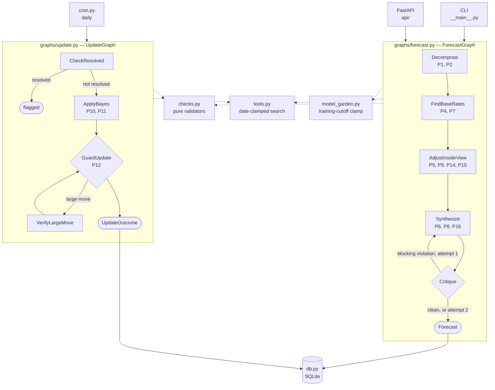

# Current State

Every module, function, and model that exists today. Generated against the code, not memory.

Read this to answer "what is there and what does it do." Read `spec/ADR.md` for *why* it is
shaped this way. Read `spec/superforecasting_methodology.md` for the 16 principles the code
implements — `P<n>` throughout this document refers to them.

---

## System Map



Two agents sit outside both graphs: `critic.py` (P3, runs while a question is being drafted)
and `postmortem.py` (P13, runs after resolution).

---

## Repository Layout

```
backend/
  config.py                      # env -> typed settings; check thresholds; model resolution
  superforecaster/
    models.py                    # every Pydantic model, one file
    deps.py                      # ForecastDeps — the two contamination clamps
    checks.py                    # pure methodology validators
    tools.py                     # date-clamped search  (clamp 1)
    model_garden.py              # model registry by training cutoff  (clamp 2)
    model_garden.json            # registry data
    db.py                        # SQLite layer + scoring math
    cron.py                      # APScheduler jobs + orchestrators
    observability.py             # Logfire config + run_agent wrapper
    __main__.py                  # CLI
    agents/                      # one module per methodology step (8)
      __init__.py                #   with_model, format_question, as_of_note
      decompose.py  outside_view.py  inside_view.py  synthesize.py
      resolution.py  update.py  critic.py  postmortem.py
    graphs/                      # orchestration only
      state.py  forecast.py  update.py
    evals/
      components.py              #   per-agent harness + 8 scorers
      components/*.json          #   per-agent golden data — all currently []
    fixtures/                    # JSON inputs for manual CLI runs
  api/
    main.py  deps.py  forecasts.py  questions.py  calibration.py  admin.py
  tests/                         # 221 tests, no network required
  test_forecasting_baseline/     # 66 legacy questions; raises on import, never run

frontend/                        # Next.js 15 + MUI v6 (unchanged by recent work)
spec/
  CURRENT_STATE.md               # this file
  ADR.md                         # architecture decisions
  superforecasting_methodology.md
  implemented/                   # shipped and merged to main
    SPEC_04_26_2026.md           #   v3 — platform, DB, API, frontend, cron
    spec3.md                     #   v4 — agent decomposition + graphs
  planned/
    spec4.md                     #   end-to-end backtest — needs a corpus
```

---

## Data Models

All in `superforecaster/models.py`. Type aliases first:

```
Confidence     = Literal["low", "medium", "high"]
QuestionStatus = Literal["pending", "approved", "rejected", "forecasted"]
Knowability    = Literal["researchable", "judgment"]
Direction      = Literal["up", "down", "neutral"]
BiasName       = Literal["confirmation", "availability", "narrative",
                         "scope_insensitivity", "anchoring"]
ALL_BIASES: tuple[BiasName, ...]      # the five, for check_bias_coverage
```

### Graph step outputs

Several constraints below carry methodology weight rather than just validating shape — they
are the half of a principle a schema can enforce.

```
SubPrediction                     # P1 + P2 — one Fermi-ized sub-question
  question       str              # specific, testable
  probability    float            # ge=0, le=1
  rationale      str
  confidence     Confidence
  knowability    Knowability = "judgment"
                                  # researchable = a base rate can be looked up.
                                  # Defaulted so forecasts persisted before P2 existed
                                  # still deserialize from decompositions_json.

Decomposition                     # output of decompose_agent
  sub_claims     list[SubPrediction]   # min_length=3, max_length=5   <- P1
  chain_note     str                   # how they combine (product? max?)

ReferenceClass                    # one outside-view lens
  name           str              # what population this rate is drawn from
  base_rate      float            # ge=0, le=1
  sample_size    int              # ge=1 — how many cases back the rate
  source         str
  analogs        list[HistoricalAnalog]

OutsideView                       # output of outside_view_agent
  reference_classes    list[ReferenceClass]  # min_length=2, max_length=5   <- P7
  aggregate_base_rate  float                 # the anchor the inside view adjusts from
  disagreement         str = ""              # why the classes differ; "" only when they agree

Adjustment                        # one inside-view move away from the base rate
  evidence       str
  direction      Direction
  magnitude      float            # ge=0, le=0.5 — probability POINTS, not a multiplier
  flip_test      str              # P9 — "if the opposite were true my estimate would ___"
  is_noise       bool = False     # set when the flip test shows it isn't decision-relevant

BiasCheck
  bias           BiasName
  assessment     str

InsideView                        # output of inside_view_agent
  adjustments               list[Adjustment]  # min_length=1, max_length=8
  steel_man                 str               # P14 — the opposing case, argued properly
  what_would_change_my_mind str               # P14
  bias_checks               list[BiasCheck]   # exactly 5   <- P15

Forecast                          # output of synthesize_agent; the persisted artifact
  question, resolution_criteria, resolution_date, category
  probability    float            # ge=0, le=1
  confidence     Confidence
  decompositions list[SubPrediction]   # min_length=3, max_length=5
  research       ResearchSummary
  reasoning      str              # must trace base rate -> adjustments -> final

ForecastInput                     # what the graph receives
  question, resolution_criteria, resolution_date, category
  max_iterations int = 5          # search budget per researching agent

HistoricalAnalog                  # one analogous past event
  description    str
  outcome        float            # 0.0 or 1.0
  relevance      str

ResearchSummary                   # outside + inside findings, persisted on the Forecast
  historical_analogs   list[HistoricalAnalog]
  empirical_base_rate  float | None    # None when < 3 analogs found
  base_rate_note       str
  causal_forces        list[str]
  evidence             dict[str, list[str]]   # {"supporting": [...], "contradicting": [...]}
  uncertainties        list[str]
```

### Methodology checks

```
CheckViolation                    # produced by checks.py, never by an LLM
  principle      int              # 1-16, indexes into the methodology doc
  name           str              # e.g. "derivation"
  detail         str              # what specifically failed
  blocking       bool = True      # True -> Critique routes back to Synthesize
```

### Updating

```
EvidenceItem                      # P11 — see checks.evidence_weight for the math
  fact           str
  source         str
  p_if_true      float            # P(seeing this | hypothesis TRUE)
  p_if_false     float            # P(seeing this | hypothesis FALSE)

UpdateDecision                    # output of update_agent
  evidence       list[EvidenceItem]
  prior          float
  posterior      float
  reasoning      str
  verified_large_move bool = False    # set by the VerifyLargeMove node, not the model

UpdateOutcome                     # final output of UpdateGraph
  flagged_resolved bool = False
  updated          bool = False
  new_probability  float | None
  violations       list[CheckViolation]
  reason           str

ResolutionCheckResult             # output of resolution_agent
  appears_resolved    bool
  suggested_outcome   float | None    # 0.0 or 1.0
  confidence          Confidence
  resolution_evidence str | None
  reasoning           str
```

### Standalone agents

```
CriteriaCritique                  # P3 — output of critic_agent
  is_resolvable               bool
  ambiguities                 list[str]   # phrases readable two ways
  missing                     list[str]   # "no resolution source", "no timezone"
  suggested_criteria          str         # a rewritten, adjudicable version
  suggested_resolution_source str

PostMortem                        # P13 — output of postmortem_agent
  process_errors list[str]        # what the reasoning got wrong, knowable at the time
  outcome_noise  list[str]        # what was genuinely unknowable
  verdict        Literal["sound_process", "flawed_process", "insufficient_evidence"]
  lesson         str
```

### Contamination clamps

```
SourceRef                         # one external source an agent saw
  url            str
  published_date datetime | None
  tool           str
  as_of          datetime | None
  .is_leak       -> bool          # published_date > as_of

ModelEntry                        # one model in the garden
  id             str              # pydantic-ai model string
  provider       str
  training_cutoff date            # provider's TRAINING DATA cutoff (the broader one),
                                  # stored as the last day of the stated month
  released       date | None
  available      bool = False     # set by `models probe`, not hand-edited
  notes          str
```

### Persistence

```
ForecastUpdateRecord              # one probability update row
  id, forecast_id, probability, confidence, reasoning, is_late, created_at

ForecastRecord                    # a forecast plus its full update history
  id, question, resolution_criteria, resolution_source, category
  submission_gap_days, submission_deadline, resolution_date
  resolved_at, outcome, is_ambiguous
  scored_probability, brier_score          # time-weighted; see db.py
  last_refreshed_at, flagged_for_resolution_review
  initial_reasoning, decompositions, research, updates, created_at

QuestionRecord                    # a community-submitted question idea
  id, text, resolution_criteria, proposed_resolution_date
  net_score, user_vote, is_own             # user_vote/is_own filled when caller IP known
  status, edited_at, is_deleted, created_at, approved_at, forecast_id

CalibrationBucket   range, predicted_avg, actual_frequency, count
CalibrationReport   aggregate_brier_score, total_resolved, total_ambiguous_excluded, buckets
RefreshSummary      total_checked, total_updated, total_skipped,
                    total_flagged_for_review, errors
```

### Evals — defined, mostly unused

`GoldenQuestion`, `QuestionScore`, and `Scorecard` are the contract for the end-to-end
backtest in `spec/planned/spec4.md`. **They ship unused** — nothing constructs them yet.

```
GoldenQuestion
  id, question, resolution_criteria
  asked_at       datetime         # both clamps key off this
  resolution_date datetime
  outcome        float            # 0.0 or 1.0
  category       str
  baseline_prior float            # human/crowd estimate — the number to beat
  contamination_risk int          # 1 = obscure, 3 = certainly in training data

QuestionScore   id, forecast_probability, outcome, brier, baseline_brier, violations,
                model_used, model_cutoff, leaked_sources, error, skipped
                .was_scored -> bool
Scorecard       mode, n, n_scored, n_skipped_no_clean_model, n_error, clean_coverage,
                mean_brier, baseline_mean_brier, brier_by_contamination_tier,
                count_by_contamination_tier, calibration_buckets, process_score,
                round_number_rate, leaked_source_count, models_used,
                violations_by_principle, scores

ComponentCase   id, agent, input, expect, as_of      # `expect` is per-agent, hence dict
ComponentScore  case_id, passed, assertions, detail, error, skipped
ComponentReport agent, n, pass_rate, assertion_pass_rates, scores
```

### API request/response bodies

```
CreateForecastRequest    question, resolution_criteria, resolution_source,
                         resolution_date, category, submission_gap_days=7
AddUpdateRequest         probability, confidence, reasoning
ResolveRequest           outcome            # 0.0, 1.0, or None for ambiguous
CreateQuestionRequest    text, resolution_criteria, proposed_resolution_date
EditQuestionRequest      text?, resolution_criteria?, proposed_resolution_date?
CritiqueQuestionRequest  question, resolution_criteria, resolution_date?
VoteRequest              vote               # +1 or -1
ApproveQuestionRequest   resolution_date?, resolution_criteria?
VoteResponse             question_id, net_score, user_vote
RefreshActionResponse    updated, reason, update
```

### Dead models

`ForecastResearchNotes` and `ForecastRefreshResult` have **zero references outside
`models.py`** — they belonged to `agent.py` and `refresh.py`, deleted in spec3. Safe to remove.

---

## Module Reference

### `config.py` — env to typed settings

```python
get_settings() -> Settings
    All env-backed config. Re-reads os.environ on every call (no caching) so tests can
    monkeypatch. Frozen dataclass, not BaseSettings.

get_check_thresholds() -> CheckThresholds
    The eight CHECK_* values used by checks.py. Also re-read every call.

get_model_garden_margin_days() -> int
    Safety margin applied to published training cutoffs. MODEL_GARDEN_MARGIN_DAYS, default 90.

get_usage_limits(*, max_iterations=None) -> UsageLimits
    General agent budget. Scales down when max_iterations is given.

get_research_limits(max_iterations) -> UsageLimits
    Tight budget for a tool-using agent: n*2+1 requests, n*2 tool calls.

get_synthesis_limits() -> UsageLimits
    Single-shot structured output: 4 requests, 0 tool calls.

resolve_agent_model() -> str
    Pick the model string from configured keys. AGENT_MODEL wins; then the Logfire
    Gateway; then direct Anthropic. Raises when neither key is set.

_validate_gateway_api_key(gateway_key) -> None
    Rejects legacy `paig_` gateway keys with a migration message.

_parse_optional_int(raw, *, unlimited_values) -> int | None
    "none"/"unlimited" -> None, so a limit can be disabled from the environment.
```

### `superforecaster/deps.py` — the two clamps

```
ForecastDeps                       # injected into every agent run (plain dataclass)
  as_of        datetime | None = None   # clamp 1 — tools return nothing published later
  model        str | None      = None   # clamp 2 — a model whose cutoff predates as_of
  verbose      bool            = False
  sources_seen list[SourceRef]  = []    # appended by the tools themselves
  .leaked_sources -> list[SourceRef]
      Sources dated after as_of. Always empty in a correct run — non-empty means the
      tool clamp has a bug, not that the forecast is merely suspect.
```

Its own module because `tools` needs it and `graphs` imports `agents` imports `tools` —
defining it beside the graph state would be a circular import. In production both clamps are
`None` and everything behaves as an ordinary live agent.

### `superforecaster/checks.py` — pure methodology validators

No LLM, no network, no I/O. Every function takes Pydantic models plus an optional
`CheckThresholds` and returns `CheckViolation | None`. No numeric literals — every threshold
comes from config.

```
check_decomposition(d, t=None) -> CheckViolation | None
    P1 + P2. Fails on an empty chain_note, a sub-claim with no rationale, or every
    sub-claim labelled "judgment" — which means nothing was researched. Because
    knowability defaults to "judgment", that last arm also catches an unlabelled
    decomposition.

check_dragonfly(o, t=None) -> CheckViolation | None
    P7. spread = max(base_rate) - min(base_rate). Fails when the spread exceeds
    t.reference_class_disagreement and `disagreement` is empty — two lenses materially
    disagreed and the agent said nothing, silently averaging away real uncertainty.

check_derivation(f, o, i, t=None) -> CheckViolation | None
    P6. implied = aggregate_base_rate + sum(signed non-noise adjustments), clamped to
    [0,1]. Fails when |probability - implied| > t.derivation_slack: the agent moved
    further than its own listed evidence supports. This is what abandoning a base rate
    for a narrative looks like from outside.

check_signal_vs_noise(i, t=None) -> CheckViolation | None
    P9. Fails on an empty flip_test, or is_noise=True with magnitude > 0 — evidence the
    agent itself called noise still moved the number.

check_disconfirming(i, t=None) -> CheckViolation | None
    P14. Fails on an empty steel_man or what_would_change_my_mind, or when two or more
    real adjustments all point the same direction. The one-sided arm only applies with
    >= 2 adjustments; with one there is nothing to be lopsided about.

check_bias_coverage(i, t=None) -> CheckViolation | None
    P15. Fails unless all five named biases appear with non-empty assessments. The schema
    pins the list at five entries but cannot stop five of the same bias.

check_calibration_hygiene(f, o, t=None) -> CheckViolation | None
    P16. Probabilities outside [calibration_floor, calibration_ceiling] are allowed only
    when confidence == "high" AND the reference classes agree within
    t.reference_class_agreement. Near-certainty has to be earned by the outside view.

evidence_weight(d) -> float
    P11. SUM log(p_if_true / p_if_false) — the total weight of evidence. Likelihoods of 0
    are clamped to 1e-6 to avoid an infinite ratio. Evidence with p_if_true == p_if_false
    contributes log(1) = 0 and correctly drops out.

check_bayes_direction(d, t=None) -> CheckViolation | None
    P11. The sign of the probability move must match the sign of evidence_weight:
        weight > 0  -> posterior must be > prior
        weight < 0  -> posterior must be < prior
        weight == 0 -> posterior must not move by >= min_probability_delta
    Checks the sign, not the magnitude — the methodology says formal Bayes isn't required,
    but self-contradiction is always an error. The zero arm also catches a move made with
    no evidence cited at all.

check_update_magnitude(d, t=None) -> CheckViolation | None
    P10 + P12. Under-reaction only: evidence carries weight but the probability did not
    move. Deliberately does NOT fail large moves — those route to VerifyLargeMove.

is_large_move(d, t=None) -> bool
    P12. |posterior - prior| > t.large_move. A routing signal for GuardUpdate, not a
    violation.

run_forecast_checks(forecast, decomposition, outside, inside, t=None) -> list[CheckViolation]
    All seven forecast-side checks. Takes the four pieces rather than a ForecastState so
    this module keeps no dependency on `graphs`, which imports it.

run_update_checks(d, t=None) -> list[CheckViolation]
    check_bayes_direction + check_update_magnitude.

blocking(violations) -> list[CheckViolation]
    The subset that should trigger another synthesis attempt.

_signed(a) -> float        # an adjustment's contribution; noise and neutral contribute 0
_spread(o) -> float        # max - min base_rate across reference classes
_thresholds(t) -> CheckThresholds
```

**There is deliberately no per-forecast granularity check (P8).** A forecast can legitimately
land on 0.60; failing it would punish a correct answer. P8 is a property of a distribution and
belongs in a run-level statistic — specified in spec4, not built.

### `superforecaster/tools.py` — clamp 1

Every tool takes `RunContext[ForecastDeps]` and reads `ctx.deps.as_of`.

```
search_web(ctx, query) -> str                                          # async
    Tavily search, clamped to ctx.deps.as_of when set. Returns a graceful message rather
    than raising when TAVILY_API_KEY is unset — missing results are missing information,
    not an error.

search_wikipedia(ctx, topic) -> str                                    # async
    Wikipedia. With as_of set, fetches the article revision as it stood on that date.

find_disconfirming_evidence(ctx, claim) -> str                         # async
    P14 as a tool. Runs search_web across three rewrites — "evidence against X", "why X
    will not happen", "X criticism" — and merges the results.

_tavily_body(query, as_of, *, max_results=5) -> dict
    Request body. With as_of set, adds end_date and switches topic to "news" — the topic
    switch is load-bearing, because Tavily only returns published_date on news results and
    without it _drop_leaked has nothing to check. Carries no api_key, so it is safe to
    assert on directly in tests.

_wikipedia_params(title, as_of) -> dict
    With as_of: prop=revisions, rvstart=<as_of>, rvdir=older, rvlimit=1,
    rvprop=content|timestamp. Without: the ordinary extracts call.

_wikipedia_search_params(topic, limit=3) -> dict

_drop_leaked(results, as_of) -> tuple[list[dict], list[SourceRef]]
    Second guard on top of Tavily's own filter. Drops anything published after as_of AND
    anything undated — an article with no date cannot be shown to predate the question,
    and "probably fine" is not good enough for a backtest. Returns a SourceRef for every
    result it considered, including dropped ones, so the filtering is visible.

_parse_published(raw) -> datetime | None
    Tavily returns ISO 8601 in most responses and RFC 2822 in some; both are tried.

_extract_page_text(page, as_of) -> tuple[str, datetime | None]
    Wikipedia returns current articles under `extract` and historical revisions under
    revisions[0].slots.main. Reads whichever shape came back.

_as_utc(value) -> datetime
_format_results(results) -> str
```

### `superforecaster/model_garden.py` — clamp 2

```
load_garden(path=GARDEN_PATH) -> list[ModelEntry]
save_garden(entries, path=GARDEN_PATH) -> None       # newest cutoff first
list_models(*, available_only=True, path=...) -> list[ModelEntry]

resolve_id(entry) -> str
    Adds the `gateway/` prefix when the deployment routes through the Pydantic AI Gateway,
    matching config.resolve_agent_model(). Without this a garden pick 404s on a gateway
    deployment.

pick_clean_model(as_of, *, margin_days=None, path=...) -> ModelEntry | None
    The newest available model whose training_cutoff is at least margin_days BEFORE as_of.
    Returns None when nothing qualifies — never falls back to a contaminated model. A
    skipped question is honest; a contaminated one is a number that looks real and isn't.
    The margin exists because a published cutoff is approximate: data collection tapers
    rather than stops.

earliest_cutoff(*, path=...) -> date | None
    The garden's reach. No question asked before this date plus the margin is scoreable.

coverage(asked_dates, *, margin_days=None, path=...) -> tuple[int, int]
    (covered, total) over a list of question dates.

probe(entry) -> bool                                                   # async
    One trivial request to confirm the model is still served. Providers retire old models,
    and old models are exactly what this depends on.

probe_all(*, path=...) -> list[ModelEntry]                             # async
    Probes every entry and rewrites the `available` flags in place.

render_garden(entries) -> str      # plain-text table
utc_today() -> date
```

**Measured reach (2026-08-03):** earliest available training cutoff is **Jul 2025**
(Sonnet 4.5 / Haiku 4.5). A question needs `asked_at >= 2025-10-29` to be clean-scorable.

### `superforecaster/agents/` — one module per methodology step

Every module has the same four parts:

```
INSTRUCTIONS: str                                   # the system prompt
build_<n>_agent(model=None) -> Agent[ForecastDeps, <Out>]
get_<n>_agent() -> Agent[ForecastDeps, <Out>]       # lazy singleton, import-safe w/o keys
run_<n>(...) -> <Out>                               # the seam nodes, tests, evals all call
```

| Module | P | `output_type` | Tools |
|---|---|---|---|
| `decompose.py` | 1, 2 | `Decomposition` | — |
| `outside_view.py` | 4, 7 | `OutsideView` | search_web, search_wikipedia |
| `inside_view.py` | 5, 9, 14, 15 | `InsideView` | + find_disconfirming_evidence |
| `synthesize.py` | 6, 8, 16 | `Forecast` | — |
| `resolution.py` | — | `ResolutionCheckResult` | search_web, search_wikipedia |
| `update.py` | 10, 11, 12 | `UpdateDecision` | search_web, find_disconfirming_evidence |
| `critic.py` | 3 | `CriteriaCritique` | search_web |
| `postmortem.py` | 13 | `PostMortem` | search_web |

```
run_decompose(input, deps) -> Decomposition                            # async
    Break the question into 3-5 labelled sub-claims. No tools — pure analysis.

run_outside_view(input, decomposition, deps) -> OutsideView            # async
    Find >= 2 reference classes and their base rates. Prioritises sub-claims the
    decomposition labelled researchable. Budget-limited.

run_inside_view(input, outside, deps) -> InsideView                    # async
    Produce signed adjustments away from outside.aggregate_base_rate, each with a flip
    test, plus a steel-man and all five bias checks. Budget-limited.

run_synthesize(input, decomposition, outside, inside, violations, deps) -> Forecast   # async
    Commit to a number. `violations` is non-empty on a retry, so attempt 2 is a correction
    rather than a re-roll. The prompt states the implied probability explicitly.

run_resolution_check(record, deps) -> ResolutionCheckResult            # async
    Has this already resolved? Never closes anything — only raises a flag for an admin.

run_update(record, deps, *, verify=None) -> UpdateDecision             # async
    Should the probability move? `verify=(prior, posterior)` switches the agent into
    deep-verification mode, called from the VerifyLargeMove node.

run_critique(question, resolution_criteria, resolution_date=None, deps=None)          # async
    -> CriteriaCritique. Standalone; runs while a question is still being drafted.

run_postmortem(record, deps=None) -> PostMortem                        # async
    Standalone; separates process errors from outcome noise on a resolved forecast.
```

Shared helpers in `agents/__init__.py`:

```
with_model(agent, deps)                                                # contextmanager
    Applies deps.model via agent.override for one run. No-op when unset, so production
    keeps using resolve_agent_model(). This is what lets the garden swap models per
    question without rebuilding the agent.

format_question(input) -> str
    The question block every prompt opens with. Shared so the four graph agents describe
    the question identically — a wording difference between steps would be a silent source
    of disagreement.

as_of_note(deps) -> str
    Tells the agent it is forecasting from a point in the past, when it is. Without this
    the model narrates in present tense about a date years gone and reads an empty search
    as "nothing is happening" rather than "I am looking at an older world."
```

Private formatters: `synthesize._implied`, `synthesize._violation_block`,
`update._format_history`, `postmortem._format_updates`.

### `superforecaster/graphs/` — orchestration

```
graphs/state.py

ForecastState       # each node writes exactly one field
  input, decomposition, outside, inside, forecast, violations, synthesis_attempts
UpdateState
  record, resolution, decision, violations, verify_attempts
```

```
graphs/forecast.py

Decompose.run(ctx)         -> FindBaseRates
FindBaseRates.run(ctx)     -> AdjustInsideView
    P4 is this edge. The inside-view agent takes the base rate as an argument, so it
    physically cannot run first. As a prompt instruction it would be a hope.
AdjustInsideView.run(ctx)  -> Synthesize
Synthesize.run(ctx)        -> Critique
    Increments synthesis_attempts; passes state.violations into the prompt.
Critique.run(ctx)          -> Synthesize | End[Forecast]
    Pure — no LLM. Runs run_forecast_checks. Routes back to Synthesize when there are
    blocking violations and synthesis_attempts < MAX_SYNTHESIS_ATTEMPTS (2). Otherwise
    ends. Surviving violations travel out with the result rather than being swallowed.

run_forecast_graph(input, *, as_of=None, model=None, verbose=False)    # async
    -> tuple[Forecast, list[CheckViolation]]
    Single entry point. Re-stamps question metadata from the input afterwards — the model
    has no business restating it and letting it try invites drift.

forecast_mermaid() -> str      # the real wiring, backs `superforecaster diagram`
```

```
graphs/update.py

CheckResolved.run(ctx)     -> ApplyBayes | End[UpdateOutcome]
    Ends immediately with flagged_resolved=True when the resolution agent fires. This is
    "resolution blocks the probability update" as an unreachable node, replacing a
    flagged_ids set passed between two for-loops.
ApplyBayes.run(ctx)        -> GuardUpdate
GuardUpdate.run(ctx)       -> VerifyLargeMove | End[UpdateOutcome]
    Pure. Routes to VerifyLargeMove on a large move (once). Otherwise runs
    run_update_checks, applies the MIN_PROBABILITY_DELTA gate, and writes the DB row only
    when the update is both material and internally consistent.
VerifyLargeMove.run(ctx)   -> GuardUpdate
    P12. Re-runs the update agent in deep-verification mode. Not a cap — FTX filing for
    bankruptcy is a legitimate 0.20 -> 0.99 move; the point is to corroborate it.

run_update_graph(forecast_id, *, verbose=False) -> UpdateOutcome       # async
    Single entry point for cron, API, and CLI. Replaces refresh_forecast + check_resolution.

update_mermaid() -> str
```

### `superforecaster/evals/components.py` — per-agent harness

```
load_cases(agent, *, cases_dir=CASES_DIR) -> list[ComponentCase]
run_case(case, *, mode="clean") -> ComponentScore                      # async
    In clean mode a case carrying as_of needs a model trained before that date; without
    one it is skipped rather than scored against a contaminated model.
run_component(agent, *, mode="clean", cases_dir=...) -> ComponentReport   # async
_dispatch(case, deps) -> Any                                           # async
    Calls the agent this case targets, reconstructing its inputs from JSON.
_build_report(agent, scores) -> ComponentReport
    Skipped and errored cases are excluded from the pass-rate denominator.
render_report(report) -> str

SCORERS: dict[str, Callable[[Any, dict], ComponentScore]]
```

Scorers — each returns named assertions rather than a bare pass/fail, so a failure says
which property broke:

```
score_decompose(out, expect)      # >=N sub-claims, >=1 researchable, expected terms present
score_outside_view(out, expect)   # >=2 classes, all sourced, rate near a documented truth
score_inside_view(out, expect)    # decisive fact used, planted irrelevant fact marked noise
score_synthesize(out, expect)     # probability near the value implied by the inputs
score_critic(out, expect)         # precision/recall on is_resolvable + names the ambiguity
score_resolution(out, expect)     # a FALSE POSITIVE fails outright — closing a live
                                  # forecast is irreversible; a miss costs a day
score_postmortem(out, expect)     # rewards calling a sound-but-missed forecast
                                  # "sound_process" — penalising that would teach outcome bias
score_update(out, expect)         # direction correct + internally Bayes-consistent
```

**All eight `components/*.json` files are `[]`.** The scorers are the durable part and they
ship; the cases are researched content and filling them is data entry against scorers that
already exist.

### `superforecaster/db.py` — SQLite

Raw SQL, no ORM. Path from `DATABASE_PATH`. Custom datetime adapters registered at import to
round-trip tz-aware ISO 8601 (Python 3.12 deprecated the built-ins).

Tables: `forecasts`, `forecast_updates`, `questions`, `votes`, `refresh_runs`.
Exceptions: `RateLimitError`, `NotFoundError`, `PermissionError`, `StateError`.

```
init_db() -> None                          # idempotent schema creation
connect() -> Iterator[Connection]          # contextmanager
hash_ip(ip) -> str                         # SHA-256; raw IPs never stored

save_forecast(forecast, resolution_source, submission_gap_days=7) -> str
add_forecast_update(forecast_id, probability, confidence, reasoning) -> ForecastUpdateRecord
get_forecast(forecast_id) -> ForecastRecord | None
list_forecasts(status=None, limit=50, offset=0) -> list[ForecastRecord]
list_active_forecast_ids() -> list[str]           # unresolved, non-ambiguous
mark_refreshed(forecast_id, flagged=False) -> None

compute_time_weighted_probability(forecast_id) -> float
    Sum(probability_i * duration_i) / total_duration. Rewards accuracy across the whole
    horizon and stops a lucky last-minute update erasing months of bad forecasting.
resolve_forecast(forecast_id, outcome) -> None    # writes brier = (scored - outcome)**2
calibration_report() -> CalibrationReport         # 10 deciles

submit_question(text, resolution_criteria, proposed_resolution_date, ip_hash) -> QuestionRecord
edit_question(question_id, ip_hash, ..., is_admin=False) -> QuestionRecord
delete_question(question_id, ip_hash, is_admin=False) -> None      # soft delete
get_question(question_id, requester_ip_hash=None) -> QuestionRecord | None
list_questions(status=None, sort="score", limit=50, offset=0, requester_ip_hash=None)
get_top_monthly(n=5) -> list[QuestionRecord]
approve_question(question_id, resolution_date=None, resolution_criteria=None)
reject_question(question_id) -> QuestionRecord
link_question_to_forecast(question_id, forecast_id) -> QuestionRecord

cast_vote(question_id, ip_hash, vote) -> int      # returns new net score
remove_vote(question_id, ip_hash) -> int
get_vote(question_id, ip_hash) -> int | None

record_refresh_run(summary_json) -> None
last_refresh_run() -> dict | None
```

### `superforecaster/cron.py` — scheduled jobs

```
run_daily_refresh() -> RefreshSummary                                  # async
    One loop over run_update_graph for every active forecast. Previously two sweeps with a
    flagged_ids set between them; the graph now enforces that ordering internally, so the
    invariant lives in one place. One forecast raising does not abort the sweep.

preview_monthly_digest(n=5) -> list[QuestionRecord]      # no mutation
run_monthly_digest(n=5) -> list[QuestionRecord]          # promotes top pending -> approved
start_scheduler() -> AsyncIOScheduler                    # idempotent; both jobs
stop_scheduler() -> None
_digest_if_last_day() -> None                            # cron fires 28-31; this gates it
```

### `superforecaster/observability.py` — Logfire

```
configure_logfire(*, verbose=False) -> None
    Validates LOGFIRE_TOKEN against /v1/info before enabling cloud export. On an invalid
    or missing token, cloud tracing is off and agent progress prints to the console
    instead. Called lazily from run_agent.

run_agent(agent, prompt, *, deps=None, verbose=False, max_iterations=None,   # async
          usage_limits=None, run_name="agent run") -> Any
    Wraps agent.run with a Logfire span, budget, and progress output. `deps` is forwarded
    so tools can read the clamps and append to the leakage audit trail.

logfire_tracing_enabled() / cloud_tracing_active() / console_active() -> bool
_looks_like_logfire_write_token(token) -> bool      # startswith "pylf_v1_"
_logfire_base_url(token) -> str                     # region from token.split("_")[2]
_token_is_valid(token) -> bool                      # blocking GET, 5s timeout
_make_event_handler(*, verbose)                     # tool calls / results / text parts
_preview(value, limit=240) -> str
```

### `superforecaster/__main__.py` — CLI

```
uv run python -m superforecaster <command>        # from backend/
```

| Command | Behavior |
|---|---|
| `forecast` | Interactive prompts; runs the forecast graph; saves to DB. Prints surviving violations to stderr |
| `forecast --fixture [path]` | Same from a fixture; `--no-save` skips the DB write; `--max-iterations N` |
| `refresh --id <uuid>` | Full update graph on a DB forecast |
| `refresh --fixture` | Update agent alone on a fixture record; no DB write |
| `resolve --id <uuid>` \| `--fixture` | Resolution agent only |
| `critique --question ... --criteria ... [--date]` | P3 — is this resolvable as written? |
| `postmortem <uuid>` | P13 — process errors vs outcome noise |
| `models [list\|probe\|pick --as-of DATE]` | Inspect the garden; `probe` marks what is served |
| `diagram [forecast\|update]` | Print the real graph wiring as mermaid |
| `test component [agent\|all]` | Component eval harness |

`test e2e` exits 2 with a pointer to `spec/planned/spec4.md` — the backtest is not built.

Internals: `_print_json`, `_load_fixture`, `_record_from_fixture`, `_cmd_*`,
`_add_verbose_flag`, `_build_parser`, `main`.

### `api/` — FastAPI

28 routes. CORS open. Swagger at `/docs`. `main.py` uses an async lifespan that runs
`db.init_db()` then `cron.start_scheduler()`.

| Method + path | Handler | Admin |
|---|---|---|
| GET `/healthz` | `healthz` | no |
| POST `/forecasts` | `create_forecast` → `run_forecast_graph` | yes |
| GET `/forecasts` | `list_forecasts` | no |
| GET `/forecasts/{id}` | `get_forecast` | no |
| POST `/forecasts/{id}/updates` | `add_update` | yes |
| PATCH `/forecasts/{id}/resolve` | `resolve` | yes |
| POST `/forecasts/{id}/refresh` | `refresh` → `run_update_graph` | yes |
| POST `/questions/critique` | `critique_question` → `run_critique` | no |
| POST `/questions` | `create_question` | no |
| GET `/questions` | `list_questions` | no |
| GET `/questions/top-monthly` | `top_monthly` | no |
| GET/PUT/DELETE `/questions/{id}` | `get_question` / `edit_question` / `delete_question` | mixed |
| POST/DELETE `/questions/{id}/vote` | `cast_vote` / `undo_vote` | no |
| POST `/questions/{id}/approve` \| `/reject` | `approve_question` / `reject_question` | yes |
| POST `/questions/{id}/forecast` | `forecast_from_question` → `run_forecast_graph` | yes |
| GET `/calibration` | `calibration` | no |
| GET `/admin/digest/preview`, POST `/admin/digest/run` | `digest_preview` / `digest_run` | yes |
| POST `/admin/refresh/run`, GET `/admin/refresh/status` | `refresh_run` / `refresh_status` | yes |

`api/deps.py`: `require_admin(authorization)`, `get_client_ip(request)`,
`get_client_ip_hash(request)`.

`POST /forecasts` and `POST /questions/{id}/forecast` run a full graph **synchronously inside
the request** — the HTTP response blocks for the whole run.

---

## Call Graph

```
CLI: superforecaster forecast   |   API: POST /forecasts, POST /questions/{id}/forecast
  -> graphs.forecast.run_forecast_graph(input)
       Decompose        -> agents.decompose.run_decompose
       FindBaseRates    -> agents.outside_view.run_outside_view  -> tools.search_web
                                                                 -> tools.search_wikipedia
       AdjustInsideView -> agents.inside_view.run_inside_view    -> tools.find_disconfirming_evidence
       Synthesize       -> agents.synthesize.run_synthesize
       Critique         -> checks.run_forecast_checks     (loops to Synthesize once)
  -> db.save_forecast

cron.run_daily_refresh   |   API: POST /forecasts/{id}/refresh
  -> db.list_active_forecast_ids
  -> graphs.update.run_update_graph(id)
       CheckResolved    -> agents.resolution.run_resolution_check -> db.mark_refreshed
       ApplyBayes       -> agents.update.run_update
       GuardUpdate      -> checks.run_update_checks -> db.add_forecast_update
       VerifyLargeMove  -> agents.update.run_update(verify=(prior, posterior))
  -> db.record_refresh_run

API: POST /questions/critique  |  CLI: superforecaster critique
  -> agents.critic.run_critique

CLI: superforecaster postmortem <id>
  -> db.get_forecast -> agents.postmortem.run_postmortem

CLI: superforecaster test component <agent>
  -> evals.components.run_component -> load_cases -> run_case -> SCORERS[agent]
       -> model_garden.pick_clean_model(case.as_of)

CLI: superforecaster models probe   ->  model_garden.probe_all
CLI: superforecaster diagram        ->  graphs.forecast.forecast_mermaid

every agent run
  -> agents.with_model(agent, deps)          # applies the garden's model pick
  -> observability.run_agent(..., deps=deps) # span, budget, progress
```

---

## Environment Variables

Backend reads everything through `config.py`. `backend/.env`; see `backend/.env.example`.

| Variable | Purpose | Default |
|---|---|---|
| `ADMIN_API_KEY` | Bearer token for admin routes | — (required) |
| `PYDANTIC_AI_GATEWAY_API_KEY` | Logfire Gateway (`pylf_v...`) | — (required unless Anthropic key set) |
| `ANTHROPIC_API_KEY` | Direct Anthropic | — (alternative) |
| `AGENT_MODEL` | Override the model for all agents | gateway or direct default |
| `AGENT_REQUEST_LIMIT` | Max LLM requests per run | `40` |
| `AGENT_TOOL_CALLS_LIMIT` | Max tool calls per run | `20` |
| `TAVILY_API_KEY` | Web search | — (optional; degrades gracefully) |
| `LOGFIRE_TOKEN` | Observability | — (optional) |
| `DATABASE_PATH` | SQLite file | `./superforecaster.db` |
| `REFRESH_CRON_SCHEDULE` | Daily update | `0 6 * * *` |
| `DIGEST_CRON_SCHEDULE` | Monthly digest | `0 9 28-31 * *` |
| `MIN_PROBABILITY_DELTA` | Update write threshold (P10) | `0.03` |
| `SEARCH_LOOKBACK_HOURS` | Update news window | `48` |
| `CHECK_RC_DISAGREEMENT` | P7 — spread demanding an explanation | `0.20` |
| `CHECK_RC_AGREEMENT` | P16 — spread counting as agreement | `0.10` |
| `CHECK_CALIBRATION_FLOOR` | P16 — lowest unearned probability | `0.02` |
| `CHECK_CALIBRATION_CEILING` | P16 — highest unearned probability | `0.98` |
| `CHECK_LARGE_MOVE` | P12 — jump triggering VerifyLargeMove | `0.75` |
| `CHECK_DERIVATION_SLACK` | P6 — stated vs implied tolerance | `0.05` |
| `CHECK_ROUND_NUMBER_RATE` | P8 — run-level rounding rate (unused until spec4) | `0.40` |
| `MODEL_GARDEN_MARGIN_DAYS` | Margin on published cutoffs | `90` |

Frontend: `NEXT_PUBLIC_API_URL` (default `http://localhost:8000`).

---

## What Works

Verified by `cd backend && uv run pytest` — **221 tests, no network, no API keys**:

- All eight agents import and build without keys (lazy construction)
- The forecast graph visits its nodes in methodology order — P4 asserted structurally
- `Critique` routes back to `Synthesize` exactly once on a blocking violation, then ends
- `CheckResolved` short-circuits, making the probability update unreachable for a resolved forecast
- `GuardUpdate` routes through `VerifyLargeMove` exactly once, never twice
- Every `checks.py` validator has a passing and a failing case; thresholds tested as tunable
- `_tavily_body` / `_wikipedia_params` carry their date params when clamped, omit them when not
- `_drop_leaked` removes post-`as_of` and undated results and records what it dropped
- `pick_clean_model` returns `None` rather than a contaminated fallback
- All eight component scorers tested, including false-positive weighting and outcome-bias resistance
- Time-weighted Brier matches the spec example; rate-limit, vote toggle, soft-delete, IP-gated edits enforced
- FastAPI loads with 28 routes; CLI `--help`, `models list`, `diagram`, `test component all` all run

---

## What Does Not Work Yet

**No accuracy number exists.** Nothing has measured whether this forecasts well. Both
contamination clamps are built; the corpus is not. See `spec/planned/spec4.md`.

**No live agent run has been exercised.** Every test uses stubs. A green `pytest` proves the
plumbing, not the prompts.

**Component golden data is empty.** All eight scorers ship; all eight JSON files are `[]`.
Until filled, P3 and P13 have no coverage at all — both are standalone agents the graph never
touches.

**`models probe` has never run.** Every garden entry is `available: false`, so
`pick_clean_model` returns `None` for everything. Needs live API keys.

**Two dead models.** `ForecastResearchNotes` and `ForecastRefreshResult` have zero references
outside `models.py`.

**`test_forecasting_baseline/run_baseline.py` raises on import** — `datetime.date(2022, 2, 1)`
after `from datetime import datetime`. Its 66 questions are unusable for clean scoring anyway
(all predate every served model's cutoff).

**Live frontend ↔ backend integration** has not been smoke-tested in a recent session.

---

## How to Run

```bash
cd backend && uv sync
```

```bash
cd backend && uv run pytest
```

```bash
cd backend && uv run python -m superforecaster diagram
```

```bash
cd backend && uv run python -m superforecaster models probe
```

```bash
cd backend && uv run python -m superforecaster forecast --fixture -v
```

```bash
cd backend && uv run uvicorn api.main:app --reload
```

```bash
cd frontend && npm install && npm run dev
```

```bash
docker compose up --build
```
