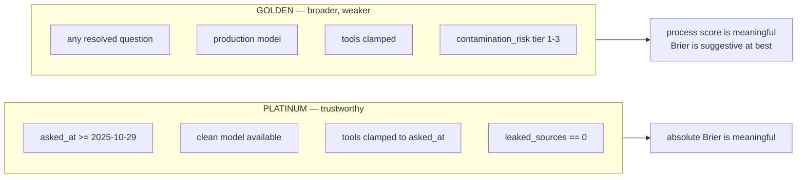
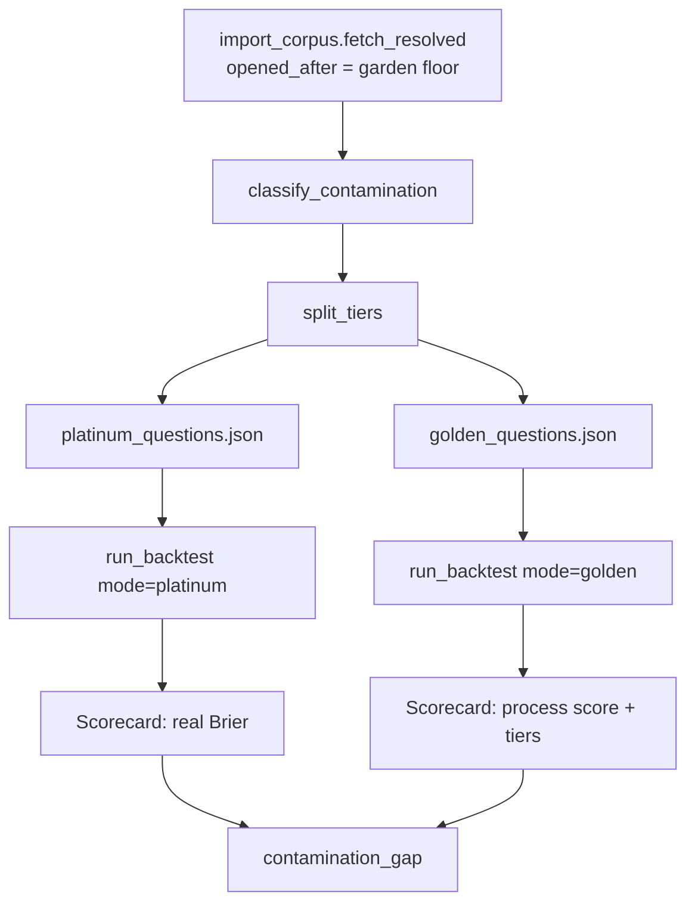

# Spec 4 — Golden and Platinum Test Data, and the End-to-End Backtest

Measure whether this system actually forecasts well, without hindsight doing the work.

**Status: blocked on a corpus.** Everything this spec depends on is built and tested — both
contamination clamps, the checks, the eval models. What is missing is questions. See
[The blocker](#the-blocker).

---

## Why This Exists

There is **no measured accuracy number for this system.** 221 tests pass; every one of them
proves plumbing. Nothing has ever asked "given a question whose answer we know, does this thing
get it right?"

That is the gap this spec closes, and the reason it is hard is contamination: a model trained
through 2026 already knows how 2022 turned out. Scoring it on 2022 questions measures its
memory, not its forecasting.

---

## The Blocker

The 66 legacy questions in `backend/test_forecasting_baseline/run_baseline.py` cannot be
clean-scored at all.

```
clean coverage, 90d margin:  0/66
clean coverage,  0d margin:  0/66
```

Measured 2026-08-03 against the shipped model garden. Published training-data cutoffs:

| Model | Training cutoff |
|---|---|
| Opus 5 | May 2026 |
| Fable 5, Sonnet 5, Opus 4.8, Opus 4.7, Sonnet 4.6 | Jan 2026 |
| Opus 4.6, Opus 4.5 | Aug 2025 |
| Haiku 4.5, **Sonnet 4.5** | **Jul 2025** — the floor |

With the 90-day margin, a question is clean-scorable only when `asked_at >= 2025-10-29`. The
newest legacy question was asked Sep 2024 — over a year too old. That file also raises on
import (`datetime.date(2022, 2, 1)` after `from datetime import datetime`) and has never run.

**The window widens on its own.** Every time a model ages out of the frontier, the clean set
grows. A corpus of questions resolved in 2026 is scoreable today; one from 2022 never will be.

---

## Two Tiers

The contamination finding forces a split. Conflating these would produce one meaningless
average.



| | Platinum | Golden |
|---|---|---|
| **Question age** | asked after the garden floor | any resolved question |
| **Model** | `pick_clean_model(asked_at)`, skip if none | `resolve_agent_model()` |
| **Tools** | clamped to `asked_at` | clamped to `asked_at` |
| **Contamination** | none by construction | tiered 1–3, never zero |
| **Brier means** | real skill | skill + memory, inseparable |
| **Process score means** | real | real — it is contamination-proof |
| **Expected size** | small, growing monthly | large |

**Platinum is the number that counts.** Golden exists to give the process score a large enough
sample to be stable, and to make contamination visible: if Golden tier-3 Brier is much better
than Platinum Brier, the gap is hindsight, quantified.

---

## Data Format

One file per tier, same schema. `GoldenQuestion` already ships in `models.py`.

```
GoldenQuestion                    # evals/golden_questions.json, evals/platinum_questions.json
  id                  str         # stable slug
  question            str
  resolution_criteria str
  asked_at            datetime    # when the question OPENED — both clamps key off this
  resolution_date     datetime
  outcome             float       # 0.0 or 1.0
  category            str
  baseline_prior      float       # crowd estimate at open — the number to beat
  contamination_risk  int         # 1 = obscure, 3 = certainly in training data
```

Whatever corpus is chosen must supply `asked_at` (open date, **not** resolution date), a binary
`outcome`, and ideally a crowd prior. Without `asked_at` the clamps have nothing to key off and
the question is unusable.

---

## What Gets Built

```
backend/superforecaster/evals/
  golden_questions.json         # NEW — broad corpus
  platinum_questions.json       # NEW — clean-scorable subset
  runner.py                     # NEW — the backtest
  scoring.py                    # NEW — Brier, calibration, process score
  import_corpus.py              # NEW — one-off importer for the chosen source
  components.py                 # EXISTS — untouched by this spec
backend/tests/
  test_scoring.py               # NEW — pure functions only, no network
```

---

## Function Inventory

### `evals/scoring.py` — pure, no network, no LLM

```
brier(p: float, outcome: float) -> float
    (p - outcome) ** 2.

calibration_buckets(scores: list[QuestionScore]) -> list[CalibrationBucket]
    Deciles of predicted probability against observed frequency. Mirrors the bucketing
    in db.calibration_report() so the backtest and the live platform are comparable.

process_score(scores: list[QuestionScore]) -> float
    Fraction of runs finishing with zero blocking violations.

    The primary metric. It is the only one that stays meaningful when clean coverage is
    low, because a methodology violation is a property of the reasoning and cannot be
    faked by knowing the answer.

    NOTE (2026-08-04): "blocking" narrowed under ADR 29. P16 became advisory, so a bold
    unargued probability no longer moves this number — report advisory violations
    separately rather than letting them vanish. Three blocking checks were added in the
    same change (aggregation, citations, linkage), so scores are not comparable across
    that boundary in either direction.

round_number_rate(scores: list[QuestionScore]) -> float
    P8, at run level. Fraction of forecasts landing on an exact multiple of 0.05.

    On a 2-decimal grid, 21 of 101 possible values are multiples of 0.05, so an unbiased
    forecaster sits near 0.21. A rate near 0.60 means the model is rounding to comfortable
    numbers. This is where P8 lives — see ADR 15 for why there is no per-forecast check.

contamination_gap(platinum: Scorecard, golden: Scorecard) -> float
    golden tier-3 Brier minus platinum mean Brier. A large negative number means the model
    scores far better on questions it likely memorised. Quantifies hindsight rather than
    arguing about it.

build_scorecard(questions, scores, *, mode) -> Scorecard
render_scorecard(s: Scorecard) -> str        # plain-text table for the terminal
```

### `evals/runner.py` — the backtest

```
load_questions(path, *, tiers=None, limit=None) -> list[GoldenQuestion]
    Read and filter a corpus file.

run_one(q: GoldenQuestion, *, mode) -> QuestionScore                        # async
    Run one question end to end.

    In platinum mode: calls pick_clean_model(q.asked_at) and returns a SKIPPED
    QuestionScore when none exists. It never falls back to a contaminated model —
    see ADR 18.

    Then runs forecast_graph with as_of=q.asked_at and model=<picked>, scores the
    result, and records violations plus deps.sources_seen. Exceptions become
    QuestionScore.error so one bad question cannot abort a long run.

run_backtest(questions, *, mode="platinum", concurrency=4) -> Scorecard     # async
    Run every question under a semaphore and aggregate. Concurrency is bounded because
    each question is ~5 agent calls and several searches.

audit_leaks(scorecard: Scorecard) -> list[SourceRef]
    Every source dated after its question's as_of. MUST be empty. A non-empty result
    means the tool clamp has a bug and the whole run is void, not merely suspect.
```

### `evals/import_corpus.py` — run by hand, never in CI

```
fetch_resolved(source: str, *, opened_after: date, limit: int) -> list[GoldenQuestion]
    Pull resolved binary questions from the chosen source. Maps the crowd forecast at
    open time to baseline_prior.

    `opened_after` is the important argument: questions opened before the garden floor
    can never be platinum, so point the importer at recent ones first.

classify_contamination(q: GoldenQuestion) -> int
    Heuristic tier 1-3. High-profile geopolitics and elections are 3; obscure sector
    statistics are 1. Deliberately a heuristic — it only has to be roughly right for the
    tier breakdown to be readable.

split_tiers(questions, *, garden_floor: date) -> tuple[list, list]
    (platinum, golden). Platinum is everything a clean model could forecast; golden is
    everything. A question can appear in both.

merge_into(questions, path) -> int
    Append questions whose id is not already present. Returns how many were added.
    The corpus is a versioned artifact, not a live query — never called from a test.
```

---

## Flow



---

## CLI

```bash
uv run python -m superforecaster test e2e                      # platinum, the default
uv run python -m superforecaster test e2e --golden             # broad corpus, production model
uv run python -m superforecaster test e2e --limit 10 --tier 1,2
uv run python -m superforecaster test e2e --audit              # print every leaked source
uv run python -m superforecaster test e2e --out reports/2026-08-03.json
```

Output:

```
mode=platinum   n=140   112 scored   28 skipped (no clean model)   coverage 80%

                agent    baseline
mean Brier      0.171      0.203
process score   0.89                  <- fraction with zero blocking violations
round-number    0.24                  <- P8; ~0.21 unbiased, >0.40 flags rounding
leaked sources  0                     <- MUST be 0, or the run is void

Models used
  anthropic:claude-sonnet-4-5-...   cutoff 2025-07-31   112 questions

Calibration
  0-10%    predicted 0.05   actual 0.08   n=14
  ...

Violations by principle
  P6  derivation          3
  P14 disconfirming       1
```

---

## Success Criteria

- `uv run python -m superforecaster test e2e --limit 3 --audit` completes and prints a scorecard.
- Every scored question reports a `model_cutoff` strictly earlier than its `asked_at`.
- `leaked sources` is 0.
- Questions with no clean model are reported as skipped, never scored.
- Platinum coverage over the chosen corpus is measured and written into this file.
- `contamination_gap` is computed and reported — the hindsight estimate is a deliverable, not
  an afterthought.
- `test_scoring.py` covers `brier`, `calibration_buckets`, `process_score`, and
  `round_number_rate` with hand-built inputs. No network.

---

## Open Questions

**1. Which corpus?** A large source of resolved questions has been identified and needs
evaluating against four requirements:

- Does it publish an **open date** (`asked_at`), not just a resolution date? Without this the
  clamps have nothing to key off and the corpus is unusable.
- Are outcomes **binary and unambiguous**?
- Is there a **crowd prior at open time** to serve as `baseline_prior`? Without it there is
  nothing to beat, only an absolute Brier with no reference.
- How many of its resolved questions **opened after 2025-10-29**? That number is the size of
  the platinum set, and it decides whether this spec is worth building now or in six months.

**2. What happens to the legacy 66?** Either repair the import bug and keep them as golden-only
with contamination tiers, clearly labelled as not clean — or retire them. Nothing imports the
file today, so there is no cost to deleting it.

**3. A forward-scored live set?** Questions open now and resolving after every current model's
cutoff would be permanently uncontaminated — the strongest possible signal. They produce no
score until they resolve, which is an argument for seeding them now rather than later.

---

## Dependencies — all built

Nothing in this spec needs to re-derive these.

| Piece | Where | State |
|---|---|---|
| Clamp 1 — date-clamped tools | `superforecaster/tools.py` | Done, tested |
| Clamp 2 — model garden | `superforecaster/model_garden.py` | Done, tested |
| Methodology checks → process score | `superforecaster/checks.py` | Done, tested |
| `GoldenQuestion`, `QuestionScore`, `Scorecard` | `superforecaster/models.py` | Defined, unused |
| Threshold config | `config.CheckThresholds` | Done |

See `spec/CURRENT_STATE.md` for signatures and `spec/ADR.md` §17, 18, 21 for the reasoning.

---

## Not In Scope

- **Component tests** (`superforecaster test component <agent>`) are a separate harness, already
  built, and do not need this corpus.
- **The two clamps** are consumed here, not modified.
