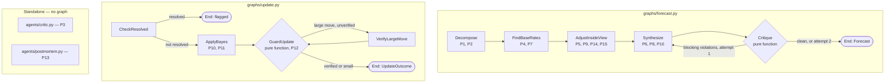

# Superforecaster v4 — Agent Decomposition and Graph Orchestration

Split the single forecasting pipeline into one agent per methodology step, orchestrate them with
Pydantic graphs, turn the checkable principles into pure functions, and build a scoring harness that
is not contaminated by hindsight.

---

## Why This Change

The whole pipeline is currently two prompts in one file. `superforecaster/agent.py` runs a research
agent then a synthesis agent, glued by a `try/except` in `run_forecast()`. Of the 16 principles in
`spec/superforecasting_methodology.md`, most exist only as English inside two large prompt strings.

Three consequences:

- **Nothing is individually testable.** There is no way to test "does it find base rates" without
  running the whole pipeline against a live LLM.
- **Most principles are unfalsifiable.** They are instructions to a model, not properties of an
  output. If the model abandons its base rate for a narrative, nothing catches it.
- **There is no scorecard.** `backend/test_forecasting_baseline/run_baseline.py` holds 66 resolved
  questions with known outcomes, but the file raises on import — `datetime.date(2022, 2, 1)` after
  `from datetime import datetime` — and `baseline_forecasting()` is `pass`. It has never run.

---

## Architecture Decisions

### One Agent Per Methodology Step

**Decision:** Eight `Agent` instances, one per methodology step, each with its own `output_type` and
system prompt. Five are orchestrated by a graph; three stand alone.

**Rationale:** A step you cannot run in isolation is a step you cannot test. Splitting the pipeline
gives every methodology step a named entry point (`run_decompose`, `run_outside_view`, …) that a test
can call directly with fixed inputs. It also makes each `output_type` narrow enough that Pydantic
validation does real work — `OutsideView` with `reference_classes: Field(min_length=2)` structurally
guarantees principle 7 in a way no prompt can.

**What this replaces:** This reverses the "Single AI Agent, Multi-Step Reasoning" decision in
`spec/TECHNICAL_DIRECTION.md`, which ruled out separate Decomposer / Researcher / Synthesizer agents.
That decision was made when the concern was v2's ignored prompt outputs. The concern now is
testability, and the earlier rationale no longer applies. `TECHNICAL_DIRECTION.md` is rewritten in
Spec 8, not appended to.

---

### Pydantic Graphs for Orchestration

**Decision:** Use `pydantic_graph` (already installed as a `pydantic-ai` dependency, v1.87.0) for
both the forecast pipeline and the daily update cycle. Orchestration lives in
`superforecaster/graphs/`; agents know nothing about each other.

**Rationale:** Both pipelines have real control flow, not just a sequence. The forecast graph loops
back from `Critique` to `Synthesize` when a methodology check fails. The update graph short-circuits
to `End` when a forecast has already resolved, and routes through `VerifyLargeMove` when a
probability jumps. Expressed as `if` statements these are invisible; expressed as nodes they are
inspectable, individually testable, and `Graph.mermaid_code()` renders the real wiring so the docs
cannot drift from the code.

The ordering guarantee matters most. Principle 4 says "outside view first." As a prompt instruction
that is a hope. As the graph edge `FindBaseRates -> AdjustInsideView` it is structural — the inside
view agent physically cannot run before the base rate exists in state.

**What this rules out:** Hand-rolled orchestration. `run_forecast()`'s `try/except` and
`run_daily_refresh()`'s two `for` loops with a `flagged_ids` set passed between them are both
replaced.

---

### Methodology Checks Are Pure Functions, Not Prompts

**Decision:** Principles 6, 7, 9, 11, 12, 14, 15, and 16 are implemented in
`superforecaster/checks.py` as pure functions over Pydantic models, returning
`CheckViolation | None`. No LLM, no network, no I/O.

**Rationale:** This is the core of the change. A principle stated in a prompt cannot be tested; a
function over structured output can be unit tested in microseconds. `check_bayes_direction` verifies
the model's probability moved the same direction as its own stated likelihood ratios — that is
arithmetic, and arithmetic either holds or it does not.

The checks also become a runtime feedback loop, not just a test fixture. The `Critique` node runs
them and routes failures back to `Synthesize` with the specific violation attached, so the model is
told exactly which principle it broke and why.

**What this rules out:** LLM-as-judge for these principles. A judge model is slower, costs money, is
non-deterministic, and is no more correct than a comparison operator for questions like "is this
number between these two numbers."

---

### Every Threshold Is Configuration

**Decision:** Every tunable number used by `checks.py` lives in `CheckThresholds` in
`backend/config.py`, overridable by `CHECK_*` environment variables. No numeric literals in
`checks.py`.

**Rationale:** These thresholds are guesses until the backtest says otherwise. A hardcoded 0.20 is a
guess nobody can revise without editing code; a config value is a guess anyone can tune from a
scorecard.

---

### Two Clamps for Contamination-Free Backtesting

**Decision:** Backtesting against resolved questions clamps both the tools and the model. Tools may
not return anything published after the question's `asked_at`; the model must have a training cutoff
earlier than `asked_at`.

**Rationale:** Contamination has two doors. Clamping only the tools leaves the model reciting an
outcome it memorised during training — it already knows Russia invaded Ukraine in 2022. Clamping
only the model leaves it reading a 2024 news article about a 2022 question. Both doors have to shut
or the score is fiction.

**What this rules out:** Treating the 66 golden questions as an accuracy benchmark at all. Measured
against the garden, they give `0/66` clean coverage — the earliest served training cutoff is Jul 2025
and the newest golden question was asked Sep 2024. `pick_clean_model` returns `None` rather than
falling back, so the honest result is "not scoreable", not a flattering number. The backtest itself
moves to `spec4.md` until a corpus of recently-resolved questions is chosen.

---

### Component Golden Data Ships Empty

**Decision:** The component test harness and all eight scorers ship now. The eight
`evals/components/*.json` data files ship as `[]` and are filled in later, one agent at a time.

**Rationale:** A scorer encodes what "good output" means for an agent — that is the hard, durable
part. The data is researched content: a base rate that is genuinely documented, a planted fact that
is genuinely irrelevant. Guessing at it produces cases that look like tests and measure nothing.
Shipping the harness empty means filling it later is data entry with no code changes.

**What this means on day one:** Principles 3 and 13 have no real coverage — both are standalone
agents outside the graph, so the end-to-end backtest never exercises them. Their data files are the
highest priority to fill.

---

### Unit Tests Cover Logic and Contamination Only

**Decision:** The `pytest` tier is scoped to pure logic and contamination guards. No test asserts
what a Pydantic field constraint already enforces at runtime.

**Rationale:** Pydantic validates output shape, ranges, and `min_length` on every real run. A test
re-asserting `Field(ge=0, le=1)` is dead weight. What Pydantic cannot catch is a wrong sign in a
log-likelihood sum, or a date parameter silently missing from an API call — both produce plausible
output and a wrong answer with nothing to flag it.

**What this rules out:** A `test_agents_contract.py` asserting each agent declares its `output_type`.

---

## System Map



Generated from the code by `uv run python -m superforecaster diagram` — this is the real
wiring, not a drawing of it:

```
stateDiagram-v2                        stateDiagram-v2
  [*] --> Decompose                      [*] --> CheckResolved
  Decompose --> FindBaseRates            CheckResolved --> ApplyBayes
  FindBaseRates --> AdjustInsideView     CheckResolved --> [*]
  AdjustInsideView --> Synthesize        ApplyBayes --> GuardUpdate
  Synthesize --> Critique                GuardUpdate --> VerifyLargeMove
  Critique --> Synthesize                GuardUpdate --> [*]
  Critique --> [*]                       VerifyLargeMove --> GuardUpdate
```

### Repository Layout

```
backend/
  config.py                      # + CheckThresholds, get_check_thresholds()
  superforecaster/
    models.py                    # all Pydantic models — extended, still one file
    tools.py                     # as_of-aware search tools  (clamp 1)
    checks.py                    # NEW — pure methodology validators
    model_garden.py              # NEW — model registry keyed by training cutoff  (clamp 2)
    model_garden.json            # NEW — registry data
    db.py                        # unchanged
    cron.py                      # calls run_update_graph()
    observability.py             # unchanged
    __main__.py                  # + test, models, critique, postmortem, diagram verbs
    agents/                      # NEW — one module per methodology step
      __init__.py                #   with_model() context manager
      decompose.py               #   P1, P2      -> Decomposition
      outside_view.py            #   P4, P7      -> OutsideView
      inside_view.py             #   P5,9,14,15  -> InsideView
      synthesize.py              #   P6, P8, P16 -> Forecast
      critic.py                  #   P3          -> CriteriaCritique      (standalone)
      resolution.py              #               -> ResolutionCheckResult
      update.py                  #   P10,11,12   -> UpdateDecision
      postmortem.py              #   P13         -> PostMortem            (standalone)
    graphs/                      # NEW — orchestration only
      __init__.py
      state.py                   #   ForecastDeps, ForecastState, UpdateState
      forecast.py                #   5 nodes + run_forecast_graph()
      update.py                  #   4 nodes + run_update_graph()
    evals/                       # NEW
      components/*.json          #   per-agent golden data — ships as []
      components.py              #   per-agent harness + 8 scorers
      #  runner.py / scoring.py / golden_questions.json / import_metaculus.py
      #  are the end-to-end backtest — deferred to spec4.md
  api/
    forecasts.py                 # -> run_forecast_graph, run_update_graph
    questions.py                 # -> run_forecast_graph, + POST /questions/critique
  tests/
    test_checks.py               # NEW
    test_model_garden.py         # NEW
    test_tools_backdating.py     # NEW
    test_graph_forecast.py       # NEW
    test_graph_update.py         # NEW

DELETED
  backend/superforecaster/agent.py           -> agents/ + graphs/forecast.py
  backend/superforecaster/refresh.py         -> agents/update.py + graphs/update.py
  backend/superforecaster/resolution.py      -> agents/resolution.py
  backend/tests/test_agent_forecast.py       -> test_graph_forecast.py
  backend/test_forecasting_baseline/         -> superforecaster/evals/
```

---

## Data Models

All models stay in `superforecaster/models.py`. New types only; existing models are unchanged.

```
Knowability = Literal["researchable", "judgment"]
Direction   = Literal["up", "down", "neutral"]

SubPrediction                     # P1 + P2 — EXTENDED, not a new model
  question            str
  probability         float       # ge=0, le=1
  rationale           str
  confidence          Confidence
  knowability         Knowability = "judgment"   # NEW. Defaulted so forecasts persisted
                                  # before P2 existed still deserialize from
                                  # decompositions_json without a migration.

Decomposition                     # P1 — output of decompose_agent
  sub_claims          list[SubPrediction]   # min_length=3, max_length=5
  chain_note          str                   # how the sub-claims combine

ReferenceClass                    # P4 + P7 — one outside-view lens
  name                str
  base_rate           float       # ge=0, le=1
  sample_size         int         # ge=1 — how many analogous cases
  source              str
  analogs             list[HistoricalAnalog]

OutsideView                       # P4 + P7 — output of outside_view_agent
  reference_classes   list[ReferenceClass]  # min_length=2  <- P7 half-enforced by schema
  aggregate_base_rate float                 # ge=0, le=1
  disagreement        str                   # "" when classes agree

Adjustment                        # P5 + P9 — one move away from the base rate
  evidence            str
  direction           Direction
  magnitude           float       # ge=0, le=0.5 — probability points, not a multiplier
  flip_test           str         # P9 — "if I saw the opposite, my estimate would ___"
  is_noise            bool        # True when the flip test shows it is not decision-relevant

BiasCheck                         # P15
  bias                Literal["confirmation","availability","narrative",
                              "scope_insensitivity","anchoring"]
  assessment          str

InsideView                        # P5, P9, P14, P15 — output of inside_view_agent
  adjustments               list[Adjustment]   # min_length=1
  steel_man                 str                # P14 — strongest opposing case
  what_would_change_my_mind  str               # P14
  bias_checks               list[BiasCheck]    # min_length=5 — all five, always

CheckViolation                    # produced by checks.py, never by an LLM
  principle           int         # 1-16, indexes into superforecasting_methodology.md
  name                str
  detail              str
  blocking            bool        # True -> Critique routes back to Synthesize

EvidenceItem                      # P11 — see "The Bayes Check" for the math
  fact                str
  source              str
  p_if_true           float       # ge=0, le=1 — P(seeing this | hypothesis true)
  p_if_false          float       # ge=0, le=1 — P(seeing this | hypothesis false)

UpdateDecision                    # P10, P11, P12 — output of update_agent
  evidence            list[EvidenceItem]
  prior               float
  posterior           float       # ge=0, le=1
  reasoning           str
  verified_large_move bool = False    # set by the VerifyLargeMove node

UpdateOutcome                     # final output of UpdateGraph
  flagged_resolved    bool
  updated             bool
  new_probability     float | None
  violations          list[CheckViolation]
  reason              str

CriteriaCritique                  # P3 — output of critic_agent
  is_resolvable               bool
  ambiguities                 list[str]
  missing                     list[str]   # "no resolution source", "no timezone on date"
  suggested_criteria          str
  suggested_resolution_source str

PostMortem                        # P13 — output of postmortem_agent
  process_errors      list[str]   # what the reasoning got wrong
  outcome_noise       list[str]   # what was genuinely unknowable at forecast time
  verdict             Literal["sound_process","flawed_process","insufficient_evidence"]
  lesson              str

SourceRef                         # leakage audit — one external source the agent saw
  url                 str
  published_date      datetime | None
  tool                str
  as_of               datetime | None

ModelEntry                        # one model in the garden
  id                  str         # pydantic-ai model string
  provider            str
  training_cutoff     date        # from provider docs — never guessed, never asked of a model
  released            date
  available           bool        # set by `models probe`, not hand-edited
  notes               str

GoldenQuestion                    # one row of evals/golden_questions.json
  id                  str
  question            str
  resolution_criteria str
  asked_at            datetime    # the as_of date — both clamps key off this
  resolution_date     datetime
  outcome             float       # 0.0 or 1.0
  category            str
  baseline_prior      float       # the number to beat
  contamination_risk  int         # 1 = obscure, 3 = certainly in training data

QuestionScore
  id                   str
  forecast_probability float
  outcome              float
  brier                float
  baseline_brier       float
  violations           list[CheckViolation]
  model_used           str
  model_cutoff         date | None      # proof the run was clean
  leaked_sources       list[SourceRef]  # must be empty
  error                str | None
  skipped              str | None       # "no available model with a cutoff before 2020-11-04"

ComponentCase                     # one row of evals/components/<agent>.json
  id                  str
  agent               str
  input               dict
  expect              dict        # agent-specific, hence dict
  as_of               datetime | None

ComponentScore
  case_id             str
  passed              bool
  assertions          dict[str, bool]   # named assertion -> pass/fail
  detail              str
  error               str | None

Scorecard                         # output of the e2e backtest (spec4.md); model ships here
  mode                        Literal["clean","production"]
  n                           int
  n_scored                    int
  n_skipped_no_clean_model    int
  clean_coverage              float
  mean_brier                  float
  baseline_mean_brier         float
  brier_by_contamination_tier dict[int, float]
  calibration_buckets         list[CalibrationBucket]   # reuses the existing model
  process_score               float
  round_number_rate           float                     # P8, run-level
  violations_by_principle     dict[int, int]
  scores                      list[QuestionScore]

ComponentReport                   # output of `superforecaster test component <name>`
  agent                 str
  n                     int
  pass_rate             float
  assertion_pass_rates  dict[str, float]
  scores                list[ComponentScore]
```

---

## Function Inventory

### `config.py`

```
CheckThresholds                                  # frozen dataclass, all CHECK_* env vars
  reference_class_disagreement  float = 0.20     # P7   CHECK_RC_DISAGREEMENT
  reference_class_agreement     float = 0.10     # P16  CHECK_RC_AGREEMENT
  calibration_floor             float = 0.02     # P16  CHECK_CALIBRATION_FLOOR
  calibration_ceiling           float = 0.98     # P16  CHECK_CALIBRATION_CEILING
  large_move                    float = 0.75     # P12  CHECK_LARGE_MOVE
  derivation_slack              float = 0.05     # P6   CHECK_DERIVATION_SLACK
  round_number_rate             float = 0.40     # P8   CHECK_ROUND_NUMBER_RATE
  min_probability_delta         float = 0.03     # P10  MIN_PROBABILITY_DELTA (exists today)

get_check_thresholds() -> CheckThresholds
    Reads every CHECK_* env var, falling back to the defaults above. Re-reads on every
    call, matching get_settings(), so tests can monkeypatch.
```

### `superforecaster/checks.py`

Every function takes Pydantic models plus an optional `CheckThresholds` and returns
`CheckViolation | None`. Pure — no LLM, no network, no I/O.

```
check_decomposition(d: Decomposition, t=None) -> CheckViolation | None
    P1 + P2. Fails when any sub-claim is unlabeled, or when every sub-claim is
    "judgment" — meaning nothing was actually researched.

check_dragonfly(o: OutsideView, t=None) -> CheckViolation | None
    P7. spread = max(base_rate) - min(base_rate) across reference_classes.
    Fails when spread > t.reference_class_disagreement and `disagreement` is empty:
    the agent found two lenses that materially disagree and said nothing about it.
    The "at least two lenses" half of P7 is enforced by the schema (min_length=2).

check_derivation(f: Forecast, o: OutsideView, i: InsideView, t=None) -> CheckViolation | None
    P6 (regression to the mean). Computes the probability implied by the agent's own
    stated numbers:
        implied = o.aggregate_base_rate + sum(signed magnitude of each non-noise adjustment)
    Fails when |f.probability - implied| > t.derivation_slack. Catches the model
    quietly abandoning its base rate for a narrative — it moved further than its own
    listed evidence supports. This is the per-forecast guard; see the note below for
    why there is no per-forecast granularity check.

check_signal_vs_noise(i: InsideView, t=None) -> CheckViolation | None
    P9. Fails when any adjustment has an empty flip_test, or has is_noise=True
    together with magnitude > 0 — evidence the agent itself called noise still
    moved the number.

check_disconfirming(i: InsideView, t=None) -> CheckViolation | None
    P14. Fails when steel_man or what_would_change_my_mind is empty, or when every
    adjustment points the same direction — no evidence was sought against the
    emerging conclusion.

check_bias_coverage(i: InsideView, t=None) -> CheckViolation | None
    P15. Fails unless all five named biases appear with non-empty assessments.

check_calibration_hygiene(f: Forecast, o: OutsideView, t=None) -> CheckViolation | None
    P16. Fails when probability is outside [t.calibration_floor, t.calibration_ceiling]
    unless confidence == "high" AND all reference classes agree within
    t.reference_class_agreement. Extremes are allowed, but only when earned.

check_update_magnitude(d: UpdateDecision, t=None) -> CheckViolation | None
    P10 + P12. Directional only. Fails when the evidence carries net weight but the
    probability did not move at all — under-reaction, anchoring on the prior.
    Does NOT fail large moves; those route to VerifyLargeMove instead.

is_large_move(d: UpdateDecision, t=None) -> bool
    P12. True when |posterior - prior| > t.large_move. A routing signal for
    GuardUpdate, not a violation.

check_bayes_direction(d: UpdateDecision, t=None) -> CheckViolation | None
    P11. Verifies the probability move agrees with the agent's own stated likelihoods.
    Full derivation in "The Bayes Check" below.

evidence_weight(d: UpdateDecision) -> float
    P11. SUM log(p_if_true / p_if_false) across the evidence — the total weight of
    evidence. Extracted from check_bayes_direction so check_update_magnitude can
    reuse it and so it can be tested on its own.

run_forecast_checks(forecast, decomposition, outside, inside, t=None) -> list[CheckViolation]
    Every forecast-side check. Called by the Critique node. Returns [] when clean.
    Takes the four pieces rather than a ForecastState so `checks` keeps no dependency
    on `graphs`, which imports it.

run_update_checks(d: UpdateDecision, t=None) -> list[CheckViolation]
    check_update_magnitude + check_bayes_direction. Called by GuardUpdate.

blocking(violations: list[CheckViolation]) -> list[CheckViolation]
    The subset that should send a forecast back for another synthesis attempt.
```

**Note on P8 (granularity).** There is deliberately no per-forecast granularity check. A single
forecast can legitimately land on 0.60, and failing it would punish a correct answer. P8 is about
rounding *habits*, which is a property of a distribution. It is measured at run level by
`scoring.round_number_rate` instead.

### `superforecaster/model_garden.py`

```
load_garden(path: Path = GARDEN_PATH) -> list[ModelEntry]
    Reads model_garden.json.

list_models(*, available_only: bool = True) -> list[ModelEntry]
    The garden, newest training_cutoff first.

pick_clean_model(as_of: datetime, *, margin_days: int = 90) -> ModelEntry | None
    The most capable available model whose training_cutoff is at least margin_days
    BEFORE as_of. Returns None when no such model exists — the caller must skip,
    never fall back to a contaminated model.

    "Most capable" means newest cutoff among the eligible, on the assumption that a
    later cutoff tracks a better model. The margin exists because a published cutoff
    is approximate: data collection tapers rather than stops, so a model with a
    stated June cutoff may have seen some July text. MODEL_GARDEN_MARGIN_DAYS
    overrides the default.

probe(entry: ModelEntry) -> bool                                          # async
    Sends one trivial request to confirm the model is still served. Providers retire
    old models, and old models are exactly what this system depends on.

probe_all() -> list[ModelEntry]                                           # async
    Probes every entry and rewrites the `available` flags in model_garden.json.
```

`training_cutoff` values come from provider documentation. They are never guessed and never obtained
by asking a model about itself — models are unreliable about their own cutoffs.

### `superforecaster/tools.py`

```
search_web(ctx: RunContext[ForecastDeps], query: str) -> str              # async
    Tavily search, clamped to ctx.deps.as_of when set.

search_wikipedia(ctx: RunContext[ForecastDeps], topic: str) -> str        # async
    Wikipedia, fetching the revision as it stood on ctx.deps.as_of when set.

find_disconfirming_evidence(ctx: RunContext[ForecastDeps], claim: str) -> str   # async
    P14 as a tool. Runs search_web across three rewrites of the claim —
    "evidence against X", "why X will not happen", "X criticism" — and merges results.

_tavily_body(query: str, as_of: datetime | None) -> dict
    Tavily request body. When as_of is set, adds end_date=<YYYY-MM-DD> and
    topic="news" — news is what makes Tavily return published_date at all, which
    the second guard needs. Extracted so tests can assert on it without a network call.

_wikipedia_params(topic: str, as_of: datetime | None) -> dict
    When as_of is set: prop=revisions, rvstart=<as_of ISO>, rvdir=older, rvlimit=1,
    rvprop=content|timestamp — the article as it stood on that date.

_drop_leaked(results: list[dict], as_of: datetime | None) -> tuple[list[dict], list[SourceRef]]
    Second guard. Drops any result whose published_date is after as_of, in case the
    API filter is loose. Returns survivors plus a SourceRef for every result it
    considered — including the dropped ones, or the filtering would be invisible.

    Undated results are also dropped when as_of is set. This costs recall on purpose:
    an article with no publication date cannot be shown to predate the question, and
    "probably fine" is not good enough for a backtest. topic="news" means most
    results carry a date, which bounds the loss.

_parse_published(raw: str | None) -> datetime | None
    Tavily returns ISO 8601 in most responses and RFC 2822 in some, so both are
    tried. None when missing or unparseable — the caller decides what unknown means.

_extract_page_text(page: dict, as_of: datetime | None) -> tuple[str, datetime | None]
    Wikipedia returns current articles under `extract` and historical revisions under
    `revisions[0].slots.main`. This reads whichever shape came back.
```

### `superforecaster/deps.py`

`ForecastDeps` gets its own module rather than living in `graphs/state.py`: `tools` needs it, and
`graphs` imports `agents` which imports `tools`, so defining it beside the graph state would be a
circular import.

```
ForecastDeps                       # injected into every agent run  (plain dataclass)
  as_of         datetime | None = None  # clamp 1 — tools return nothing published later
  model         str | None      = None  # clamp 2 — a model whose cutoff predates as_of.
                                        #           None = resolve_agent_model() (production)
  verbose       bool            = False
  sources_seen  list[SourceRef] = []    # appended by the tools themselves

  .leaked_sources -> list[SourceRef]
      Sources dated after as_of. Always empty in a correct run — a non-empty list
      means the tool clamp has a bug, not that the forecast is merely suspect.
```

The audit trail lives on the deps rather than on `ForecastState` because a tool can reach
`ctx.deps` but not the graph state.

### `superforecaster/graphs/state.py`

```
ForecastState                      # mutated as the graph walks; each node writes one field
  input               ForecastInput
  decomposition       Decomposition | None      = None
  outside             OutsideView | None        = None
  inside              InsideView | None         = None
  forecast            Forecast | None           = None
  violations          list[CheckViolation]      = []
  synthesis_attempts  int                       = 0
  sources_seen        list[SourceRef]           = []      # leakage audit trail

UpdateState
  record          ForecastRecord
  resolution      ResolutionCheckResult | None  = None
  decision        UpdateDecision | None         = None
  violations      list[CheckViolation]          = []
  verify_attempts int                           = 0
```

### `superforecaster/graphs/forecast.py`

```
Decompose(BaseNode[ForecastState, ForecastDeps, Forecast])
  run(ctx) -> FindBaseRates
    Calls run_decompose(). Writes state.decomposition.

FindBaseRates(BaseNode[...])
  run(ctx) -> AdjustInsideView
    Calls run_outside_view(). Writes state.outside. P4 — this node runs before
    AdjustInsideView by construction, which is how "outside view first" becomes
    structural rather than a prompt instruction the model can ignore.

AdjustInsideView(BaseNode[...])
  run(ctx) -> Synthesize
    Calls run_inside_view() with state.outside. Writes state.inside.

Synthesize(BaseNode[...])
  run(ctx) -> Critique
    Calls run_synthesize(), passing state.violations so a retry sees exactly what
    failed. Writes state.forecast, increments state.synthesis_attempts.

Critique(BaseNode[...])
  run(ctx) -> Synthesize | End[Forecast]
    Pure. Calls checks.run_forecast_checks(). If blocking violations exist and
    synthesis_attempts < 2, routes back to Synthesize. Otherwise End(forecast) —
    surviving violations travel out with the result rather than being swallowed.

forecast_graph = Graph(nodes=[Decompose, FindBaseRates, AdjustInsideView,
                              Synthesize, Critique])

run_forecast_graph(input: ForecastInput, *, as_of=None, model=None,           # async
                   verbose=False) -> tuple[Forecast, list[CheckViolation]]
    Single entry point. Runs the graph, re-stamps question metadata onto the
    Forecast so the model cannot hallucinate it, returns the forecast plus any
    surviving violations.

forecast_mermaid() -> str
    forecast_graph.mermaid_code(start_node=Decompose). Backs `superforecaster
    diagram` so the documented wiring cannot drift from the real wiring.
```

### `superforecaster/graphs/update.py`

```
CheckResolved(BaseNode[UpdateState, ForecastDeps, UpdateOutcome])
  run(ctx) -> ApplyBayes | End[UpdateOutcome]
    Calls run_resolution_check(). If appears_resolved, End immediately with
    flagged=True — preserves the rule that resolution blocks the probability sweep,
    now as a graph edge instead of a set of ids passed between two for-loops.

ApplyBayes(BaseNode[...])
  run(ctx) -> GuardUpdate
    Calls run_update(). Writes state.decision.

GuardUpdate(BaseNode[...])
  run(ctx) -> VerifyLargeMove | End[UpdateOutcome]
    Pure. If checks.is_large_move() and verify_attempts == 0, routes to
    VerifyLargeMove. Otherwise runs run_update_checks() plus the
    MIN_PROBABILITY_DELTA gate, writes the DB row when the update is both material
    and internally consistent, and ends.

VerifyLargeMove(BaseNode[...])
  run(ctx) -> GuardUpdate
    P12. Re-runs the update agent in deep-verification mode: corroborate the
    decisive claim from a second independent source, and search explicitly for
    evidence it is wrong or premature. Sets verified_large_move, increments
    verify_attempts, returns to GuardUpdate — which cannot route here twice.

update_graph = Graph(nodes=[CheckResolved, ApplyBayes, GuardUpdate, VerifyLargeMove])

run_update_graph(forecast_id: str, *, verbose=False) -> UpdateOutcome        # async
    Single entry point for cron, API, and CLI. Replaces both refresh_forecast(id)
    and check_resolution(id).
```

A large move does not fail. Genuinely decisive news exists — FTX filing, SVB seizure — and a hard cap
would reject the correct behaviour. The move survives if it is real and gets walked back if the first
pass over-reacted to one headline.

### `superforecaster/agents/*.py`

All eight modules have exactly four things. The uniformity is what makes them testable in isolation.

```
INSTRUCTIONS: str                                        # the system prompt
build_<n>_agent(model: str | None = None) -> Agent[ForecastDeps, <Out>]
get_<n>_agent() -> Agent[ForecastDeps, <Out>]            # lazy singleton, import-safe without keys
run_<n>(...) -> <Out>                                    # the seam nodes, tests, and evals call
```

| Module | Output type | Tools | Entry point |
|---|---|---|---|
| `decompose.py` | `Decomposition` | — | `run_decompose(input, deps)` |
| `outside_view.py` | `OutsideView` | `search_web`, `search_wikipedia` | `run_outside_view(input, d, deps)` |
| `inside_view.py` | `InsideView` | `search_web`, `search_wikipedia`, `find_disconfirming_evidence` | `run_inside_view(input, o, deps)` |
| `synthesize.py` | `Forecast` | — | `run_synthesize(input, d, o, i, violations, deps)` |
| `critic.py` | `CriteriaCritique` | `search_web` | `run_critique(question, criteria, resolution_date)` |
| `resolution.py` | `ResolutionCheckResult` | `search_web`, `search_wikipedia` | `run_resolution_check(record, deps)` |
| `update.py` | `UpdateDecision` | `search_web`, `find_disconfirming_evidence` | `run_update(record, deps, *, verify=None)` |
| `postmortem.py` | `PostMortem` | `search_web` | `run_postmortem(record)` |

```
agents/__init__.py

with_model(agent: Agent, deps: ForecastDeps)                    # contextmanager
    Applies deps.model via agent.override for the duration of one run. No-op when
    unset, so production keeps using resolve_agent_model(). This is what lets the
    model garden swap models per run without rebuilding the agent.
```

`run_update`'s `verify` argument carries `(prior, posterior)` when called from `VerifyLargeMove`,
switching the agent into deep-verification mode.

Existing prompt text from `agent.py`, `refresh.py`, and `resolution.py` is ported into these modules
rather than rewritten — it encodes real work.

### `superforecaster/evals/`

Only the component harness is in scope here. `runner.py`, `scoring.py`,
`golden_questions.json`, and `import_metaculus.py` — the end-to-end backtest — are specified in
`spec4.md` and deferred until a corpus of recently-resolved questions is chosen.

```
components.py

load_cases(agent: str) -> list[ComponentCase]
    Reads evals/components/<agent>.json.

run_case(case: ComponentCase, *, mode="clean") -> ComponentScore            # async
    Dispatches to the right run_* entry point with
    deps=ForecastDeps(as_of=case.as_of, model=pick_clean_model(case.as_of).id),
    then applies that agent's scorer. Skips when as_of is set and no clean model exists.

run_component(agent: str) -> ComponentReport                                # async
SCORERS: dict[str, Callable[[Any, dict], ComponentScore]]     # agent name -> scorer

```

The eval models (`GoldenQuestion`, `QuestionScore`, `Scorecard`) ship in `models.py` now, so
`spec4.md` can be picked up without re-deriving them.

---

## The Bayes Check

`check_bayes_direction` verifies the model's probability move agrees with its own stated likelihoods.
The math, in full, because it is the one check whose correctness is not obvious by inspection.

The agent reports, for each new fact E, two numbers:

```
p_if_true  = P(E | H)      how likely this fact is if the hypothesis is TRUE
p_if_false = P(E | not H)  how likely this fact is if the hypothesis is FALSE
```

Bayes in odds form. Odds are probability restated as a ratio:

```
odds(p) = p / (1 - p)              0.60 -> 1.5      ("3-to-2 on")
```

For one piece of evidence:

```
posterior_odds = prior_odds * (p_if_true / p_if_false)
```

That ratio is the likelihood ratio, LR. Its meaning is direct:

```
LR > 1   more expected in a true world     -> pushes probability UP
LR = 1   equally expected either way       -> the fact is NOISE, moves nothing  (this is P9)
LR < 1   more expected in a false world    -> pushes probability DOWN
```

Independent evidence multiplies, so several facts compose as:

```
posterior_odds = prior_odds * LR_1 * LR_2 * ... * LR_n
```

Multiplying many small numbers underflows and is awkward to reason about, so take logs, which turns
the product into a sum:

```
log(posterior_odds) = log(prior_odds) + SUM_i log(LR_i)
```

That sum is the total weight of evidence. Its **sign** is all this check needs:

```
SUM log(LR) > 0   evidence is net-confirming      -> posterior MUST be > prior
SUM log(LR) < 0   evidence is net-disconfirming   -> posterior MUST be < prior
SUM log(LR) = 0   evidence is net-neutral         -> posterior MUST equal prior
```

The check tests the sign, not the magnitude. Requiring the agent to hit the exact Bayesian posterior
would be too strict — principle 11 says the discipline of asking the question provides most of the
value and formal Bayes is not required. But an agent that says "this evidence makes the outcome more
likely" and then lowers its probability has contradicted itself, and that is always an error.

Guards: `p_if_false == 0` gives an infinite LR, so it is clamped to `1e-6`. Evidence with
`p_if_true == p_if_false` contributes `log(1) = 0` and is correctly ignored.

---

## Backdating

Contamination has two doors. Both are shut for every eval run.

### Clamp 1 — Tools

Every tool reads `ctx.deps.as_of` and refuses to return anything published after it. Both APIs
support this natively:

| Source | Mechanism |
|---|---|
| Tavily | `end_date=<YYYY-MM-DD>` plus `topic="news"` so `published_date` comes back, then `_drop_leaked` removes anything that slips through |
| Wikipedia | `prop=revisions`, `rvstart=<as_of>`, `rvdir=older`, `rvlimit=1`, `rvprop=content|timestamp` — the article as it stood on that date |

`SourceRef` records accumulate on `ForecastState.sources_seen` and land in the scorecard, so
`ForecastDeps.leaked_sources` surfaces any source dated after its `as_of`. If that list is ever
non-empty, the clamp has a bug.

### Clamp 2 — Model Garden

The important half. A model whose training cutoff predates the question cannot know the outcome.
`pick_clean_model(q.asked_at)` selects it; `with_model()` applies it per run.

### Measured Reach — the garden's floor is Jul 2025

Published training-data cutoffs, as of 2026-08-03:

| Model | Training cutoff |
|---|---|
| Opus 5 | May 2026 |
| Fable 5, Sonnet 5, Opus 4.8, Opus 4.7, Sonnet 4.6 | Jan 2026 |
| Opus 4.6, Opus 4.5 | Aug 2025 |
| Haiku 4.5, **Sonnet 4.5** | **Jul 2025** — the floor |

With the 90-day margin, a question is clean-scorable only when `asked_at >= 2025-10-29`. That
window widens every time a model ages out of the frontier.

*(Opus 4.1 reached back to Mar 2025 but retires 2026-08-05; it was dropped rather than let a
backtest silently change behaviour mid-week.)*

**Consequence: the existing 66-question set is entirely out of reach** — it spans Sep 2020 to
Sep 2024, giving `0/66` clean coverage at any margin. The end-to-end backtest that would consume
this garden is therefore deferred to `spec/change_specs/spec4.md`, pending a corpus of
recently-resolved questions. The garden itself ships now: it is correct, cheap, and its reach
grows on its own.

---

## Call Graph

```
CLI: superforecaster forecast
  -> graphs.forecast.run_forecast_graph(input, as_of=None)
       Decompose        -> agents.decompose.run_decompose
       FindBaseRates    -> agents.outside_view.run_outside_view  -> tools.search_web
                                                                 -> tools.search_wikipedia
       AdjustInsideView -> agents.inside_view.run_inside_view    -> tools.find_disconfirming_evidence
       Synthesize       -> agents.synthesize.run_synthesize
       Critique         -> checks.run_forecast_checks            (loops back to Synthesize once)

CLI: superforecaster test component <agent>
  -> evals.components.run_component -> load_cases -> run_case -> SCORERS[agent]
       -> model_garden.pick_clean_model(case.as_of)

CLI: superforecaster models list | probe | pick --as-of <date>
  -> model_garden.list_models / probe_all / pick_clean_model

CLI: superforecaster critique     |  API: POST /questions/critique
  -> agents.critic.run_critique

CLI: superforecaster postmortem <id>
  -> db.get_forecast -> agents.postmortem.run_postmortem

CLI: superforecaster diagram
  -> graphs.forecast.forecast_mermaid

cron.run_daily_refresh
  -> db.list_active_forecast_ids
  -> graphs.update.run_update_graph(id)     (per forecast; replaces the two-sweep loop)
       CheckResolved   -> agents.resolution.run_resolution_check
       ApplyBayes      -> agents.update.run_update
       GuardUpdate     -> checks.run_update_checks -> db.add_forecast_update
       VerifyLargeMove -> agents.update.run_update(verify=(prior, posterior))
  -> db.record_refresh_run

API: POST /forecasts                     -> graphs.forecast.run_forecast_graph
API: POST /questions/{id}/forecast       -> graphs.forecast.run_forecast_graph
API: POST /forecasts/{id}/refresh        -> graphs.update.run_update_graph
API: POST /questions/critique            -> agents.critic.run_critique          (NEW)
```

---

## Principle → Code → Test

**Day one** is what actually measures the principle when this change lands. **Later** is what the
component golden data adds once written. A principle whose only day-one coverage is a schema
constraint is structurally guaranteed but not quality-tested.

| # | Principle | Lives in | Day one | Later |
|---|---|---|---|---|
| 1 | Fermi-ize | `agents/decompose.py` | schema `min_length=3` + `check_decomposition` | `decompose` — sub-claims are the right ones |
| 2 | Knowable vs unknowable | `SubClaim.knowability` | `check_decomposition` rejects all-`judgment` | `decompose` — labels are correct |
| 3 | Resolution criteria | `agents/critic.py` | schema only | `critic` — precision/recall on 16 labeled criteria |
| 4 | Outside view first | graph edge `FindBaseRates -> AdjustInsideView` | `test_graph_forecast` node order — structural | — |
| 5 | Inside view second | `Adjustment.magnitude` is a delta | `check_derivation` | `inside_view` |
| 6 | Regression to the mean | `checks.check_derivation` | unit test | — |
| 7 | Dragonfly eye | schema `min_length=2` + `check_dragonfly` | unit test + schema | `outside_view` — rates match documented truth |
| 8 | Granularity | `scoring.round_number_rate` (run-level) | nothing — needs the backtest (spec4.md) | — |
| 9 | Signal vs noise | `Adjustment.flip_test`, `is_noise` | `check_signal_vs_noise` | `inside_view` — planted irrelevant fact marked noise |
| 10 | Frequent small updates | `MIN_PROBABILITY_DELTA` gate in `GuardUpdate` | `test_graph_update` | `update` |
| 11 | Bayesian updating | `EvidenceItem`, `check_bayes_direction` | pure-arithmetic unit test | `update` — likelihoods are sane, not just consistent |
| 12 | Under/over-reaction | `check_update_magnitude` + `VerifyLargeMove` | unit test + routing test | `update` |
| 13 | Post-mortem | `agents/postmortem.py` | schema only | `postmortem` — verdict matches label |
| 14 | Disconfirming evidence | `find_disconfirming_evidence`, `steel_man` | `check_disconfirming` | `inside_view` |
| 15 | Bias checklist | `InsideView.bias_checks` `min_length=5` | `check_bias_coverage` + schema | `inside_view` — assessments are substantive |
| 16 | Calibration over boldness | `check_calibration_hygiene` | unit test (Brier vs baseline needs spec4.md) | — |

Principles 3 and 13 are the two with no real day-one coverage. Both are standalone agents outside the
main graph, so the end-to-end backtest never exercises them.

---

## Testing

One live harness, plus a thin non-live tier that exists only to catch wiring errors.

### 1. End-to-End — deferred to `spec4.md`

The backtest over resolved questions is designed but not built. The corpus it needs does not exist
yet: the existing 66 questions span Sep 2020 to Sep 2024 and give `0/66` clean coverage against a
garden whose earliest cutoff is Jul 2025. Both clamps it depends on ship here; only the runner,
scorer, and question set are deferred. See `spec4.md`.

### 2. Component — `superforecaster test component <agent>`

One golden file per agent, live model, real scoring. The true test of each agent — the only thing
that answers "how well does this individual function do its job."

**The harness ships now; the data ships empty.** Each `evals/components/<agent>.json` is `[]`, and
`run_component` reports `0 cases — add data to evals/components/decompose.json` rather than failing.
The table below is the spec for the data still to be written, and for the scorers that already exist:

| Agent | Golden data to write | What each case asserts |
|---|---|---|
| `decompose` | 12 questions of varying shape | ≥3 sub-claims; every one labeled; ≥1 `researchable`; expected key terms present; `check_decomposition` clean |
| `outside_view` | 12 questions where a real base rate is documented | ≥2 reference classes; `aggregate_base_rate` within tolerance of the documented rate; every class has a source and `sample_size ≥ 1`; `check_dragonfly` clean |
| `inside_view` | 10 questions with a known decisive fact and a known irrelevant fact planted | the decisive fact appears as an adjustment; the irrelevant one is `is_noise=True` with magnitude 0; `steel_man` non-empty; all 5 bias checks; `check_signal_vs_noise` + `check_disconfirming` clean |
| `synthesize` | 10 pre-built `(Decomposition, OutsideView, InsideView)` triples | every `checks.py` validator clean; probability within tolerance of the value implied by the inputs |
| `critic` | 16 labeled criteria — 8 sharp, 8 deliberately vague | precision/recall on `is_resolvable`; the known ambiguity is named for each bad case |
| `resolution` | 20 `(question, as_of)` pairs — 10 already resolved by that date, 10 not | precision/recall on `appears_resolved`. False positives weighted heavier — they close a forecast |
| `update` | 12 `(record, news item)` pairs with a known correct direction | posterior moves the right way; `check_bayes_direction` clean; large moves route through `VerifyLargeMove` |
| `postmortem` | 10 resolved forecasts labeled `sound_process` / `flawed_process`, including 70% forecasts that resolved "no" with good reasoning | `verdict` matches the label — this directly tests P13's "separate process errors from outcome noise" |

`resolution`, `critic`, and `postmortem` are the strongest sets, because they have genuine labeled
ground truth rather than a tolerance band. They are also the highest priority to fill.

### 3. Unit — `uv run pytest`

Cheap and fast, so they stay, but they are **not a test of the agents**. Pydantic validates output
shape, ranges, and `min_length` at runtime on every real run — a test re-asserting what a
`Field(ge=0, le=1)` already guarantees is dead weight.

Scoped to the two things Pydantic cannot catch: **pure logic** and **silent contamination**. A bug in
either produces plausible output and a wrong answer with nothing to flag it.

| File | Why it earns its place |
|---|---|
| `tests/test_checks.py` | `checks.py` is arithmetic and comparison logic — the derivation sum, the log-likelihood sign, the disagreement spread. A wrong sign in `check_bayes_direction` fails silently forever |
| `tests/test_model_garden.py` | `pick_clean_model` returns the newest eligible entry, returns `None` rather than a contaminated fallback, respects `margin_days`, ignores `available=False`. A bug here contaminates every eval while everything looks green |
| `tests/test_tools_backdating.py` | `_tavily_body` / `_wikipedia_params` carry date params when `as_of` is set and omit them when `None`; `_drop_leaked` removes a post-`as_of` result and records it |
| `tests/test_graph_forecast.py` | Node order via `graph.iter()` (how P4 is enforced), and that `Critique` loops back exactly once then ends. `FunctionModel`, no network |
| `tests/test_graph_update.py` | `CheckResolved` short-circuits to `End` when `appears_resolved=True`; `GuardUpdate` routes to `VerifyLargeMove` exactly once |
| existing db/api/cron/config tests | Kept, updated where they referenced deleted modules |

---

## Environment Variables

New. All optional — every one has a default.

| Variable | Default | Purpose |
|---|---|---|
| `CHECK_RC_DISAGREEMENT` | `0.20` | P7 — reference-class spread that demands an explanation |
| `CHECK_RC_AGREEMENT` | `0.10` | P16 — spread under which classes count as agreeing |
| `CHECK_CALIBRATION_FLOOR` | `0.02` | P16 — lowest unearned probability |
| `CHECK_CALIBRATION_CEILING` | `0.98` | P16 — highest unearned probability |
| `CHECK_LARGE_MOVE` | `0.75` | P12 — probability jump that triggers `VerifyLargeMove` |
| `CHECK_DERIVATION_SLACK` | `0.05` | P6 — tolerance between stated and implied probability |
| `CHECK_ROUND_NUMBER_RATE` | `0.40` | P8 — run-level rounding rate that gets flagged |
| `MODEL_GARDEN_MARGIN_DAYS` | `90` | Safety margin on published training cutoffs |

Existing variables are unchanged.

---

## Spec 1: Config, Models, and Checks

Pure logic with no dependencies on the rest of the change. Valuable on its own.

### Prerequisites
None.

### Requirements
- Add `CheckThresholds` and `get_check_thresholds()` to `backend/config.py`, matching the existing
  frozen-dataclass + `os.getenv` style. No caching — re-read on every call so tests can monkeypatch.
- Add every new model listed in **Data Models** to `superforecaster/models.py`. All models stay in
  one file.
- Write `superforecaster/checks.py` with every function in the inventory. No numeric literals.
- Write `tests/test_checks.py` — passing and failing case for each function, hand-built model
  instances, thresholds monkeypatched.

### Success Criteria
- `uv run pytest` passes.
- `check_bayes_direction` catches a decision whose evidence is net-confirming but whose posterior
  dropped.
- `check_derivation` catches base rate 0.20 with adjustments summing 0.10 and a final of 0.75.
- `check_dragonfly` passes when two classes differ by 0.05 with no explanation, and fails when they
  differ by 0.43 with no explanation.
- Changing `CHECK_LARGE_MOVE` in the environment changes `is_large_move`'s answer.

---

## Spec 2: Clamp 1 — Date-Aware Tools

### Prerequisites
Spec 1 — needs `SourceRef` and `ForecastDeps`.

### Requirements
- Rewrite `tools.py` so every tool takes `RunContext[ForecastDeps]`.
- Extract `_tavily_body`, `_wikipedia_params`, `_drop_leaked` as pure functions.
- Add `find_disconfirming_evidence`.
- Write `tests/test_tools_backdating.py` with mocked `httpx`.

### Success Criteria
- `_tavily_body("x", datetime(2022, 2, 1))` contains `end_date` and `topic="news"`.
- `_tavily_body("x", None)` contains neither.
- `_wikipedia_params("x", <date>)` contains `rvstart` and `rvdir="older"`.
- `_drop_leaked` removes a result published after `as_of` and returns a `SourceRef` for it.
- `uv run pytest` passes with no network access.

---

## Spec 3: Clamp 2 — Model Garden

### Prerequisites
Spec 1 — needs `ModelEntry`.

### Requirements
- Write `superforecaster/model_garden.py` and `model_garden.json`.
- Populate `training_cutoff` from provider documentation. Never guess; never ask a model about
  itself.
- Add `models list`, `models probe`, `models pick --as-of <date>` CLI verbs.
- Write `tests/test_model_garden.py` against a fixture garden.
- Run `models probe` and record the real clean coverage over the golden set in this file.

### Success Criteria
- `pick_clean_model` returns the newest eligible entry.
- `pick_clean_model` returns `None` — never a fallback — when nothing qualifies.
- `pick_clean_model` respects `margin_days` and ignores `available=False` entries.
- `uv run python -m superforecaster models probe` marks availability and rewrites the JSON.
- The measured clean coverage over the 66 golden questions is written into this spec.

---

## Spec 4: Agents

### Prerequisites
Specs 1–3.

### Requirements
- Create `superforecaster/agents/` with all eight modules following the four-part shape.
- Add `with_model()` to `agents/__init__.py`.
- Port prompt text from `agent.py`, `refresh.py`, `resolution.py` rather than rewriting it.
- Every `run_*` wraps its call in `with with_model(agent, deps):`.

### Success Criteria
- All eight modules import without any API key set.
- No dedicated test file — Pydantic validates the contracts at runtime, and Spec 5's graph tests
  exercise every module.

---

## Spec 5: Graphs

### Prerequisites
Spec 4.

### Requirements
- Write `graphs/state.py`, `graphs/forecast.py`, `graphs/update.py`.
- Write `tests/test_graph_forecast.py` and `tests/test_graph_update.py` using `FunctionModel`.

### Success Criteria
- `forecast_graph` visits `Decompose -> FindBaseRates -> AdjustInsideView -> Synthesize -> Critique`
  in that order, asserted via `graph.iter()`.
- `Critique` routes back to `Synthesize` exactly once when a blocking violation is injected, and
  ends on the second attempt regardless.
- `CheckResolved` ends immediately with `flagged_resolved=True` when `appears_resolved=True`.
- `GuardUpdate` routes to `VerifyLargeMove` exactly once on a large move, never twice.
- `uv run python -m superforecaster diagram` prints valid mermaid.

---

## Spec 6: Cutover

### Prerequisites
Spec 5.

### Requirements
- Delete `agent.py`, `refresh.py`, `resolution.py`, `tests/test_agent_forecast.py`.
- Point `api/forecasts.py`, `api/questions.py`, `cron.py`, `__main__.py` at `run_forecast_graph` and
  `run_update_graph`.
- Add `POST /questions/critique`.
- Update `tests/test_cron_orchestrators.py`.

### Success Criteria
- `uv run pytest` passes.
- No import of `superforecaster.agent`, `.refresh`, or `.resolution` remains anywhere.
- `run_daily_refresh` still applies resolution before probability updates — now because
  `CheckResolved` short-circuits, not because of a `flagged_ids` set.
- The FastAPI app loads; `POST /questions/critique` returns a `CriteriaCritique`.

---

## Spec 7: Component Test Harness

### Prerequisites
Spec 6.

### Requirements
- Write `evals/components.py` with all eight scorers.
- Create the eight `evals/components/*.json` files containing `[]`.
- Add the `test component` CLI verb.
- Leave `backend/test_forecasting_baseline/` in place — `spec4.md` decides whether those 66
  questions are repaired or retired, and nothing imports the file today (it raises on import).

### Success Criteria
- `uv run python -m superforecaster test component decompose` reports `0 cases` and exits 0.
- `uv run python -m superforecaster test component all` reports every agent with 0 cases.
- Each scorer has a docstring stating what "good output" means for its agent, so filling the data
  later is data entry rather than design.

---

## Spec 8: Documentation

### Prerequisites
Spec 7.

### Requirements
- Rewrite the "Single AI Agent, Multi-Step Reasoning" and "Three Agents, One Tool Set" sections of
  `spec/TECHNICAL_DIRECTION.md`. Remove, do not append.
- Add a "Model Garden for Contamination-Free Backtesting" decision entry.
- Replace this file's hand-written mermaid with the real output of `forecast_mermaid()`.
- Update `spec/CURRENT_STATE.md` per `CLAUDE.md` — layout, models, tools, agents, functions,
  dependencies, env vars, what works.
- Fix `CURRENT_STATE.md`'s stale reference to `spec/SPEC.md`, which no longer exists.

### Success Criteria
- No section of `TECHNICAL_DIRECTION.md` still claims a single agent runs decomposition, research,
  and synthesis in one call.
- `CURRENT_STATE.md` lists `agents/`, `graphs/`, `checks.py`, `model_garden.py`, and `evals/`.
- Every `CHECK_*` and `MODEL_GARDEN_*` variable appears in the env var table.

---

## Verification

Run after every spec:

```bash
cd backend && uv run pytest
```

Run after Spec 5:

```bash
cd backend && uv run python -m superforecaster diagram
```

Run after Spec 3 — providers retire old models, and old models are exactly what the garden depends
on, so its reach has to be re-measured rather than assumed:

```bash
cd backend && uv run python -m superforecaster models probe
cd backend && uv run python -m superforecaster models pick --as-of 2026-01-15
```

Run after Spec 7:

```bash
cd backend && uv run python -m superforecaster test component all
```

Reports every agent with `0 cases` until the data files are filled.

Full suite before release:

```bash
cd backend && uv run pytest
cd frontend && npx next build
docker compose up --build -d
```

---

## Cost

`test component all` is free until the data files are filled. `pytest` is free. The only spend in
this change is manual `forecast` / `critique` runs during development — the end-to-end backtest,
which is where real money would go, is deferred to `spec4.md`.

---

## Out of Scope

- **End-to-end backtest and the golden question set** — deferred to `spec4.md`. Both contamination
  clamps ship here; the runner, scorer, and corpus do not. The existing 66 questions give `0/66`
  clean coverage against the current garden, so a better corpus is being evaluated first.
- **Component golden data.** The harness and scorers ship; the eight data files ship as `[]`. Filling
  them is incremental data entry with no code changes. Start with `resolution`, `critic`, and
  `postmortem` — they have real labeled ground truth.
- **Running the agent asynchronously.** `POST /forecasts` still blocks for the duration of a full
  graph run. That was true before this change and is not made worse by it.
