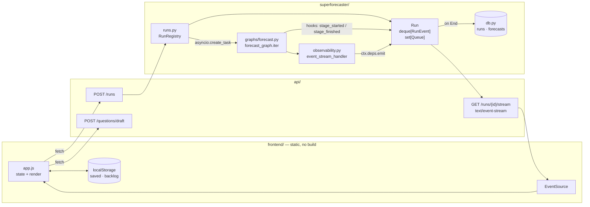
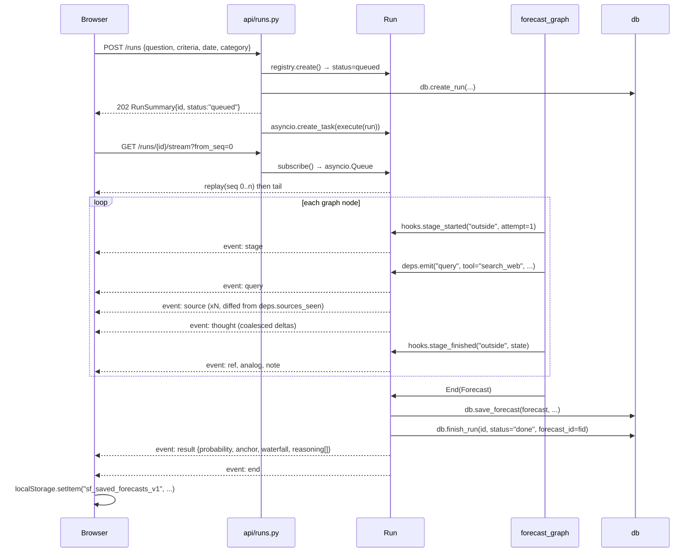
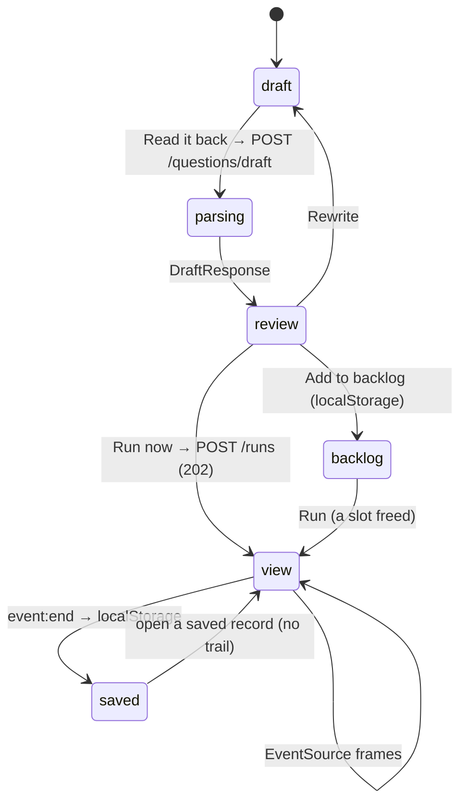

# Spec 3.1 — Streaming the Agent to a Frontend

**Status: shipped.** 299 tests green; the streaming path exercised end-to-end with stubbed
agents through the real registry, the real SSE endpoint, and the real browser. What that does
not prove is the prompts — no live agent has streamed yet.

Connect the forecast graph to a UI that watches it think, live. Replace the Next.js + MUI
frontend with a zero-build static app matching the `Superforecaster.dc.html` design.

**Design source:** `Superforecaster.dc.html` (Design Compiler export). Its `STAGE_META`,
`GRAPH_SPEC`, and 14 event constructors in `buildFullQueue()` are the visual contract this
spec makes real.

**Guiding constraint:** minimal backend change. No prompt edits, no agent rewrites, no new
graph nodes. Every event the UI renders is already a field on an existing Pydantic model or
an existing `pydantic_ai` stream event — the work is projection and transport, not new
reasoning.

---

## 1. Scope

| Area | Change | Size |
|---|---|---|
| `superforecaster/deps.py` | `+3` fields (`emit`, and stage tagging via the run) | 5 lines |
| `superforecaster/observability.py` | forward stream events to `ctx.deps.emit` | ~30 lines |
| `superforecaster/checks.py` | `CheckResult` + `run_forecast_checks_detailed` | ~40 lines |
| `superforecaster/graphs/forecast.py` | `hooks` param, drive with `.iter()` | ~40 lines |
| `superforecaster/runs.py` | **new** — registry, buffer, fan-out, projections | ~320 lines |
| `superforecaster/agents/draft.py` | **new** — freeform text → structured question | ~60 lines |
| `superforecaster/db.py` | **new** `runs` table + 5 functions | ~80 lines |
| `superforecaster/models.py` | `+7` models | ~70 lines |
| `api/runs.py` | **new** — 5 routes incl. SSE | ~120 lines |
| `api/questions.py` | `+1` route (`/questions/draft`) | ~15 lines |
| `api/main.py` | mount `runs` router + `StaticFiles` | 5 lines |
| `frontend/` | **replaced** — Next.js deleted, 4 static files added | — |

**Not in scope.** Streaming the update graph. Streaming the criteria critic. Persisting the
reasoning trail (the design says *"The reasoning trail is not kept locally. Re-run this
question to watch it again."*). Multi-user run ownership.

**ADR conflicts** — see [§9](#9-adr-deltas). ADR 4 (Next.js + MUI) is superseded. ADR 3's
"synchronous inside the request" cost is partially retired.

---

## 2. Architecture



Two emit paths, two granularities:

| Path | Mechanism | Produces |
|---|---|---|
| **Node** | `forecast_graph.iter()` — project typed state after each node | `stage` `sub` `note` `ref` `analog` `adj` `bias` `draft` `check` `route` `result` |
| **Token** | `event_stream_handler` reading `ctx.deps.emit` | `thought` `query` `source` |

Neither touches an agent module or a prompt.

---

## 3. Event Protocol

### 3.1 Lifecycle



### 3.2 Wire format

Plain SSE. No new dependency — a `StreamingResponse` over an async generator.

```
id: 47
event: run
data: {"seq":47,"run_id":"run_c40b91d","type":"query","stage":"outside","attempt":1,
       "ts":"2026-08-04T10:12:03.221Z","payload":{"tool":"search_web","q":"US private companies valued over $50B that listed, by year","hits":null}}

: heartbeat
```

- `id:` is `seq`, so a browser reconnect sends `Last-Event-ID` and resumes automatically.
- `?from_seq=N` does the same explicitly for a fresh page load.
- A `:` comment every 15s keeps proxies from closing an idle stream.
- `event: end` is the last frame; the client closes the `EventSource` on it.

### 3.3 Event catalogue

> **SUPERSEDED by `spec3.3.md` §3.3.** This table is kept for the history of the decision, not
> as a reference. It has been wrong since ADR 29 and the spec3.2 wire change: `ref` and `analog`
> no longer exist (replaced by `claim`), `sub.confidence` / `draft.confidence` /
> `result.confidence` were deleted, `source.snippet` never shipped, and `brief`, `resume`,
> `truncated`, `column` and `exhausted` are missing entirely. The envelope also gained a
> `sub_claim` tag. Read `spec3.3.md` §3.3.

Every `payload` shape, and exactly where the data comes from. **No LLM output changes.**

| `type` | Emitted after | `payload` | Source field |
|---|---|---|---|
| `stage` | node about to run | `{stage, attempt}` | node class name → key |
| `thought` | token deltas, coalesced 80ms | `{delta}` | `PartDeltaEvent` → `ThinkingPartDelta.content_delta` \| `TextPartDelta.content_delta` |
| `query` | tool call starts | `{tool, q, hits: null}` | `FunctionToolCallEvent.part` |
| `source` | tool call returns | `{title, url, domain, published_date, snippet, credibility: null}` | new entries in `deps.sources_seen` |
| `sub` | `Decompose` | `{question, p, knowability, confidence, rationale}` | `Decomposition.sub_claims[i]` |
| `note` | `Decompose` | `{label:"chain_note", text}` | `Decomposition.chain_note` |
| `ref` | `FindBaseRates` | `{name, rate, n, source}` | `OutsideView.reference_classes[i]` |
| `analog` | `FindBaseRates` | `{description, outcome, relevance}` | `ReferenceClass.analogs[*]` |
| `note` | `FindBaseRates` | `{label:"aggregate_base_rate — N%", text}` | `.aggregate_base_rate` + `.disagreement` |
| `adj` | `AdjustInsideView` | `{evidence, dir, mag, flip, noise}` | `InsideView.adjustments[i]` |
| `note` | `AdjustInsideView` | `{label:"steel_man"\|"what_would_change_my_mind", text}` | `InsideView` |
| `bias` | `AdjustInsideView` | `{bias, assessment}` | `InsideView.bias_checks[i]` |
| `draft` | `Synthesize` | `{p, ok:null, note:"Attempt N · <conf> confidence."}` | `Forecast.probability`, `.confidence` |
| `check` | `Critique` | `{check, ok, detail, principle}` | `checks.run_forecast_checks_detailed` |
| `route` | `Critique` → `Synthesize` | `{text}` | blocking-violation count |
| `result` | `End` | see below | `Forecast` + `OutsideView` + `InsideView` |
| `error` | exception | `{message}` | — |
| `end` | always last | `{status, forecast_id}` | — |

`result` payload:

```json
{
  "forecast_id": "…", "probability": 0.03, "anchor": 0.05, "confidence": "medium",
  "reasoning": "…full text; client splits on \\n\\n…",
  "violations": [{"principle": 6, "name": "derivation", "detail": "…", "blocking": true}],
  "waterfall": [
    {"label": "Outside view anchor — 2 reference classes", "delta": null, "running": 0.05, "kind": "anchor"},
    {"label": "Public-market appetite for AI listings",   "delta":  0.02, "running": 0.07, "kind": "up"},
    {"label": "No S-1 or 8-A on file in August",          "delta": -0.03, "running": 0.04, "kind": "down"},
    {"label": "Stated allowance for an unobservable filing", "delta": 0.02, "running": 0.03, "kind": "final"}
  ]
}
```

The waterfall is not new reasoning. It is `aggregate_base_rate + Σ signed non-noise
adjustments`, which is byte-for-byte the arithmetic `checks.check_derivation` already runs
(`checks._signed`). The final row is the **stated** probability, and the gap between the last
running total and it is the derivation slack the critique already measured.

### 3.4 Honest limits of the token path

- `thought` events only appear when the model emits `ThinkingPart` / `TextPart` before its
  structured output. With Anthropic tool-based structured output this is common but **not
  guaranteed**. The UI must render a stage with zero `thought` events without looking broken.
- `query.hits` is `null` at call time. The count arrives implicitly as the `source` events
  that follow; the client counts them.
- `source.credibility` is `null`. The mockup's green/yellow dot has no backend equivalent —
  the client renders a neutral dot. Adding a credibility score is a separate spec.
- `check` events carry `detail` only on **failure**. The seven validators return
  `CheckViolation | None`, so a pass has no message. The client renders the check name alone
  on a pass. Emitting pass-detail requires rewriting all seven validators to return
  `CheckResult` — deliberately out of scope.

---

## 4. Backend — Function Templates

### 4.1 `superforecaster/deps.py`

```python
@dataclass
class ForecastDeps:
    as_of: datetime | None = None
    model: str | None = None
    verbose: bool = False
    sources_seen: list[SourceRef] = field(default_factory=list)

    emit: Callable[[str, dict[str, Any]], None] | None = None
    """Fire-and-forget sink for live run events. Set by `runs.execute`; None everywhere
    else, so the CLI, cron, and evals are byte-identical to today.

    MUST be synchronous and non-blocking — it is called from inside the agent's event
    stream handler, and an await there would stall token delivery. `Run.emit` only
    appends to a deque and does a non-blocking put on each subscriber queue.
    """
```

### 4.2 `superforecaster/observability.py`

Only `_make_event_handler` changes. `run_agent`'s signature is untouched; `ctx.deps` is
already threaded through `agent.run(deps=deps)`.

```python
def _make_event_handler(*, verbose: bool):
    """Logfire + console progress, plus the live UI sink.

    The UI sink reads `ctx.deps.emit` rather than taking a parameter, because `run_agent`
    already forwards `deps` into `agent.run` — routing it through the handler's own
    signature would mean touching all eight `run_<agent>` call sites for nothing.
    """

    async def _handler(ctx: RunContext[Any], stream: AsyncIterable[AgentStreamEvent]) -> None:
        emit = getattr(ctx.deps, "emit", None)
        seen_before = len(getattr(ctx.deps, "sources_seen", ()))

        async for event in stream:
            # ... existing Logfire / console branches unchanged ...

            if emit is None:
                continue

            if isinstance(event, FunctionToolCallEvent):
                emit("query", {"tool": event.part.tool_name,
                               "q": _tool_query_arg(event.part.args),
                               "hits": None})

            elif isinstance(event, FunctionToolResultEvent):
                # Tools append to deps.sources_seen themselves (tools.py:200, :257).
                # Diffing is how a `source` event gets a URL without changing any tool.
                for ref in ctx.deps.sources_seen[seen_before:]:
                    emit("source", _source_payload(ref))
                seen_before = len(ctx.deps.sources_seen)

            elif isinstance(event, PartDeltaEvent):
                delta = getattr(event.delta, "content_delta", None)
                if isinstance(delta, str) and delta:
                    emit("thought", {"delta": delta})

    return _handler


def _tool_query_arg(args: str | dict[str, Any] | None) -> str:
    """The one human-meaningful argument of a search tool.

    `search_web(query)`, `search_wikipedia(topic)`, `find_disconfirming_evidence(claim)` —
    three different parameter names for the same idea. Falls back to a JSON preview.
    """


def _source_payload(ref: SourceRef) -> dict[str, Any]:
    """SourceRef -> the `source` event payload. `domain` is urlparse(ref.url).netloc."""
```

`run_agent` gains one condition: attach the handler when `deps.emit` is set, even if neither
Logfire nor console tracing is on.

```python
trace_events = verbose or logging_active or getattr(deps, "emit", None) is not None
```

### 4.3 `superforecaster/checks.py`

```python
@dataclass(frozen=True)
class CheckResult:
    """One methodology check and whether it passed. `violation` is None on a pass."""
    principle: int
    name: str
    label: str                       # "P6 · derivation" — what the UI shows
    passed: bool
    violation: CheckViolation | None


FORECAST_CHECK_LABELS: tuple[tuple[str, int, str], ...] = (
    ("decomposition",        "P1 · P2 decomposition"),
    ("dragonfly",            "P7 dragonfly"),
    ("derivation",           "P6 derivation"),
    ("signal_vs_noise",      "P9 signal vs noise"),
    ("disconfirming",        "P14 disconfirming"),
    ("bias_coverage",        "P15 bias coverage"),
    ("calibration_hygiene",  "P16 calibration hygiene"),
)
"""Display order for the critique panel. Matches the order the mockup renders."""


def run_forecast_checks_detailed(
    forecast: Forecast,
    decomposition: Decomposition,
    outside: OutsideView,
    inside: InsideView,
    t: CheckThresholds | None = None,
) -> list[CheckResult]:
    """All seven checks, passes included, in FORECAST_CHECKS order.

    Exists because the UI shows a ✓ for a check that passed, and the existing
    `run_forecast_checks` returns only failures — a pass is indistinguishable from a
    check that never ran.
    """


def run_forecast_checks(...) -> list[CheckViolation]:
    """Unchanged behaviour. Now a filter over run_forecast_checks_detailed, so the two
    can never disagree about which checks exist."""
    return [r.violation for r in run_forecast_checks_detailed(...) if r.violation]


def signed_adjustment(a: Adjustment) -> float:
    """Public alias for `_signed`. The waterfall builder needs the same arithmetic
    check_derivation uses; duplicating it would let the chart and the check drift."""
```

### 4.4 `superforecaster/graphs/forecast.py`

```python
STAGE_KEYS: dict[str, str] = {
    "Decompose": "decompose",
    "FindBaseRates": "outside",
    "AdjustInsideView": "inside",
    "Synthesize": "synth",
    "Critique": "critique",
}
"""Node class name -> the stage key the design uses (STAGE_META in the mockup)."""


class GraphHooks(Protocol):
    """Observation points on a graph run. Implemented by `runs.Run`; None in CLI/cron/evals."""

    def stage_started(self, stage: str, attempt: int) -> None: ...
    def stage_finished(self, stage: str, state: ForecastState) -> None: ...


async def run_forecast_graph(
    input: ForecastInput,
    *,
    as_of: datetime | None = None,
    model: str | None = None,
    verbose: bool = False,
    hooks: GraphHooks | None = None,
    emit: Callable[[str, dict[str, Any]], None] | None = None,
) -> tuple[Forecast, list[CheckViolation]]:
    """Run the forecast pipeline. Still the single entry point for API, CLI, and evals.

    With `hooks=None` and `emit=None` this is behaviourally identical to the previous
    implementation — `graph.iter()` drives exactly the same nodes `graph.run()` did, and
    the existing graph tests assert node order against it unchanged.

    `hooks.stage_started` fires BEFORE a node runs; `hooks.stage_finished` fires after,
    with the mutated state, which is where every typed projection comes from. The retry
    edge shows up naturally: Synthesize is yielded twice, and `state.synthesis_attempts`
    distinguishes the attempts.
    """
    deps = ForecastDeps(as_of=as_of, model=model, verbose=verbose, emit=emit)
    state = ForecastState(input=input)

    async with forecast_graph.iter(Decompose(), state=state, deps=deps) as run:
        node = run.next_node
        while not isinstance(node, End):
            stage = STAGE_KEYS[type(node).__name__]
            attempt = state.synthesis_attempts + 1 if stage in ("synth", "critique") else 1
            if hooks:
                hooks.stage_started(stage, attempt)
            node = await run.next(node)
            if hooks:
                hooks.stage_finished(stage, state)
        result = run.result

    forecast = result.output.model_copy(update={...})   # unchanged re-stamping
    return forecast, state.violations
```

### 4.5 `superforecaster/runs.py` — new

```python
"""In-process registry of live forecast runs, and the projection of graph state into
UI events.

Runs are memory-resident by design. The final Forecast persists through the existing
`db.save_forecast`; the reasoning trail does not persist at all, matching the design's
own statement that a trail must be re-run to be re-watched. That decision is what keeps
this spec at zero new event tables.

A server restart therefore loses every in-flight run. `db.init_db` marks orphaned rows
`lost` on boot so the UI can say so instead of hanging on a dead stream.
"""

RunStatus = Literal["queued", "running", "done", "error", "cancelled", "lost"]

THOUGHT_FLUSH_SECONDS = 0.08
HEARTBEAT_SECONDS = 15.0


@dataclass
class Run:
    """One forecast graph execution plus its event buffer and subscriber set."""

    id: str
    input: ForecastInput
    resolution_source: str
    status: RunStatus = "queued"
    stage: str = ""                        # stamped onto every event
    attempt: int = 1
    seq: int = 0
    dropped: int = 0                       # events evicted from the ring buffer
    forecast_id: str | None = None
    error: str | None = None
    created_at: datetime = ...
    ended_at: datetime | None = None
    events: deque[RunEvent] = ...          # maxlen = settings.run_event_buffer
    task: asyncio.Task[None] | None = None
    _subscribers: set[asyncio.Queue[RunEvent]] = ...
    _thought: str = ""
    _thought_deadline: float = 0.0

    # ---- emit ----

    def emit(self, type: str, payload: dict[str, Any]) -> RunEvent:
        """Append an event and fan it out. Synchronous and non-blocking.

        A slow or dead subscriber cannot stall the graph: `put_nowait` on a bounded
        queue, and a QueueFull drops that subscriber's connection rather than the event.
        The dropped client reconnects with `?from_seq=` and replays from the buffer.
        """

    def emit_thought(self, delta: str) -> None:
        """Buffer a token delta, flushing at most every THOUGHT_FLUSH_SECONDS.

        Un-coalesced deltas are one SSE frame per token — thousands of frames per run,
        most of them 3 bytes of payload inside 90 bytes of envelope.
        """

    def flush_thought(self) -> None:
        """Emit whatever `emit_thought` has buffered. Called on the timer, and
        unconditionally before any non-thought event, so ordering is never scrambled."""

    # ---- GraphHooks ----

    def stage_started(self, stage: str, attempt: int) -> None:
        """Set the tag every subsequent event carries, then emit the `stage` event."""

    def stage_finished(self, stage: str, state: ForecastState) -> None:
        """Project the field this node just wrote. Dispatches to the `project_*` below."""

    # ---- subscribers ----

    def subscribe(self) -> asyncio.Queue[RunEvent]: ...
    def unsubscribe(self, q: asyncio.Queue[RunEvent]) -> None: ...

    def replay(self, from_seq: int) -> list[RunEvent]:
        """Buffered events with seq >= from_seq. Prepends a `truncated` event when
        `from_seq` predates the oldest retained event."""

    def summary(self) -> RunSummary: ...


class RunRegistry:
    """Process-wide run table. One instance, module-level."""

    def create(self, input: ForecastInput, resolution_source: str) -> Run:
        """Allocate a Run, write the `runs` DB row, register it. Does NOT start it.

        Raises `SlotsFullError` when `len(self.active()) >= settings.run_max_concurrent`
        — the API turns that into 429. Concurrency is capped because each run is five
        agent invocations with a live search budget.
        """

    def get(self, run_id: str) -> Run | None: ...
    def active(self) -> list[Run]:  """status in (queued, running)"""
    def recent(self, limit: int = 20) -> list[Run]: ...
    def slots_free(self) -> int: ...
    def cancel(self, run_id: str) -> bool:  """Cancel the asyncio task; status -> cancelled."""
    def reap(self) -> int:
        """Drop finished runs older than settings.run_retention_minutes. Called from the
        create path — no extra scheduler job for a dict cleanup."""


registry = RunRegistry()


async def start(input: ForecastInput, resolution_source: str) -> Run:
    """Create a run and schedule `execute`. Returns as soon as the task is scheduled —
    this is the fix for ADR 3's blocking-request cost on the create path."""


async def execute(run: Run) -> None:
    """Drive the graph, persist the forecast, close the stream.

    Terminal in every branch: a raised exception becomes an `error` event and an `error`
    status, never a stream that simply stops. The client cannot distinguish a hung
    server from a silent crash, so the server must always say which.
    """
    run.status = "running"
    try:
        forecast, violations = await run_forecast_graph(
            run.input, hooks=run, emit=lambda t, p: (
                run.emit_thought(p["delta"]) if t == "thought" else run.emit(t, p)
            ),
        )
        fid = db.save_forecast(forecast, resolution_source=run.resolution_source)
        run.forecast_id = fid
        run.emit("result", result_payload(run, forecast, violations, fid))
        run.status = "done"
    except asyncio.CancelledError:
        run.status = "cancelled"
        raise
    except Exception as exc:
        run.status, run.error = "error", str(exc)
        run.emit("error", {"message": str(exc)})
    finally:
        run.ended_at = utc_now()
        db.finish_run(run.id, status=run.status, forecast_id=run.forecast_id, error=run.error)
        run.emit("end", {"status": run.status, "forecast_id": run.forecast_id})


# ---- projections: typed state -> UI events ----

def project_decompose(run: Run, d: Decomposition) -> None:
    """One `sub` per sub-claim, then the `chain_note`."""

def project_outside(run: Run, o: OutsideView) -> None:
    """One `ref` per reference class, its analogs, then the aggregate note.

    The note's text is `o.disagreement` when set — P7's "disagreement is information"
    surfacing in the UI as the sentence the agent was required to write."""

def project_inside(run: Run, i: InsideView) -> None:
    """One `adj` per adjustment (`mag` 0 when `is_noise`), the steel-man and
    what-would-change-my-mind notes, then one `bias` per bias check."""

def project_synth(run: Run, f: Forecast, attempt: int) -> None:
    """One `draft`. `ok` is null — whether it survives is the critique's verdict, and
    the UI colours the card when the following `check` events land."""

def project_critique(run: Run, state: ForecastState, retrying: bool) -> None:
    """Seven `check` events, then a `route` event when Critique is sending this back.

    `retrying` is derived, not guessed: blocking violations exist AND
    synthesis_attempts < MAX_SYNTHESIS_ATTEMPTS — the same condition the node itself uses."""


def build_waterfall(o: OutsideView, i: InsideView, f: Forecast) -> list[dict[str, Any]]:
    """Anchor -> signed adjustments -> stated, as running totals.

    Rows: one `anchor` (aggregate_base_rate), one per non-noise adjustment tagged
    up/down, and a `final` row carrying the stated probability. Uses
    `checks.signed_adjustment`, so this chart and `check_derivation` can never disagree
    about what the evidence implies.
    """


def result_payload(run, forecast, violations, forecast_id) -> dict[str, Any]: ...
def utc_now() -> datetime: ...
```

### 4.6 `superforecaster/agents/draft.py` — new

The design's first screen is one freeform textarea — *"Write it the way you think about it"* —
and the review screen shows five parsed fields. `POST /questions/critique` needs those fields
already separated, so something has to split the text first.

```python
INSTRUCTIONS = """You convert one block of freeform text into a structured forecasting
question. You do NOT judge it, improve it, or forecast it — a later step critiques the
criteria and another step forecasts. Extract only what is there.
...
"""

def build_draft_agent(model: str | None = None) -> Agent[ForecastDeps, DraftedQuestion]: ...
def get_draft_agent() -> Agent[ForecastDeps, DraftedQuestion]: ...

async def run_draft(text: str, deps: ForecastDeps | None = None) -> DraftedQuestion:
    """Freeform text -> question, criteria, resolution date, category, source.

    No tools, single structured call, `get_synthesis_limits()`. Deliberately separate
    from `critic_agent`: extraction and adjudicability are different jobs, and folding
    them together would make `score_critic` measure two things at once (ADR 11).
    """
```

### 4.7 `superforecaster/models.py` — additions

```python
RunStatus = Literal["queued", "running", "done", "error", "cancelled", "lost"]

class RunEvent(BaseModel):
    """One frame on the wire. `payload` is an untyped dict on purpose — fourteen event
    models would be fourteen classes to keep in sync with a JS renderer that reads them
    as JSON regardless. §3.3 is the schema of record."""
    seq: int
    run_id: str
    type: str
    stage: str = ""
    attempt: int = 1
    ts: datetime
    payload: dict[str, Any] = Field(default_factory=dict)

class RunSummary(BaseModel):
    """A row in the 'Running · N of 5' rail."""
    id: str
    question: str
    status: RunStatus
    stage: str
    stage_index: int                  # 0-5, drives the progress bar
    attempt: int
    tool_calls: int
    last_seq: int
    forecast_id: str | None
    error: str | None
    created_at: datetime
    ended_at: datetime | None

class RunSnapshot(BaseModel):
    """Everything a client needs without SSE. Backs the polling fallback."""
    summary: RunSummary
    events: list[RunEvent]

class CreateRunRequest(BaseModel):
    question: str
    resolution_criteria: str
    resolution_date: datetime
    category: str
    resolution_source: str = ""
    max_iterations: int = 5

class DraftQuestionRequest(BaseModel):
    text: str = Field(min_length=20)

class DraftedQuestion(BaseModel):
    question: str
    resolution_criteria: str
    resolution_date: datetime
    category: str
    resolution_source: str = ""

class DraftResponse(BaseModel):
    """One round-trip for the design's parse-then-critique screen."""
    parsed: DraftedQuestion
    critique: CriteriaCritique
```

---

## 5. API

### 5.1 New routes

| Method · path | Auth | Body | Response |
|---|---|---|---|
| `POST /questions/draft` | public | `DraftQuestionRequest` | `DraftResponse` |
| `POST /runs` | **admin** | `CreateRunRequest` | `202` `RunSummary` |
| `GET /runs` | public | — | `list[RunSummary]` |
| `GET /runs/{id}` | public | — | `RunSnapshot` |
| `GET /runs/{id}/stream` | public | — | `text/event-stream` |
| `DELETE /runs/{id}` | **admin** | — | `204` |

`POST /runs` is admin-gated for the same reason `POST /forecasts` is (ADR 5): a run is five
live agent invocations with a search budget. The stream is public — watching costs nothing.

### 5.2 `api/runs.py`

```python
router = APIRouter(prefix="/runs", tags=["runs"])


@router.post("", status_code=status.HTTP_202_ACCEPTED)
async def create_run(body: CreateRunRequest, _: None = Depends(require_admin)) -> RunSummary:
    """Start a forecast run in the background and return immediately.

    202, not 201: nothing is created yet but a job. The client then opens
    `GET /runs/{id}/stream`. 429 when all RUN_MAX_CONCURRENT slots are busy — the design
    handles that by parking the question in its client-side backlog.
    """


@router.get("")
def list_runs(limit: int = 20) -> list[RunSummary]:
    """Active runs first, then recently finished. Backs the home rail."""


@router.get("/{run_id}")
def get_run(run_id: str) -> RunSnapshot:
    """Full buffered event list. The no-SSE fallback and the debugging view."""


@router.get("/{run_id}/stream")
async def stream_run(run_id: str, request: Request, from_seq: int = 0) -> StreamingResponse:
    """Server-sent events for one run: buffered replay, then live tail.

    `Last-Event-ID` overrides `from_seq` so a browser's automatic reconnect resumes
    without the client tracking anything. Replay-then-tail is ordered by subscribing
    BEFORE snapshotting the buffer — the reverse would drop any event emitted in between.

    Terminates on `event: end`, on client disconnect, or on a finished run with nothing
    left to replay. `X-Accel-Buffering: no` and `Cache-Control: no-cache` because an
    nginx in front of this will otherwise buffer the whole stream into one response.
    """


@router.delete("/{run_id}", status_code=status.HTTP_204_NO_CONTENT)
def cancel_run(run_id: str, _: None = Depends(require_admin)) -> None: ...


def _sse(event: RunEvent) -> str:
    """RunEvent -> `id:`/`event:`/`data:` frame. Newlines in payload are JSON-escaped by
    model_dump_json, so no data line can ever break the framing."""
```

### 5.3 `api/questions.py` — one addition

```python
@router.post("/draft")
async def draft_question(body: DraftQuestionRequest) -> DraftResponse:
    """Parse freeform text into a question, then critique its resolvability. Principle 3.

    Two sequential agent calls, ~15-40s total. Deliberately NOT streamed: it is the
    cheapest step in the system and a spinner is a truthful UI for it. If it becomes the
    slowest thing the user waits on, it gets the same SSE treatment as /runs.
    """
    parsed = await run_draft(body.text)
    critique = await run_critique(
        question=parsed.question,
        resolution_criteria=parsed.resolution_criteria,
        resolution_date=parsed.resolution_date,
    )
    return DraftResponse(parsed=parsed, critique=critique)
```

### 5.4 `api/main.py`

```python
app.include_router(runs_router)

# Static frontend, mounted last so it cannot shadow an API prefix.
if (frontend := Path(get_settings().frontend_dir)).is_dir():
    app.mount("/", StaticFiles(directory=frontend, html=True), name="frontend")
```

---

## 6. Database

One new table. **No event rows** — the trail is ephemeral by design (§4.5).

```sql
CREATE TABLE IF NOT EXISTS runs (
    id                  TEXT PRIMARY KEY,
    question            TEXT NOT NULL,
    resolution_criteria TEXT NOT NULL,
    resolution_source   TEXT NOT NULL DEFAULT '',
    resolution_date     TIMESTAMP NOT NULL,
    category            TEXT NOT NULL,
    status              TEXT NOT NULL,          -- queued|running|done|error|cancelled|lost
    forecast_id         TEXT REFERENCES forecasts(id) ON DELETE SET NULL,
    error               TEXT,
    created_at          TIMESTAMP NOT NULL,
    ended_at            TIMESTAMP
);

CREATE INDEX IF NOT EXISTS idx_runs_status     ON runs(status);
CREATE INDEX IF NOT EXISTS idx_runs_created_at ON runs(created_at DESC);
```

`init_db()` is idempotent and already runs on every boot, so this needs no migration
script — it appends to the existing `executescript`, plus one recovery statement:

```sql
-- A run only lives in memory. Anything still 'running' after a restart is gone.
UPDATE runs SET status = 'lost', ended_at = CURRENT_TIMESTAMP
 WHERE status IN ('queued', 'running');
```

```python
def create_run(run_id, question, resolution_criteria, resolution_source,
               resolution_date, category) -> None:
    """Insert a queued run. Written before the task is scheduled so a crash between the
    two shows up as a `lost` run rather than as nothing at all."""

def finish_run(run_id, *, status, forecast_id=None, error=None) -> None:
    """Terminal state + ended_at. Idempotent."""

def get_run(run_id: str) -> dict | None: ...

def list_runs(status: RunStatus | None = None, limit: int = 20) -> list[dict]:
    """Newest first. Survives restarts, which the in-memory registry does not — this is
    what lets the UI show a `lost` run instead of a spinner that never resolves."""

def mark_orphaned_runs_lost() -> int:
    """Called from init_db. Returns how many were reaped."""
```

Existing tables are untouched. `forecasts` still receives exactly one row per completed run,
via the existing `save_forecast`.

---

## 7. Frontend

### 7.1 Decision

Delete `frontend/` (Next.js 15 + MUI v6 + 8 components + 6 routes). Replace with four static
files, no `package.json`, no `node_modules`, no build step.

**Why replace rather than restyle:** the design ships its own token system (`--pv-*`
variables, a light/dark toggle, a bespoke stream timeline). Layering that over MUI means
fighting emotion's specificity for every one of the fourteen event renderers, and ADR 4's own
stated rule was "no competing style system." The rationale that bought MUI — a consistent
component set without building a design system — is void once a design system arrives.

**What is lost, explicitly:** server-side rendering, and with it the indexability of public
forecast pages that was ADR 4's other justification. Forecast pages become client-rendered.
If indexability matters later, the fix is prerendering the `/forecasts/{id}` read view, not
reinstating Next.js for the streaming view.

**Vanilla, not React:** the app is one page, one state object, and fourteen small renderers.
React from a CDN would add a network dependency and an import map for a component tree three
levels deep. A 30-line `h()` helper covers it.

### 7.2 Files

```
frontend/
  index.html      markup shell + <style> (design tokens lifted from Superforecaster.dc.html)
  app.js          state machine, SSE client, renderers          (~650 lines)
  api.js          fetch wrappers + EventSource helper           (~90 lines)
  admin.html      moderation tables over the existing admin routes (~200 lines, self-contained)
```

Served by FastAPI at `/` (§5.4). `docker-compose.yml` loses its `frontend` service; the `api`
service gains `FRONTEND_DIR=/app/frontend`.

### 7.3 Screens



Two things stay client-side, exactly as the design has them: the **backlog**
(`sf_backlog_v1`) and the **saved results** (`sf_saved_forecasts_v1`). Neither needs a server
— the backlog is a personal queue, and a saved result is a cached copy of a
`ForecastRecord` the server already has under `forecast_id`.

The criteria gate (*"Blocked: the criteria have to be adjudicable before a run is worth its
cost"*) is **client-side only**. `POST /runs` accepts any question; the UI refuses to send
one whose critique came back `is_resolvable: false` until the user applies the rewrite or
explicitly keeps their own. Enforcing it server-side would make the CLI unable to run an
un-critiqued question.

### 7.4 `api.js`

```js
/** Base URL. Same-origin when served by FastAPI; overridable for `npx serve` dev. */
const API = window.SF_API_URL || "";

/** @returns {Promise<any>} Throws {status, detail} on a non-2xx. */
async function req(path, {method = "GET", body, admin = false} = {})

/** POST /questions/draft — freeform text -> {parsed, critique}. */
async function draftQuestion(text)

/** POST /runs. Throws {status: 429} when all slots are busy — caller parks it in the backlog. */
async function createRun(fields)

/** GET /runs -> RunSummary[]. Polled every 4s while the home rail is visible. */
async function listRuns()

/** GET /forecasts/{id} -> ForecastRecord. */
async function getForecast(id)

/**
 * Open the SSE stream for a run.
 *
 * Resumption is the whole contract: `lastSeq` is tracked on every frame, and the browser's
 * own reconnect sends Last-Event-ID, so a dropped connection replays exactly the gap. A
 * closed laptop lid must not produce a run with a hole in its timeline.
 *
 * @param {string} runId
 * @param {(e: RunEvent) => void} onEvent
 * @param {() => void} onEnd   fired on `event: end` or a terminal status
 * @returns {() => void}       detach
 */
function openRunStream(runId, onEvent, onEnd)
```

### 7.5 `app.js`

```js
/** @typedef {{
 *   phase: "draft"|"parsing"|"review"|"view",
 *   theme: "light"|"dark",
 *   view: "timeline"|"graph"|"split",
 *   draftText: string,
 *   fields: DraftedQuestion|null,
 *   critique: CriteriaCritique|null,
 *   applied: boolean, dismissed: boolean,
 *   runs: Record<string, LocalRun>,   // runId -> {summary, stages, result, lastSeq}
 *   openId: string|null,
 *   saved: SavedForecast[],           // localStorage sf_saved_forecasts_v1
 *   backlog: BacklogItem[],           // localStorage sf_backlog_v1
 *   sel: string|null, expanded: Record<string, boolean>
 * }} State */

// ---- state ----
function loadState()                     /** Hydrate saved + backlog from localStorage. */
function persist(key, value)             /** Write-through; swallows quota errors. */
function setState(patch)                 /** Shallow merge, then render(). */

// ---- flow ----
async function onReadItBack()            /** draft -> parsing -> review. */
function onApplyRewrite()                /** critique.suggested_criteria -> fields. */
function onKeepMine()                    /** Dismiss the rewrite; unblocks Run now. */
async function onRunNow()                /** POST /runs; 429 -> onQueueToBacklog() + a note. */
function onQueueToBacklog()              /** Park the current fields in sf_backlog_v1. */
async function onRunFromBacklog(id)      /** Pop from backlog, POST /runs, open the stream. */

// ---- streaming ----
/**
 * Fold one event into `state.runs[runId]`.
 *
 * `stage` opens a new stage group — keyed by `stage + "-" + attempt`, which is what makes
 * the Synthesize retry render as "Synthesize · attempt 2" instead of overwriting attempt 1.
 * `thought` appends its delta to the trailing thought item of the current group, creating
 * one if the last item is not a thought. Everything else appends as a new item.
 */
function applyEvent(runId, ev)

/** `result` -> the saved record. Writes localStorage so a closed tab keeps the outcome. */
function onResult(runId, payload)

// ---- render ----
function h(tag, attrs, ...children)      /** 30-line hyperscript. */
function render()                        /** Full re-render into #root. Sub-ms at this size. */

function renderHome(s)                   /** Running rail + Saved list + Backlog. */
function renderDraft(s) / renderParsing(s) / renderReview(s)
function renderRun(s, run)               /** Header, result card, trail, view switcher. */
function renderResultCard(result)        /** Probability, lean, movement vs anchor, confidence. */
function renderWaterfall(rows)           /** result.waterfall -> anchor→adjustments→stated bars. */
function renderReasoning(text)           /** Split on \n\n into paragraphs. */
function renderGraph(run)                /** The five GRAPH_SPEC nodes; dim until started. */
function renderStage(stage)              /** One collapsible stage group. */

/** Event type -> renderer. The one table that must stay in step with §3.3. */
const EVENT_RENDERERS = {
  thought, sub, note, query, source, ref, analog, adj, bias, check, draft, route,
};
```

### 7.6 Event → DOM

| Event | Rendered as (design element) |
|---|---|
| `stage` | new numbered stage card; `busy` border until the next `stage` |
| `thought` | typewriter paragraph with a trailing `▍` while streaming |
| `query` | tool chip — `search_web` + the quoted query + a live hit count |
| `source` | favicon row, title, domain; a snippet turns it into the `cite` block |
| `sub` | sub-claim row: `%`, confidence, question, knowability tag, rationale |
| `note` | labelled block (`chain_note`, `aggregate_base_rate — 5%`, `steel_man`, …) |
| `ref` | reference-class row with a proportional base-rate bar and `n=` |
| `analog` | YES/NO chip + description + relevance |
| `adj` | signed magnitude, evidence, flip test; `is_noise` renders `0 pts` at 60% opacity |
| `bias` | bias name + assessment |
| `check` | `✓`/`✗` + label; failures show `detail` on a red fill |
| `draft` | probability card, yellow-bordered until the checks land |
| `route` | `↩` retry banner |
| `result` | closes the trail, fills the result card and waterfall |

### 7.7 Design tokens

Lifted verbatim from the mockup's `<style>` block: `--pv-bg`, `--pv-surface{,-2,-3}`,
`--pv-border{,-2,-strong}`, `--pv-text{,-2,-3}`, `--pv-brand{,-fill,-fg}`,
`--pv-green{,-fill}`, `--pv-red{,-fill,-soft}`, `--pv-yellow{,-fill}`. Theme switches by
`data-theme` on `<html>`, persisted to localStorage.

---

## 8. Configuration

| Variable | Purpose | Default |
|---|---|---|
| `RUN_MAX_CONCURRENT` | Live forecast runs allowed at once | `5` |
| `RUN_EVENT_BUFFER` | Events retained per run for replay | `5000` |
| `RUN_RETENTION_MINUTES` | How long a finished run stays in memory | `60` |
| `FRONTEND_DIR` | Static files to serve at `/`; unset disables the mount | `../frontend` |

All four go through `config.get_settings()` like everything else (ADR 14). No new
dependencies in `pyproject.toml` — SSE is a `StreamingResponse` over an async generator.

---

## 9. ADR Deltas

| ADR | Effect | Note |
|---|---|---|
| **4** — Next.js + MUI | **Superseded** | Replaced by a zero-build static app. Records what is lost: SSR and indexability of public forecast pages. New ADR 24. |
| **3** — FastAPI | **Amended** | Its "known cost" (a forecast graph running synchronously inside the request) no longer applies to the create path. `POST /forecasts` keeps the old behaviour for API clients; `POST /runs` is the async one. |
| **2** — SQLite | Unchanged | One new table, no event rows. |
| **5** — API key auth | Unchanged | `POST /runs` and `DELETE /runs/{id}` are admin; the stream is public. |
| **11/12/13** — agents, graphs, checks | Unchanged | No agent, prompt, or node was modified. `checks.py` gains a reporting function; the seven validators are untouched. |
| **new 24** | Runs are memory-resident; the trail is not persisted | A restart loses in-flight runs, and `db.runs` records that as `lost` rather than hiding it. Persisting the trail means an event table and a replay path for something the design says should be re-run instead. |
| **new 25** | SSE, not WebSockets | The data is one-directional. SSE gets automatic reconnection with `Last-Event-ID`, works through ordinary HTTP proxies, and needs no new dependency. Cancel is a `DELETE`, which is the only client→server message there is. |

---

## 10. Tests

Additions to the 221-test suite. All offline, no keys — ADR 19 holds.

```
tests/test_runs_registry.py
  emit assigns monotonic seq and stamps the current stage + attempt
  ring buffer evicts oldest; replay(from_seq) prepends `truncated` when the gap is real
  subscribe/unsubscribe; a full subscriber queue drops that subscriber, not the event
  slots_full raises at RUN_MAX_CONCURRENT; reap drops finished runs past retention
  emit_thought coalesces within the window and flushes before any non-thought event

tests/test_runs_projection.py
  Decomposition -> N `sub` + 1 `note`; OutsideView -> N `ref` + analogs + aggregate note
  InsideView -> adjustments, 2 notes, 5 `bias`; a noise adjustment emits mag 0
  Critique -> exactly 7 `check` events in FORECAST_CHECK_LABELS order, passes included
  a blocking violation on attempt 1 emits `route`; on attempt 2 it does not
  build_waterfall final row == forecast.probability, and its running totals match
      checks.check_derivation's implied value

tests/test_graph_stream.py
  run_forecast_graph(hooks=None) visits the identical node sequence as before   <- regression
  hooks record stage_started/finished for all five stages, Synthesize twice on a retry
  stage_started fires before the node's agent is called (ordering, not just presence)

tests/test_api_runs.py
  POST /runs -> 202 + a queued RunSummary; 401 without an admin token
  POST /runs -> 429 when slots are full
  GET /runs/{id}/stream replays a buffered run and terminates on `event: end`
  Last-Event-ID resumes at the right seq; from_seq does the same
  a run that raises emits `error` then `end` — never a silently truncated stream
  DELETE cancels and sets status=cancelled

tests/test_db_runs.py
  create_run/finish_run round-trip; finish_run is idempotent
  mark_orphaned_runs_lost flips queued+running and leaves terminal rows alone

tests/test_checks_detailed.py
  run_forecast_checks_detailed returns 7 results in order, passes included
  run_forecast_checks output is unchanged for every existing fixture   <- regression
```

Stubs: a `FakeGraph` yielding scripted nodes, and a `ForecastState` factory. No test starts an
agent.

---

## 11. Build Order — as built

Each step left the suite green.

1. `checks.py` — `CheckResult`, `FORECAST_CHECKS`, `run_forecast_checks_detailed`,
   `signed_adjustment`. Pure, no callers change.
2. `models.py` — the seven new models.
3. `db.py` — `runs` table, five functions, orphan recovery in `init_db`.
4. `graphs/forecast.py` — `hooks`/`emit` params, drive with `.iter()`.
   **Gate: existing graph tests pass untouched.**
5. `deps.py` + `observability.py` — the `emit` field and the three handler branches.
6. `runs.py` — registry, buffer, projections, `execute`.
7. `agents/draft.py` + `POST /questions/draft`.
8. `api/runs.py` + router mount. **Gate: `curl -N` a real run and watch the frames.**
9. `frontend/index.html` + `api.js` + `app.js`.
10. `frontend/admin.html`; delete the Next.js tree; update `docker-compose.yml` and
    `frontend/Dockerfile`.
11. Update `spec/CURRENT_STATE.md` and `spec/ADR.md`. Move this spec to `spec/implemented/`.

Steps 1–8 shipped a working streaming API with no UI. Step 8's gate was the real one: it is the
first moment anything in this project has been watched running.

### What the build changed from this plan

- **ADRs 24–27, not 24–25.** The run-lifetime decision and the projection decision were each
  substantial enough to record separately. ADR 3 and ADR 8 were amended rather than superseded.
- **`FORECAST_CHECKS` became `FORECAST_CHECK_LABELS`** and carries the principle number, since
  a check can report a different `name` than the slot it occupies (`check_decomposition`
  returns "knowability" for its P2 arm).
- **`checks.implied_probability` was extracted** alongside `signed_adjustment`, so the
  waterfall and `check_derivation` share the clamp as well as the arithmetic.
- **`Run.state` was added.** `run_forecast_graph` returns the forecast and its violations but
  not the state, and the final waterfall needs the outside view's anchor and the inside view's
  adjustments. Holding the reference the hooks already receive was cheaper than widening that
  return type for one caller.
- **`_finalize_if_orphaned` was added** after a test caught it: a task cancelled before the
  event loop gives it a slice has its coroutine closed rather than entered, so `execute`'s
  `finally` never runs and the run sat `queued` forever with a stream nobody would ever close.
- **`pollRuns` no longer copies summaries onto streaming runs.** Poll results are seconds
  ahead of the frames still being delivered, so copying them let the rail claim "Synthesize
  4/5" while the trail was still drawing base rates.
- **`create_run` is `async`.** A sync handler runs in FastAPI's threadpool, where
  `asyncio.create_task` has no running loop.
- **Admin auth is 403, not 401** — matching the existing `require_admin`.
- **`admin.css` was split out** of `admin.html` so the two pages cannot drift into slightly
  different greys.

### Follow-up round (2026-08-04)

Four rendering bugs and three feature requests, after the first look at the running UI.

**Bugs.** `render()` rebuilt the whole document on every poll tick and every SSE frame:
renders are now coalesced to one per animation frame, the 4s poll only re-renders when it
learned something, and focus/caret/scroll survive any render that does happen (matched by
`data-focus`, not by position). `replaceChildren` stringifies nulls instead of skipping them
the way `h()` does — that was the literal "null" on the page, in both `index.html` and
`admin.html`. The flicker was not a repaint: `.ev { animation: pv-in }` replayed the fade-in
on the entire trail at once, so the animation moved to `.ev.fresh`, added only to events above
the previous render's high-water mark. Saved runs gained a delete affordance.

**Trail persistence — reverses the original §4.5 decision.** See ADR 26 as amended: trails are
written to localStorage on `end`, capped at 12 with oldest-first eviction and quota-aware
retry, and recovered from local storage → server snapshot → an honest "no stored trail".
`hydrateRun` is guarded by an in-flight set because it is called from `renderRun`, which runs
every frame — without it a run missing from both places would fetch forever.

**Check evidence.** `checks.check_evidence` is a new pure function beside the validators
returning the material each verdict rests on. The seven validators are untouched.

**Retry brief.** `synthesize.retry_brief` returns the literal text a second attempt receives,
built from the same formatters the prompt uses; `_arithmetic_block` was extracted so the shown
text cannot drift from the sent text. Emitted from `Run.stage_started` when Synthesize begins
attempt 2, ordered before the corrected draft.

---

## 12. Known Limits

- **A restart kills in-flight runs.** Accepted (ADR 26). The DB records them as `lost`.
- **Single process.** The registry is in-memory, so two uvicorn workers each see half the
  runs. `--workers 1` until that is a real constraint; the fix is Redis pub/sub behind the
  same `Run.emit`/`subscribe` interface.
- **`thought` events are best-effort** (§3.4). A stage can legitimately show tool calls and
  results with no narration.
- **No credibility scores and no pass-detail on checks** (§3.3) — both are backend features
  the design assumes and this spec does not add.
- **No live agent has streamed.** Everything verified used stubbed agents. The transport and
  the projections are proven; the prompts are not.
- **The prompts are still unmeasured.** This spec makes a run *visible*, which is not the
  same as making it *good*. `spec/planned/spec4.md` remains the open accuracy question, and
  watching a run stream is not evidence that its number is right.
