# Decompose the forecaster into agents + graphs, and make every step testable

## Context

Today the whole forecasting pipeline is two prompts in one file. `superforecaster/agent.py` runs a
research agent then a synthesis agent, glued by a `try/except` in `run_forecast()`. Of the 16
principles in `spec/superforecasting_methodology.md`, most exist only as English sentences inside
two large prompt strings. Nothing verifies the agent followed them.

That has three consequences:

1. **Nothing is individually testable.** There is no way to test "does it find base rates" without
   running the whole pipeline against a live LLM.
2. **Several principles are unfalsifiable.** They are instructions to the model, not properties of
   the output. If the model ignores its own base rate, nothing catches it.
3. **There is no scorecard.** `backend/test_forecasting_baseline/run_baseline.py` has 66 resolved
   questions with known outcomes, but the file crashes on import (`datetime.date(2022, 2, 1)` after
   `from datetime import datetime`) and `baseline_forecasting()` is `pass`.

The change: split the pipeline into one agent per methodology step, wire them with `pydantic_graph`,
convert the checkable principles into **pure functions over the structured output** with tunable
thresholds, and build two live scoring harnesses — end-to-end over the 66 golden questions, and
per-agent component tests with their own golden data.

---

## Conflict with TECHNICAL_DIRECTION.md — flagging before proceeding

`spec/TECHNICAL_DIRECTION.md:30-36` currently says:

> **Decision:** One Pydantic AI agent that runs decomposition, research, and synthesis in a single structured call.
> **What this rules out:** Separate specialized sub-agents (Decomposer, Researcher, Synthesizer).

This plan reverses that decision. Per `.claude/commands/update-direction.md` ("If a decision reverses
a previous one, remove or update the old entry rather than appending a correction"), Stage 7 rewrites
that section and the "Three Agents, One Tool Set" section rather than appending to them.

---

## What gets built

```
backend/config.py        EDIT   — add CheckThresholds; every check threshold is env-tunable
backend/superforecaster/
  models.py              EDIT   — add ~16 models, all models stay in one file
  tools.py               EDIT   — tools become as_of-aware; add find_disconfirming_evidence
  checks.py              NEW    — pure validators. Principles 6,7,9,11,12,14,15,16 live here
  model_garden.py        NEW    — model registry keyed by training cutoff; picks clean models
  model_garden.json      NEW    — the registry data: model id, provider, training cutoff, availability
  __main__.py            EDIT   — new CLI verbs
  cron.py                EDIT   — call update_graph instead of refresh/resolution
  agents/                NEW
    __init__.py
    decompose.py                — principles 1, 2
    outside_view.py             — principles 4, 7
    inside_view.py              — principles 5, 9, 14, 15
    synthesize.py               — principles 6, 8, 16
    critic.py                   — principle 3   (standalone, not in a graph)
    resolution.py               — has it resolved?  (moved from superforecaster/resolution.py)
    update.py                   — principles 10, 11, 12
    postmortem.py               — principle 13   (standalone, not in a graph)
  graphs/                NEW
    __init__.py
    state.py                    — ForecastState, UpdateState, ForecastDeps
    forecast.py                 — the 5-node forecast graph
    update.py                   — the 4-node daily update graph
  evals/                 NEW
    golden_questions.json       — the 66 questions, fixed and versioned  (end-to-end)
    components/*.json           — per-agent golden data. Ships as `[]`, filled in later
    runner.py                   — end-to-end harness
    components.py               — per-agent harness + the eight scorers
    scoring.py                  — Brier, calibration buckets, process score, round-number rate
    import_metaculus.py         — one-off importer

  agent.py               DELETE — replaced by agents/ + graphs/forecast.py
  refresh.py             DELETE — replaced by agents/update.py + graphs/update.py
  resolution.py          DELETE — moved to agents/resolution.py

backend/api/
  forecasts.py           EDIT   — run_forecast(...) -> run_forecast_graph(...)
  questions.py           EDIT   — same, plus new POST /questions/critique
backend/tests/
  test_checks.py         NEW    — pure functions, no network
  test_graph_forecast.py NEW    — full graph under FunctionModel
  test_graph_update.py   NEW
  test_tools_backdating.py NEW
  test_model_garden.py   NEW
  test_agent_forecast.py DELETE — superseded

spec/change_specs/SPEC_IN_PROGRESS.md   WRITE FIRST — this plan, in house style, before any code
spec/TECHNICAL_DIRECTION.md             EDIT — reverse the single-agent decision, add model garden
spec/CURRENT_STATE.md                   EDIT — per CLAUDE.md
```

---

## Diagram

```mermaid
flowchart TD
    subgraph FG["graphs/forecast.py — ForecastGraph"]
        D[Decompose<br/>agents/decompose.py<br/>P1, P2] --> B[FindBaseRates<br/>agents/outside_view.py<br/>P4, P7]
        B --> I[AdjustInsideView<br/>agents/inside_view.py<br/>P5, P9, P14, P15]
        I --> S[Synthesize<br/>agents/synthesize.py<br/>P6, P8, P16]
        S --> C{Critique<br/>checks.run_forecast_checks<br/>pure function}
        C -->|blocking violations, attempt 1| S
        C -->|clean, or attempt 2| E([End: Forecast])
    end

    subgraph UG["graphs/update.py — UpdateGraph"]
        R[CheckResolved<br/>agents/resolution.py] -->|resolved| E2([End: flagged])
        R -->|not resolved| U[ApplyBayes<br/>agents/update.py<br/>P10, P11]
        U --> G{GuardUpdate<br/>checks.run_update_checks<br/>pure function, P12}
        G -->|large move, unverified| V[VerifyLargeMove<br/>agents/update.py deep pass<br/>P12]
        V --> G
        G -->|verified or small| E3([End: UpdateOutcome])
    end

    subgraph SA["Standalone — no graph"]
        Q[agents/critic.py<br/>P3]
        P[agents/postmortem.py<br/>P13]
    end
```



---

## Design notes on the checks

The four decisions below are the ones most likely to be misread later, so the reasoning is recorded
inline rather than left in commit history.

### `check_granularity` is deliberately absent

A single forecast can legitimately land on 0.60. Principle 8 is about *rounding habits*, which is a
property of a distribution, not of one number. Failing an individual forecast for being 0.60 punishes
a correct answer.

**Per-forecast:** the granularity check is deleted. In its place, `check_derivation` verifies the
final probability is actually derived from the stated base rate and adjustments (see P6 below). If
the model reasons its way to exactly 0.60, that is fine and it passes.

**Per-run:** granularity becomes a statistic in the scorecard.

```python
def round_number_rate(scores: list[QuestionScore]) -> float:
    """P8. Fraction of forecasts landing on an exact multiple of 0.05.
    On a 2-decimal grid, ~21 of 101 possible values are multiples of 0.05, so
    an unbiased forecaster sits near 0.21. A rate near 0.60 means the model is
    rounding to comfortable numbers. Reported always; flagged when it exceeds
    CheckThresholds.round_number_rate (default 0.40)."""
```

That is measurable, honest, and does not penalise any individual answer.

### Every threshold is config, not a literal

New in `backend/config.py`, matching the existing frozen-dataclass + `os.getenv` style:

```python
@dataclass(frozen=True, slots=True)
class CheckThresholds:
    """Every tunable number used by checks.py. Read fresh each call so tests can monkeypatch."""
    reference_class_disagreement: float = 0.20   # P7   CHECK_RC_DISAGREEMENT
    reference_class_agreement: float   = 0.10    # P16  CHECK_RC_AGREEMENT
    calibration_floor: float           = 0.02    # P16  CHECK_CALIBRATION_FLOOR
    calibration_ceiling: float         = 0.98    # P16  CHECK_CALIBRATION_CEILING
    large_move: float                  = 0.75    # P12  CHECK_LARGE_MOVE
    derivation_slack: float            = 0.05    # P6   CHECK_DERIVATION_SLACK
    round_number_rate: float           = 0.40    # P8   CHECK_ROUND_NUMBER_RATE (run-level)
    min_probability_delta: float       = 0.03    # P10  MIN_PROBABILITY_DELTA (already exists)

def get_check_thresholds() -> CheckThresholds:
    """Reads every CHECK_* env var, falling back to the defaults above."""
```

Every check function takes `t: CheckThresholds | None = None` and defaults to `get_check_thresholds()`.
No magic numbers survive in `checks.py`.

### A large move triggers a deeper search, not a failure

You're right that genuinely decisive news exists — FTX filing, SVB seizure. A hard cap would reject
the correct behaviour. So the large-move threshold defaults to **0.75**, and crossing it routes to a
new graph node rather than producing a violation:

```python
@dataclass
class VerifyLargeMove(BaseNode[UpdateState, ForecastDeps, UpdateOutcome]):
    async def run(self, ctx) -> GuardUpdate:
        """P12. Reached only when |posterior - prior| > thresholds.large_move and
        state.verify_attempts == 0. Re-runs the update agent with a deeper-search instruction:
        corroborate the decisive claim from a second independent source, and search
        explicitly for evidence the claim is wrong or premature. Writes the revised
        UpdateDecision and returns to GuardUpdate, which cannot route here twice."""
```

The move survives if it is real; it gets walked back if the first pass over-reacted to one headline.
`check_update_magnitude` keeps only its *directional* half, which is unambiguous.

### The Bayes check, with the math spelled out

```python
def check_bayes_direction(
    d: UpdateDecision, t: CheckThresholds | None = None
) -> CheckViolation | None:
    """P11. Verifies the model's probability move agrees with its own stated likelihoods.

    The agent reports, for each new fact E, two numbers:
        p_if_true  = P(E | H)     how likely this fact is if the hypothesis is TRUE
        p_if_false = P(E | not H) how likely this fact is if the hypothesis is FALSE

    Bayes in odds form. Odds are probability restated as a ratio:
        odds(p) = p / (1 - p)          0.60 -> 1.5      ("3-to-2 on")

    For one piece of evidence:
        posterior_odds = prior_odds * (p_if_true / p_if_false)

    That ratio is the likelihood ratio, LR. Its meaning is direct:
        LR > 1  the fact is more expected in a true world  -> pushes probability UP
        LR = 1  equally expected either way -> the fact is NOISE, moves nothing (this is P9)
        LR < 1  more expected in a false world -> pushes probability DOWN

    Independent evidence multiplies, so several facts compose as:
        posterior_odds = prior_odds * LR_1 * LR_2 * ... * LR_n

    Multiplying many small numbers underflows and is awkward to reason about, so we take
    logs, which turns the product into a sum:
        log(posterior_odds) = log(prior_odds) + SUM_i log(LR_i)

    That sum is the total weight of evidence. Its SIGN is all this check needs:
        SUM log(LR) > 0  ->  evidence is net-confirming  ->  posterior MUST be > prior
        SUM log(LR) < 0  ->  evidence is net-disconfirming -> posterior MUST be < prior
        SUM log(LR) = 0  ->  evidence is net-neutral      ->  posterior MUST equal prior

    We check the sign, not the magnitude. Requiring the agent to hit the exact Bayesian
    posterior would be too strict — the methodology says the discipline of asking the
    question provides most of the value, and formal Bayes is not required. But an agent
    that says "this evidence makes the outcome more likely" and then LOWERS its probability
    has contradicted itself, and that is always an error worth catching.

    Guards: p_if_false == 0 gives an infinite LR, so it is clamped to 1e-6. Evidence with
    p_if_true == p_if_false contributes log(1) = 0 and is correctly ignored.

    Returns a violation when the sign of the probability move disagrees with the sign of
    the total weight of evidence.
    """
```

---

## Function inventory

### `superforecaster/models.py` — new models

```python
Knowability = Literal["researchable", "judgment"]
Direction   = Literal["up", "down", "neutral"]

class SubClaim(BaseModel):
    """One Fermi-ized sub-question. P1 + P2."""
    question: str
    probability: float          # Field(ge=0, le=1)
    knowability: Knowability    # P2 — researchable vs judgment-required
    rationale: str

class Decomposition(BaseModel):
    """Output of decompose_agent. P1."""
    sub_claims: list[SubClaim]  # Field(min_length=3, max_length=6)
    chain_note: str             # how the sub-claims combine into the whole

class ReferenceClass(BaseModel):
    """One outside-view lens. P4 + P7."""
    name: str
    base_rate: float            # Field(ge=0, le=1)
    sample_size: int            # Field(ge=1) — how many analogous cases the rate is drawn from
    source: str
    analogs: list[HistoricalAnalog]

class OutsideView(BaseModel):
    """Output of outside_view_agent. P4 + P7."""
    reference_classes: list[ReferenceClass]   # Field(min_length=2)  <- P7 half-enforced by schema
    aggregate_base_rate: float                # Field(ge=0, le=1)
    disagreement: str                         # "" when classes agree; P7 says disagreement is information

class Adjustment(BaseModel):
    """One inside-view move away from the base rate. P5 + P9."""
    evidence: str
    direction: Direction
    magnitude: float            # Field(ge=0, le=0.5) — probability points, not a multiplier
    flip_test: str              # P9 — "if I saw the opposite, my estimate would ___"
    is_noise: bool              # True when the flip test shows the evidence is not decision-relevant

class BiasCheck(BaseModel):
    """P15 — one named bias and how it was countered."""
    bias: Literal["confirmation", "availability", "narrative", "scope_insensitivity", "anchoring"]
    assessment: str

class InsideView(BaseModel):
    """Output of inside_view_agent. P5, P9, P14, P15."""
    adjustments: list[Adjustment]      # Field(min_length=1)
    steel_man: str                     # P14 — strongest case for the opposite conclusion
    what_would_change_my_mind: str     # P14
    bias_checks: list[BiasCheck]       # Field(min_length=5) — all five, always

class CheckViolation(BaseModel):
    """One failed methodology check. Produced by checks.py, never by an LLM."""
    principle: int              # 1-16, indexes into superforecasting_methodology.md
    name: str
    detail: str
    blocking: bool              # True -> Critique sends it back to Synthesize

class EvidenceItem(BaseModel):
    """P11 — likelihood assessment for one new fact. See check_bayes_direction for the math."""
    fact: str
    source: str
    p_if_true: float            # Field(ge=0, le=1)  P(seeing this | hypothesis true)
    p_if_false: float           # Field(ge=0, le=1)  P(seeing this | hypothesis false)

class UpdateDecision(BaseModel):
    """Output of update_agent. P10, P11, P12."""
    evidence: list[EvidenceItem]
    prior: float
    posterior: float            # Field(ge=0, le=1)
    reasoning: str
    verified_large_move: bool = False   # set by the VerifyLargeMove node

class UpdateOutcome(BaseModel):
    """Final output of UpdateGraph."""
    flagged_resolved: bool
    updated: bool
    new_probability: float | None
    violations: list[CheckViolation]
    reason: str

class CriteriaCritique(BaseModel):
    """Output of critic_agent. P3. Powers the frontend suggestion box."""
    is_resolvable: bool
    ambiguities: list[str]
    missing: list[str]                  # e.g. "no resolution source", "no timezone on date"
    suggested_criteria: str
    suggested_resolution_source: str

class PostMortem(BaseModel):
    """Output of postmortem_agent. P13."""
    process_errors: list[str]           # what the reasoning got wrong
    outcome_noise: list[str]            # what was genuinely unknowable at forecast time
    verdict: Literal["sound_process", "flawed_process", "insufficient_evidence"]
    lesson: str

class GoldenQuestion(BaseModel):
    """One row of evals/golden_questions.json."""
    id: str
    question: str
    resolution_criteria: str
    asked_at: datetime          # the as_of date — tools may not see past this
    resolution_date: datetime
    outcome: float              # 0.0 or 1.0
    category: str
    baseline_prior: float       # the number to beat
    contamination_risk: int     # 1 = obscure, 3 = certainly in training data

class SourceRef(BaseModel):
    """One external source the agent saw. Exists so leakage is auditable, not assumed absent."""
    url: str
    published_date: datetime | None
    tool: str
    as_of: datetime | None

class QuestionScore(BaseModel):
    id: str
    forecast_probability: float
    outcome: float
    brier: float
    baseline_brier: float
    violations: list[CheckViolation]
    model_used: str                     # which garden entry ran this question
    model_cutoff: date | None           # its training cutoff — proof the run was clean
    leaked_sources: list[SourceRef]     # must be empty; non-empty means the tool clamp has a bug
    error: str | None
    skipped: str | None                 # e.g. "no available model with a cutoff before 2020-11-04"

class ComponentCase(BaseModel):
    """One row of evals/components/<agent>.json. `expect` is agent-specific, hence dict."""
    id: str
    agent: str
    input: dict
    expect: dict
    as_of: datetime | None = None

class ComponentScore(BaseModel):
    case_id: str
    passed: bool
    assertions: dict[str, bool]     # named assertion -> pass/fail, so failures are readable
    detail: str
    error: str | None

class Scorecard(BaseModel):
    """Output of `superforecaster test e2e`."""
    mode: Literal["clean", "production"]
    n: int
    n_scored: int
    n_skipped_no_clean_model: int
    clean_coverage: float                            # n_scored / n
    mean_brier: float
    baseline_mean_brier: float
    brier_by_contamination_tier: dict[int, float]
    calibration_buckets: list[CalibrationBucket]     # reuses the existing model
    process_score: float
    round_number_rate: float                         # P8, run-level
    violations_by_principle: dict[int, int]
    scores: list[QuestionScore]

class ComponentReport(BaseModel):
    """Output of `superforecaster test component <name>`."""
    agent: str
    n: int
    pass_rate: float
    assertion_pass_rates: dict[str, float]
    scores: list[ComponentScore]
```

### `superforecaster/checks.py` — NEW. Pure functions, no LLM, no network

Every function takes Pydantic models plus an optional `CheckThresholds`, and returns
`CheckViolation | None`. Every one gets a unit test.

```python
def check_decomposition(d: Decomposition, t=None) -> CheckViolation | None:
    """P1 + P2. Fails when any sub-claim is unlabeled, or when every sub-claim is 'judgment'
    (nothing was actually researched)."""

def check_dragonfly(o: OutsideView, t=None) -> CheckViolation | None:
    """P7. spread = max(base_rate) - min(base_rate) across reference_classes.
    Fails when spread > t.reference_class_disagreement and `disagreement` is empty —
    the agent found two lenses that disagree materially and said nothing about it.
    The 'at least two lenses' half of P7 is enforced by the schema (min_length=2)."""

def check_derivation(f: Forecast, o: OutsideView, i: InsideView, t=None) -> CheckViolation | None:
    """P6 (regression to the mean). Computes the probability implied by the agent's own
    stated numbers:
        implied = o.aggregate_base_rate + sum(signed magnitude of each non-noise adjustment)
    Fails when |f.probability - implied| > t.derivation_slack. This is the check that
    catches the model quietly abandoning its base rate for a narrative — it moved further
    than its own listed evidence supports. Replaces the deleted granularity check as the
    per-forecast guard, and lets a legitimately-0.60 forecast pass."""

def check_signal_vs_noise(i: InsideView, t=None) -> CheckViolation | None:
    """P9. Fails when any adjustment has an empty flip_test, or has is_noise=True together
    with magnitude > 0 — evidence the agent itself called noise still moved the number."""

def check_disconfirming(i: InsideView, t=None) -> CheckViolation | None:
    """P14. Fails when steel_man or what_would_change_my_mind is empty, or when every
    adjustment points the same direction (no evidence was sought against the conclusion)."""

def check_bias_coverage(i: InsideView, t=None) -> CheckViolation | None:
    """P15. Fails unless all five named biases appear with non-empty assessments."""

def check_calibration_hygiene(f: Forecast, o: OutsideView, t=None) -> CheckViolation | None:
    """P16. Fails when probability is outside [t.calibration_floor, t.calibration_ceiling]
    unless confidence == 'high' AND all reference classes agree within
    t.reference_class_agreement. Extremes are allowed, but only when earned."""

def check_update_magnitude(d: UpdateDecision, t=None) -> CheckViolation | None:
    """P10 + P12. Directional only. Fails when the evidence carries net weight but the
    probability did not move at all (under-reaction / anchoring on the prior).
    It does NOT fail large moves — those route to the VerifyLargeMove node instead."""

def is_large_move(d: UpdateDecision, t=None) -> bool:
    """P12. True when |posterior - prior| > t.large_move. Used by GuardUpdate to decide
    whether to route through VerifyLargeMove. Not a violation — a routing signal."""

def check_bayes_direction(d: UpdateDecision, t=None) -> CheckViolation | None:
    """P11. Full derivation in the docstring shown earlier in this plan. Verifies that the
    sign of the probability move matches the sign of sum(log(p_if_true / p_if_false))."""

def run_forecast_checks(state: ForecastState, t=None) -> list[CheckViolation]:
    """Every forecast-side check. Called by the Critique node. Returns [] when clean."""

def run_update_checks(d: UpdateDecision, t=None) -> list[CheckViolation]:
    """check_update_magnitude + check_bayes_direction. Called by the GuardUpdate node."""
```

### `superforecaster/graphs/state.py` — NEW

```python
@dataclass
class ForecastDeps:
    """Injected into every agent run. The two clamps that make backtesting honest."""
    as_of: datetime | None = None   # clamp 1 — tools may not return anything published later
    model: str | None = None        # clamp 2 — a model whose training cutoff predates as_of.
                                    #           None = use resolve_agent_model() (production)
    verbose: bool = False

@dataclass
class ForecastState:
    """Mutated as the graph walks. Every node writes exactly one field."""
    input: ForecastInput
    decomposition: Decomposition | None = None
    outside: OutsideView | None = None
    inside: InsideView | None = None
    forecast: Forecast | None = None
    violations: list[CheckViolation] = field(default_factory=list)
    synthesis_attempts: int = 0
    sources_seen: list[SourceRef] = field(default_factory=list)   # leakage audit trail

@dataclass
class UpdateState:
    record: ForecastRecord
    resolution: ResolutionCheckResult | None = None
    decision: UpdateDecision | None = None
    violations: list[CheckViolation] = field(default_factory=list)
    verify_attempts: int = 0
```

### `superforecaster/graphs/forecast.py` — NEW

```python
@dataclass
class Decompose(BaseNode[ForecastState, ForecastDeps, Forecast]):
    async def run(self, ctx) -> FindBaseRates:
        """Calls run_decompose(). Writes state.decomposition."""

@dataclass
class FindBaseRates(BaseNode[ForecastState, ForecastDeps, Forecast]):
    async def run(self, ctx) -> AdjustInsideView:
        """Calls run_outside_view(). Writes state.outside. P4 — this node runs before
        AdjustInsideView by construction, which is how 'outside view first' becomes
        structural rather than a prompt instruction the model can ignore."""

@dataclass
class AdjustInsideView(BaseNode[ForecastState, ForecastDeps, Forecast]):
    async def run(self, ctx) -> Synthesize:
        """Calls run_inside_view() with state.outside. Writes state.inside."""

@dataclass
class Synthesize(BaseNode[ForecastState, ForecastDeps, Forecast]):
    async def run(self, ctx) -> Critique:
        """Calls run_synthesize(), passing state.violations so a retry sees exactly what
        failed. Writes state.forecast, increments state.synthesis_attempts."""

@dataclass
class Critique(BaseNode[ForecastState, ForecastDeps, Forecast]):
    async def run(self, ctx) -> Synthesize | End[Forecast]:
        """Pure. Calls checks.run_forecast_checks(). If blocking violations exist and
        synthesis_attempts < 2, routes back to Synthesize. Otherwise End(forecast) —
        surviving violations travel out with the result rather than being swallowed."""

forecast_graph = Graph(nodes=[Decompose, FindBaseRates, AdjustInsideView, Synthesize, Critique])

async def run_forecast_graph(
    input: ForecastInput, *, as_of: datetime | None = None, verbose: bool = False
) -> tuple[Forecast, list[CheckViolation]]:
    """Single entry point. Runs the graph, re-stamps question metadata onto the Forecast so
    the model cannot hallucinate it, returns the forecast plus surviving violations."""

def forecast_mermaid() -> str:
    """Returns forecast_graph.mermaid_code(start_node=Decompose). Used by
    `superforecaster diagram` and pasted into the spec so docs cannot drift from code."""
```

### `superforecaster/graphs/update.py` — NEW

```python
@dataclass
class CheckResolved(BaseNode[UpdateState, ForecastDeps, UpdateOutcome]):
    async def run(self, ctx) -> ApplyBayes | End[UpdateOutcome]:
        """Calls run_resolution_check(). If appears_resolved, End immediately with
        flagged=True — preserves the existing rule that resolution blocks the probability
        sweep, now as a graph edge instead of a set of ids passed between two for-loops."""

@dataclass
class ApplyBayes(BaseNode[UpdateState, ForecastDeps, UpdateOutcome]):
    async def run(self, ctx) -> GuardUpdate:
        """Calls run_update(). Writes state.decision."""

@dataclass
class GuardUpdate(BaseNode[UpdateState, ForecastDeps, UpdateOutcome]):
    async def run(self, ctx) -> VerifyLargeMove | End[UpdateOutcome]:
        """Pure. If checks.is_large_move() and verify_attempts == 0, routes to
        VerifyLargeMove. Otherwise runs run_update_checks() plus the existing
        MIN_PROBABILITY_DELTA gate, writes the DB row when the update is material and
        internally consistent, and ends."""

@dataclass
class VerifyLargeMove(BaseNode[UpdateState, ForecastDeps, UpdateOutcome]):
    async def run(self, ctx) -> GuardUpdate:
        """P12. Re-runs the update agent in deep-verification mode: corroborate the
        decisive claim from a second independent source, and search explicitly for
        evidence it is wrong or premature. Sets verified_large_move, increments
        verify_attempts, returns to GuardUpdate — which cannot route here twice."""

update_graph = Graph(nodes=[CheckResolved, ApplyBayes, GuardUpdate, VerifyLargeMove])

async def run_update_graph(forecast_id: str, *, verbose: bool = False) -> UpdateOutcome:
    """Single entry point for cron, API, and CLI.
    Replaces both refresh_forecast(id) and check_resolution(id)."""
```

### `superforecaster/agents/*.py` — NEW. All eight follow one shape

```python
INSTRUCTIONS: str                                        # the system prompt
def build_<n>_agent(model: str | None = None) -> Agent[ForecastDeps, <Out>]
def get_<n>_agent() -> Agent[ForecastDeps, <Out>]        # lazy singleton, import-safe without keys
async def run_<n>(...) -> <Out>                          # the seam nodes, tests, and evals call
```

Every `run_*` body wraps its call in `with with_model(agent, deps):` so the model garden can swap
the model per run without rebuilding the agent.

| Module | Output type | Tools | Entry point |
|---|---|---|---|
| `decompose.py` | `Decomposition` | none | `run_decompose(input, deps) -> Decomposition` |
| `outside_view.py` | `OutsideView` | search_web, search_wikipedia | `run_outside_view(input, d, deps) -> OutsideView` |
| `inside_view.py` | `InsideView` | search_web, search_wikipedia, find_disconfirming_evidence | `run_inside_view(input, o, deps) -> InsideView` |
| `synthesize.py` | `Forecast` | none | `run_synthesize(input, d, o, i, violations, deps) -> Forecast` |
| `critic.py` | `CriteriaCritique` | search_web | `run_critique(question, criteria, resolution_date) -> CriteriaCritique` |
| `resolution.py` | `ResolutionCheckResult` | search_web, search_wikipedia | `run_resolution_check(record, deps) -> ResolutionCheckResult` |
| `update.py` | `UpdateDecision` | search_web, find_disconfirming_evidence | `run_update(record, deps, *, verify: tuple[float,float] \| None = None) -> UpdateDecision` |
| `postmortem.py` | `PostMortem` | search_web | `run_postmortem(record) -> PostMortem` |

`run_update`'s `verify` argument carries `(prior, posterior)` when called from `VerifyLargeMove`,
switching the agent into deep-verification mode. Existing prompt text from `agent.py`, `refresh.py`,
and `resolution.py` is ported into these modules rather than rewritten — it encodes real work.

### `superforecaster/tools.py` — EDIT

```python
async def search_web(ctx: RunContext[ForecastDeps], query: str) -> str:
    """Tavily search, clamped to ctx.deps.as_of when set."""

async def search_wikipedia(ctx: RunContext[ForecastDeps], topic: str) -> str:
    """Wikipedia, fetching the revision as it stood on ctx.deps.as_of when set."""

async def find_disconfirming_evidence(ctx: RunContext[ForecastDeps], claim: str) -> str:
    """P14 as a tool. Runs search_web across three rewrites — 'evidence against X',
    'why X will not happen', 'X criticism' — and returns merged results."""

def _tavily_body(query: str, as_of: datetime | None) -> dict:
    """Builds the Tavily request body. Extracted so tests can assert on it without network."""

def _wikipedia_params(topic: str, as_of: datetime | None) -> dict:
    """Same, for Wikipedia."""
```

---

## Backdating — two clamps

Contamination has two doors and both have to be shut. Clamping only the tools leaves the model
reciting an outcome it memorised during training; clamping only the model leaves it reading a 2024
news article about a 2022 question.

### Clamp 1 — the tools

Every tool reads `ctx.deps.as_of` and refuses to return anything published after it.

```python
def _tavily_body(query: str, as_of: datetime | None) -> dict:
    """Tavily request body. When as_of is set, adds end_date=<YYYY-MM-DD> and topic='news'
    (news is what makes Tavily return published_date at all, which the second guard needs)."""

def _drop_leaked(results: list[dict], as_of: datetime | None) -> tuple[list[dict], list[SourceRef]]:
    """Second guard. Drops any result whose published_date is after as_of, in case the API
    filter is loose. Returns the surviving results plus a SourceRef for every URL seen,
    so a run can be audited for leakage rather than trusted."""

def _wikipedia_params(topic: str, as_of: datetime | None) -> dict:
    """When as_of is set, fetches the article revision as it stood on that date:
    prop=revisions, rvstart=<as_of ISO>, rvdir=older, rvlimit=1, rvprop=content|timestamp."""
```

`SourceRef(url, published_date, tool, as_of)` accumulates on `ForecastState.sources_seen` and lands
in the scorecard, so `test e2e --audit` can print any source dated after its `as_of`. If that list is
ever non-empty, the clamp has a bug.

### Clamp 2 — the model garden

The important half. A model whose training cutoff predates the question cannot know the outcome.

```python
# superforecaster/model_garden.py

class ModelEntry(BaseModel):
    """One model in the garden. training_cutoff is what makes a question clean or dirty."""
    id: str                      # pydantic-ai model string, e.g. "anthropic:claude-3-5-sonnet-20240620"
    provider: str
    training_cutoff: date        # documented knowledge cutoff, from provider docs — never guessed
    released: date
    available: bool = False      # set by `superforecaster models probe`, not hand-edited
    notes: str = ""

def load_garden(path: Path = GARDEN_PATH) -> list[ModelEntry]:
    """Reads model_garden.json."""

def list_models(*, available_only: bool = True) -> list[ModelEntry]:
    """The garden, newest cutoff first."""

def pick_clean_model(as_of: datetime, *, margin_days: int = 90) -> ModelEntry | None:
    """The most capable available model whose training_cutoff is at least margin_days BEFORE
    as_of. Returns None when no such model exists — the caller must skip, not silently fall
    back to a contaminated model.

    'Most capable' means newest cutoff among the eligible, on the assumption that a later
    cutoff tracks a better model. The margin exists because a published cutoff is approximate:
    data collection tapers rather than stops, so a model with a stated June cutoff may have
    seen some July text. 90 days is the default; MODEL_GARDEN_MARGIN_DAYS overrides it."""

async def probe(entry: ModelEntry) -> bool:
    """Sends one trivial request to confirm the model is still served. Providers retire old
    models, and the old models are exactly the ones this system depends on."""

async def probe_all() -> list[ModelEntry]:
    """Probes every entry and rewrites the `available` flags in model_garden.json."""
```

`ForecastDeps` gains `model: str | None`. Each agent is still a lazily-built singleton, but
`run_*` wraps the call in `agent.override(model=deps.model)` when set — that is the supported
Pydantic AI mechanism for swapping a model per run.

```python
# agents/__init__.py
@contextmanager
def with_model(agent: Agent, deps: ForecastDeps):
    """Applies deps.model via agent.override for the duration of one run. No-op when unset,
    so production keeps using resolve_agent_model()."""
```

### Populating the registry

`training_cutoff` values come from provider documentation, not from memory and not from asking the
model — models are unreliable about their own cutoffs. The initial `model_garden.json` is populated
by hand from the Anthropic model docs (and the Pydantic AI Gateway's other providers, which widens
the range of available cutoffs), then `superforecaster models probe` marks what is actually callable.

### Two consequences to plan around

**Coverage will be partial, and that is fine.** The golden set spans Nov 2020 to Sep 2024. A question
asked in Nov 2020 needs a model with a cutoff before Aug 2020, which almost certainly is not served
any more. The runner reports coverage rather than pretending:

```
clean coverage  31/66   (35 skipped: no available model with a cutoff before asked_at)
```

This also flips the value of the Metaculus importer: **recently resolved questions are the useful
ones**, because plenty of served models predate them. A 2026 question is clean for most of the
garden; a 2021 question is clean for almost nothing. `import_metaculus.py` should pull recent
resolutions first. The clean set grows on its own as models age.

**The clean run and the production run use different models.** So `test e2e` has two modes:

| Mode | Model | Measures |
|---|---|---|
| `--clean` (default) | `pick_clean_model(q.asked_at)`, skip if none | the **methodology**, honestly. Older model, so worse absolute Brier |
| `--production` | `resolve_agent_model()` everywhere | the **shipped system**, but contaminated on tiers 2 and 3 |

Running both is more informative than either alone. If production beats clean by a lot on tier 3 and
barely at all on tier 1, that gap is a direct estimate of how much hindsight is doing the work.

---

## Testing

Two live harnesses, plus a thin non-live tier that exists only to catch wiring errors.

### 1. End-to-end — `superforecaster test e2e`

Runs a fresh forecast on all 66 golden questions with `as_of` set to each question's `asked_at`,
scores against known outcomes.

```bash
uv run python -m superforecaster test e2e                          # clean mode, the default
uv run python -m superforecaster test e2e --production             # shipped model everywhere
uv run python -m superforecaster test e2e --limit 10 --tier 1,2
uv run python -m superforecaster test e2e --audit                  # print every leaked source
uv run python -m superforecaster test e2e --out reports/2026-08-03.json
```

```python
# evals/runner.py
def load_golden(path, *, tiers=None, limit=None) -> list[GoldenQuestion]:
    """Reads and filters the golden set."""

async def run_one(q: GoldenQuestion, *, mode: Literal["clean","production"]) -> QuestionScore:
    """In clean mode, calls pick_clean_model(q.asked_at) and returns a skipped QuestionScore
    when none exists — never falls back to a contaminated model. Otherwise runs
    forecast_graph with as_of=q.asked_at and model=<picked>, scores it, records violations
    and sources_seen. Exceptions become QuestionScore.error so one bad question cannot
    abort the run."""

async def run_backtest(questions, *, mode="clean", concurrency: int = 4) -> Scorecard:
    """Runs every question under a semaphore and aggregates."""
```

Output:

```
mode=clean   n=66   31 scored   35 skipped (no clean model)   coverage 47%

              agent    baseline
mean Brier    0.171      0.203        <- over the 31 scored
process score 0.89                    <- fraction with zero blocking violations
round-number  0.24                    <- P8; ~0.21 is unbiased, >0.40 flags rounding
leaked sources 0                      <- must be 0; anything else is a tool-clamp bug

Models used
  anthropic:claude-3-5-sonnet-...  cutoff 2024-04   19 questions
  anthropic:claude-3-haiku-...     cutoff 2023-08   12 questions

Brier by contamination tier
  tier 1 (obscure)      0.166   n=7
  tier 2                0.174   n=13
  tier 3 (well-known)   0.172   n=11   <- with a clean model this should stop being an outlier

Calibration
  0-10%    predicted 0.05   actual 0.08   n=6
  ...

Violations by principle
  P6  derivation          3
  P14 disconfirming       1
```

The `--production` run prints the same table with full coverage. The comparison between the two is
the point: with the model clamp working, tier-3 Brier in clean mode should look like tier 1, while
in production mode tier 3 pulls ahead. That gap is the contamination, made measurable instead of
argued about.

### 2. Component tests — `superforecaster test component <agent>`

One golden file per agent, live model, real scoring. This is the true test of each agent — the only
thing that answers "how well does this individual function do its job."

**The harness ships now; the data ships empty.** Writing eight sets of researched golden cases is
real work (a base rate that is genuinely documented, a planted fact that is genuinely irrelevant),
and guessing at it produces cases that look like tests but measure nothing. So Stage 7 delivers
`components.py`, the `ComponentCase` schema, and all eight **scorers** — which are the hard part,
because a scorer is where "good output for this agent" gets written down precisely. Each
`evals/components/<agent>.json` ships as `[]`, and `run_component` reports `0 cases — add data to
evals/components/decompose.json` rather than failing. Filling them is incremental data entry
afterward, one agent at a time, with no code changes.

Until they are filled, **the component tier reports nothing**, and the honest state of the system is
that only the e2e backtest and the pure checks are actually measuring anything.

```bash
uv run python -m superforecaster test component decompose
uv run python -m superforecaster test component all --out reports/components.json
```

```python
# evals/components.py
def load_cases(agent: str) -> list[ComponentCase]:
    """Reads evals/components/<agent>.json."""

async def run_case(case: ComponentCase, *, mode="clean") -> ComponentScore:
    """Dispatches to the right run_* entry point with
    deps=ForecastDeps(as_of=case.as_of, model=pick_clean_model(case.as_of).id),
    then applies that agent's scorer. Skips when case.as_of is set and no clean model exists."""

async def run_component(agent: str) -> ComponentReport:
SCORERS: dict[str, Callable[[Any, dict], ComponentScore]]   # agent name -> scorer
```

Each scorer is a plain function of `(agent output, case.expect)`. Named assertions so a failure
report reads clearly. The table below is the **spec for the data still to be written** — it defines
what each file's cases must contain and what its scorer already checks:

| Agent | Golden data to write | What each case will assert |
|---|---|---|
| `decompose` | 12 questions of varying shape | ≥3 sub-claims; every one labeled; ≥1 `researchable`; expected key terms present; `check_decomposition` clean |
| `outside_view` | 12 questions where a real base rate is known and documented | ≥2 reference classes; `aggregate_base_rate` within a stated tolerance of the documented true rate; every class has a source and `sample_size ≥ 1`; `check_dragonfly` clean |
| `inside_view` | 10 questions with a known decisive fact and a known irrelevant fact planted | the decisive fact appears as an adjustment; the irrelevant one is marked `is_noise=True` with magnitude 0; `steel_man` non-empty; all 5 bias checks; `check_signal_vs_noise` + `check_disconfirming` clean |
| `synthesize` | 10 pre-built `(Decomposition, OutsideView, InsideView)` triples | every `checks.py` validator clean; probability within tolerance of the value implied by the inputs |
| `critic` | 16 labeled criteria — 8 sharp, 8 deliberately vague | precision/recall on `is_resolvable`; the known ambiguity is named for each bad case |
| `resolution` | 20 (question, as_of) pairs — 10 already resolved by that date, 10 not | precision/recall on `appears_resolved`. Real ground truth, since we know the resolution dates. False positives weighted heavier — they close a forecast |
| `update` | 12 (record, news item) pairs with a known correct direction | posterior moves the right way; `check_bayes_direction` clean; large moves route through `VerifyLargeMove` |
| `postmortem` | 10 resolved forecasts, labeled `sound_process` / `flawed_process` — including 70%-forecasts that resolved "no" with good reasoning | `verdict` matches the label. This directly tests P13's "separate process errors from outcome noise" |

The `resolution`, `critic`, and `postmortem` sets will be the strongest when written, because they
have genuine labeled ground truth rather than a tolerance band.

### 3. Unit tests — `uv run pytest` (no network, no LLM, seconds)

These are cheap and fast so they stay, but they are **not a test of the agents** and shouldn't be
over-invested in. Pydantic already validates output shape, ranges, and `min_length` constraints at
runtime, on every real run — a unit test that re-asserts what a `Field(ge=0, le=1)` already
guarantees is dead weight.

So the unit tier is scoped to the two things Pydantic cannot catch: **pure logic**, and **silent
contamination**. A bug in either produces plausible output and a wrong answer, with nothing to
flag it.

| File | Why it earns its place |
|---|---|
| `tests/test_checks.py` | `checks.py` is arithmetic and comparison logic — the derivation sum, the log-likelihood sign, the disagreement spread. Pydantic validates none of it, and a wrong sign in `check_bayes_direction` fails silently forever. Highest-value file here |
| `tests/test_model_garden.py` | `pick_clean_model` returns the newest eligible entry, returns `None` rather than a contaminated fallback when nothing qualifies, respects `margin_days`, ignores `available=False`. A bug here contaminates every eval result while everything still looks green |
| `tests/test_tools_backdating.py` | `_tavily_body` / `_wikipedia_params` carry the date params when `as_of` is set and omit them when `None`; `_drop_leaked` removes a post-`as_of` result and records it. Same reason — silent contamination |
| `tests/test_graph_forecast.py` | Node order via `graph.iter()` (this is how P4 "outside view first" is enforced), and that `Critique` loops back exactly once then ends. `FunctionModel`, no network |
| `tests/test_graph_update.py` | `CheckResolved` short-circuits to `End` when `appears_resolved=True`; `GuardUpdate` routes to `VerifyLargeMove` exactly once |
| existing db/api/cron/config tests | Kept, updated where they referenced deleted modules |

`tests/test_agents_contract.py` is **dropped** from the earlier draft — asserting that an agent
declares its `output_type` duplicates what Pydantic enforces on every run, and an import error would
surface from any other test anyway.

---

## Principle → code → test

The **Day one** column is what actually measures the principle when this change lands. **Later** is
what the component golden data adds once written. Being explicit about the gap matters: a principle
whose only day-one coverage is "Pydantic enforces the field exists" is structurally guaranteed but
not *quality*-tested.

| # | Principle | Lives in | Day one | Later (component data) |
|---|---|---|---|---|
| 1 | Fermi-ize | `agents/decompose.py` | schema `min_length=3` + `check_decomposition` | `decompose` — sub-claims are the right ones |
| 2 | Knowable vs unknowable | `SubClaim.knowability` | `check_decomposition` rejects all-`judgment` | `decompose` — labels are correct |
| 3 | Resolution criteria | `agents/critic.py` | nothing — schema only | `critic` — precision/recall on 16 labeled criteria |
| 4 | Outside view first | graph edge `FindBaseRates -> AdjustInsideView` | `test_graph_forecast` node order — structural, not promptable | — |
| 5 | Inside view second | `Adjustment.magnitude` is a delta from the base rate | `check_derivation` | `inside_view` |
| 6 | Regression to the mean | `checks.check_derivation` | unit test: base 0.20, adjustments summing 0.10, final 0.75 → violation | — |
| 7 | Dragonfly eye | schema `min_length=2` + `checks.check_dragonfly` | unit test + schema | `outside_view` — rates match documented truth |
| 8 | Granularity | `scoring.round_number_rate` (run-level) | every e2e scorecard | — |
| 9 | Signal vs noise | `Adjustment.flip_test`, `is_noise` | `check_signal_vs_noise` | `inside_view` — planted irrelevant fact is marked noise |
| 10 | Frequent small updates | `MIN_PROBABILITY_DELTA` gate in `GuardUpdate` | `test_graph_update` | `update` |
| 11 | Bayesian updating | `EvidenceItem`, `checks.check_bayes_direction` | pure-arithmetic unit test | `update` — likelihoods are sane, not just consistent |
| 12 | Under/over-reaction | `check_update_magnitude` + `VerifyLargeMove` node | unit test + routing test | `update` |
| 13 | Post-mortem | `agents/postmortem.py` | nothing — schema only | `postmortem` — verdict matches label on 10 resolved forecasts |
| 14 | Disconfirming evidence | `tools.find_disconfirming_evidence`, `InsideView.steel_man` | `check_disconfirming` | `inside_view` |
| 15 | Bias checklist | `InsideView.bias_checks` min_length=5 | `check_bias_coverage` + schema | `inside_view` — assessments are substantive |
| 16 | Calibration over boldness | `checks.check_calibration_hygiene` | unit test + e2e `mean_brier` vs `baseline_mean_brier` | — |

Principles 3 and 13 are the two with no real day-one coverage — both are standalone agents outside
the main graph, so the e2e backtest never exercises them. Their component files are the highest
priority to fill.

---

## Call graph

```
CLI: superforecaster forecast
  -> graphs.forecast.run_forecast_graph(input, as_of=None)
       Decompose        -> agents.decompose.run_decompose
       FindBaseRates    -> agents.outside_view.run_outside_view  -> tools.search_web / search_wikipedia
       AdjustInsideView -> agents.inside_view.run_inside_view    -> tools.find_disconfirming_evidence
       Synthesize       -> agents.synthesize.run_synthesize
       Critique         -> checks.run_forecast_checks            (loops back to Synthesize once)

CLI: superforecaster test e2e
  -> evals.runner.run_backtest -> load_golden -> run_one (per question)
       -> model_garden.pick_clean_model(q.asked_at)     (clean mode; skip when None)
       -> graphs.forecast.run_forecast_graph(input, as_of=q.asked_at, model=entry.id)
       -> evals.scoring.brier
  -> evals.scoring.build_scorecard -> calibration_buckets, process_score, round_number_rate
  -> evals.scoring.render_scorecard

CLI: superforecaster test component <agent>
  -> evals.components.run_component -> load_cases -> run_case -> SCORERS[agent]
       -> model_garden.pick_clean_model(case.as_of)

CLI: superforecaster models list | probe | pick --as-of <date>
  -> model_garden.list_models / probe_all / pick_clean_model

CLI: superforecaster critique  |  API: POST /questions/critique
  -> agents.critic.run_critique

CLI: superforecaster postmortem <id>
  -> db.get_forecast -> agents.postmortem.run_postmortem

cron.run_daily_refresh
  -> db.list_active_forecast_ids
  -> graphs.update.run_update_graph(id)      (per forecast; replaces the two-sweep loop)
       CheckResolved   -> agents.resolution.run_resolution_check
       ApplyBayes      -> agents.update.run_update
       GuardUpdate     -> checks.run_update_checks -> db.add_forecast_update
       VerifyLargeMove -> agents.update.run_update(verify=(prior, posterior))
  -> db.record_refresh_run

API: POST /forecasts, POST /questions/{id}/forecast  -> graphs.forecast.run_forecast_graph
API: POST /forecasts/{id}/refresh                    -> graphs.update.run_update_graph
```

---

## Stages

Each stage leaves `uv run pytest` green.

0. **Write the spec into the repo.** Everything in this plan goes into
   `spec/change_specs/SPEC_IN_PROGRESS.md` first, in the house style (Decision/Rationale entries,
   plain-text trees, tables, the mermaid diagram), so the spec is reviewable in the editor rather
   than in a chat transcript. Implementation follows the spec file, not this plan file.
1. **Config + models + checks.** `CheckThresholds` in `config.py`, new models in `models.py`,
   `checks.py`, `tests/test_checks.py`. Pure and fast, valuable on its own.
2. **Clamp 1 — tools.** Rewrite `tools.py` for `RunContext[ForecastDeps]`, add
   `_drop_leaked` + `SourceRef`, add `find_disconfirming_evidence`, add
   `tests/test_tools_backdating.py`.
3. **Clamp 2 — model garden.** `model_garden.py` + `model_garden.json`, populated by hand from
   provider docs. Add the `models list | probe | pick` CLI verbs and
   `tests/test_model_garden.py` (pure: pick the right entry for a date, return None when nothing
   qualifies, respect the margin). Run `models probe` to find out what the real coverage is —
   this number determines how useful the clean-mode backtest can be, so it is worth knowing early.
4. **Agents.** Create `agents/` with all eight modules plus `with_model`, porting existing prompt
   text. No dedicated test file — Pydantic validates the output contracts at runtime, and the
   graph tests in Stage 5 exercise every module.
5. **Graphs.** Create `graphs/`, wire both graphs including the `VerifyLargeMove` branch,
   add the two graph tests.
6. **Cutover.** Delete `agent.py`, `refresh.py`, `resolution.py`. Point `api/forecasts.py`,
   `api/questions.py`, `cron.py`, `__main__.py` at the graph entry points. Add
   `POST /questions/critique`. Update `test_cron_orchestrators.py`, delete `test_agent_forecast.py`.
7. **Evals.** Move the 66 questions into `evals/golden_questions.json` (fixing the date bug), write
   `runner.py`, `scoring.py`, `components.py` including all eight scorers, and
   `import_metaculus.py` (biased toward recent resolutions, which are the ones the garden can
   forecast cleanly). The eight `components/*.json` files are created as `[]`. Add the `test` CLI
   verbs. Delete `test_forecasting_baseline/`.
8. **Docs.** Rewrite the "Single AI Agent" and "Three Agents, One Tool Set" sections of
   `spec/TECHNICAL_DIRECTION.md` and add a new decision entry for the model garden. Refresh
   `spec/change_specs/SPEC_IN_PROGRESS.md` where implementation diverged from Stage 0, replacing
   its hand-written mermaid with the real output of `forecast_mermaid()`. Update
   `spec/CURRENT_STATE.md` per CLAUDE.md, and fix its stale `spec/SPEC.md` reference.

**Later, incremental — component golden data.** Fill `components/*.json` one agent at a time, per
the table in the Testing section. Pure data entry against scorers that already exist; no code
changes, no ordering constraint. Worth starting with `resolution`, `critic`, and `postmortem` —
they have real labeled ground truth, so they are both the easiest to write and the most informative.
This is out of scope for this change and tracked separately.

---

## Verification

```bash
cd backend && uv run pytest
```

```bash
cd backend && uv run python -m superforecaster diagram
```
Prints the mermaid generated from the real graph — confirms wiring matches the docs.

```bash
cd backend && uv run python -m superforecaster models probe
```
Marks which garden entries are still served, then prints clean coverage over the golden set. Run
this before any clean-mode backtest; providers retire old models and the old models are the ones
this depends on.

```bash
cd backend && uv run python -m superforecaster forecast --fixture forecast_question
```

```bash
cd backend && uv run python -m superforecaster test component resolution
```
Strongest single signal that a component works — real labeled ground truth.

```bash
cd backend && uv run python -m superforecaster test e2e --limit 5 --tier 1 --audit
```
Small live backtest on the least-contaminated questions, with the leakage audit on. Both clamps
are working when `leaked sources` is 0 and every scored question reports a `model_cutoff` earlier
than its `asked_at`.

```bash
cd backend && uv run python -m superforecaster test e2e --out reports/baseline.json
cd frontend && npx next build
docker compose up --build -d
```

---

## Three things to flag

**What is actually measured on day one is narrower than the design suggests.** With the component
files empty, real measurement comes from two places: the e2e backtest, and the pure checks. That
covers principles 4–12, 14–16 to some degree, and leaves 3 and 13 with schema validation only. The
scorers ship, so closing that gap is data entry rather than engineering — but it is worth naming
rather than letting the architecture imply more coverage than exists.

**Clean-mode coverage may be low, and we won't know how low until Stage 3.** The golden set reaches
back to Nov 2020, and models with cutoffs that early are almost certainly no longer served. If
`models probe` shows the earliest available cutoff is, say, mid-2024, then only the 2024+ golden
questions can run clean and the rest are production-mode-only. That is not a reason to drop the
model clamp — it is a reason to run `models probe` early (it's Stage 3, before any eval work) and
to weight `import_metaculus.py` toward recent resolutions, where the garden has room to work.

**Cost.** `test e2e` is 66 questions × ~5 agent calls × several searches each, and the
clean/production comparison means running it twice. `test component all` is free until the data
files are filled. All live by design. `--limit` and `--tier` keep the common case cheap; the full
runs are a deliberate act before a release, not something to run on every commit.