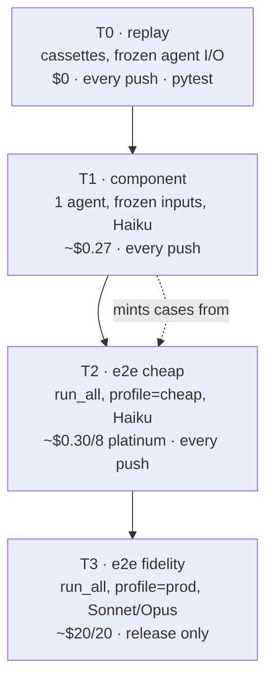
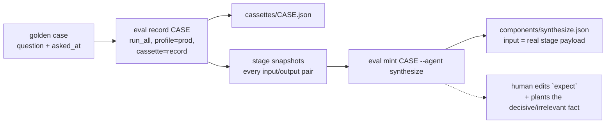
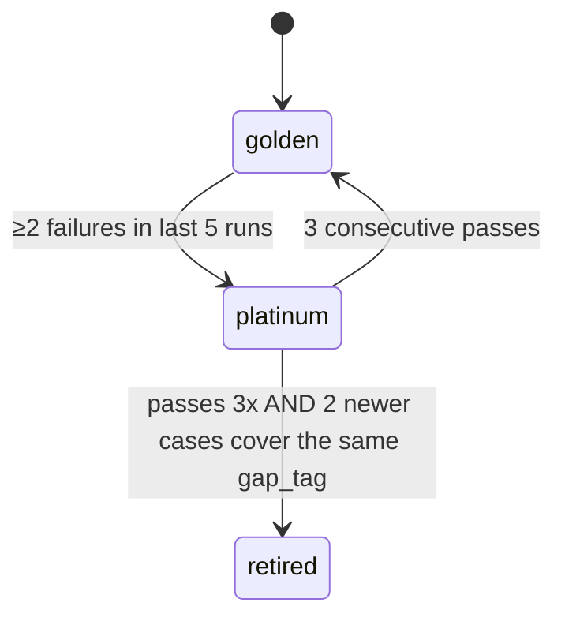

# Spec 6 — The Eval Harness: Golden & Platinum Data, Per-Agent Tests, Cheap Runs

> **Path note (ADR 73).** The eval harness now lives in `backend/app/evals/`, not
> `backend/superforecaster/`. Every `app/evals/...` path below reflects that move; the
> design is unchanged.

Make the system measurable. Supersedes `spec/planned/spec4.md` (which defined golden/platinum by
*contamination*; this spec redefines them by *purpose* and demotes contamination to a per-case field).

---

## 1. What already exists

| Piece | Where | State |
|---|---|---|
| `stages.run_all` — whole pipeline, no gates | `superforecaster/stages.py` | Done. **The e2e eval entry point.** |
| Per-agent seams `run_<agent>(...)` | `superforecaster/agents/*.py` | Done. 11 agents, uniform signature. |
| Component harness + 8 scorers | `app/evals/components.py` | Done. The empty `components/*.json` were deleted; the scorers still have no data. |
| Clamp 1 — date-clamped tools | `superforecaster/tools.py` | Done, tested. `_drop_leaked` audits leaks. |
| Clamp 2 — model garden | `superforecaster/model_garden.py` | Done. Floor = **2025-07-31** (Haiku 4.5 / Sonnet 4.5). |
| `checks.run_forecast_checks` / `blocking` | `superforecaster/checks.py` | Done. The contamination-proof metric. |
| `GoldenQuestion`, `QuestionScore`, `Scorecard` | `superforecaster/models.py` | Defined, **unused**. |
| Legacy 66-question corpus | `test_forecasting_baseline/questions.json` | Loads. Priors hand-guessed. 0/66 clean-scorable. |

**Three gaps this spec closes:** no cost accounting (`run_agent` reads `usage` only inside an
`if verbose` branch and drops it), no replay layer (every run pays for every search), no corpus.

---

## 2. Tier definitions

The user-facing split is **purpose**, not contamination.

| | **Golden** | **Platinum** |
|---|---|---|
| Purpose | Broad regression net across topics & outcomes | The cases we currently get **wrong** |
| Size | 40–60 cases | 6–10 cases, **rotating** |
| Cadence | Weekly / pre-release | Every push |
| Membership | Curated, stable | Derived from golden run history (§9) |
| Reads as | "did anything break" | "did the known weakness move" |
| Contains YES/NO balance | Enforced ≥40/60 | Whatever is failing |

Contamination is now **a field on every case**, not a tier:

```
contamination_risk: 1|2|3      # 1 obscure, 3 certainly memorised
clean_model: str | None        # stamped at run time by pick_clean_model(asked_at)
```

A case is **clean-scorable** iff `asked_at >= 2025-10-29` (garden floor + 90d margin). Report
`clean_brier` and `all_brier` side by side; never average them together.

> **Convenient alignment:** the only clean models are Haiku 4.5 / Sonnet 4.5 — also the cheapest.
> Contamination-honest and cost-cheap point the same direction.

---

## 3. Four test tiers



| Tier | Answers | Determinism | LLM |
|---|---|---|---|
| T0 replay | Does the plumbing still work on real recorded data? | Exact | none |
| T1 component | Does *this agent* do *its* job? | Same cassette → same searches | yes |
| T2 e2e cheap | Does the whole pipeline still produce a defensible number? | searches replayed | yes |
| T3 e2e fidelity | What is our actual Brier? | live | yes |

---

## 4. Cost model — the arithmetic, honestly

Per-MTok list price:

| Model | in | out | Clean floor |
|---|---:|---:|---|
| Haiku 4.5 | $1 | $5 | 2025-07-31 ✅ |
| Sonnet 4.6 | $3 | $15 | 2026-01-31 ❌ |
| Opus 5 | $5 | $25 | 2026-05-31 ❌ |

Agent-call count for one `run_all`, as a function of fan-out:

```
calls = 1 (decompose)
      + S (lenses, one per researchable sub-claim)
      + S·L (base_rate cells)
      + S·L (inside cells)
      + 1 (reflect) + 1..2 (synthesize)
```

| Profile | S | L | calls | est. tokens (in/out) | Haiku $/case |
|---|--:|--:|--:|---|--:|
| `prod` (today, `max_iterations=5`) | 4 | 2 | **~28** | 300k / 60k | ~$0.60 (Sonnet: ~$1.80) |
| `cheap` (`max_iterations=1`) | 2 | 1 | **9** | 72k / 22k | **~$0.18** |
| `minimal` (`max_iterations=1`) | 1 | 1 | **6** | 40k / 13k | **~$0.11** |

**The `$1 / 20 e2e runs` target is not reachable with any full-pipeline profile.** 20 × cheapest
honest case ≈ $2.20. So the *default suite* is not 20 e2e runs:

| `eval <target>` | Composition | Est. cost |
|---|---|--:|
| `replay` | T0 only | **$0.00** |
| `platinum` **(default, every push)** | T1 all agents (24 cases) + T2 on 8 platinum cases | **~$0.55** |
| `golden` | T2 on 50 golden cases | ~$9 |
| `golden --profile prod` | T3 on 50 | ~$30 |

Every command takes `--budget <usd>` (default `1.00` for `platinum`) enforced by the ledger:
**the run aborts before the call that would cross it**, and the partial scorecard is still written.

Levers that move the numbers later, in order of payoff: prompt-caching the agent `INSTRUCTIONS`
blocks (they are byte-stable across cases; ~60% of input tokens) → batch API at 50% → shrinking
structured-output schemas.

---

## 5. Cassettes — replay layer

The single biggest cost + flake lever. Wraps `tools.py`, nothing else.

```python
# app/evals/cassette.py

@dataclass(frozen=True, slots=True)
class Interaction:
    tool: Literal["search_web", "search_wikipedia"]
    query: str
    as_of: date | None
    response: str          # the exact string the tool returned, budget notice stripped
    recorded_at: datetime

class Cassette:
    """One JSON file per golden/platinum case: evals/cassettes/<case_id>.json."""

    def __init__(self, path: Path, mode: Literal["replay", "record", "bypass"]) -> None: ...

    def lookup(self, tool: str, query: str, as_of: date | None) -> str | None:
        """Exact key match, then normalised (lowercased, whitespace-collapsed) match.
        Returns None on miss."""

    def record(self, i: Interaction) -> None: ...
    def save(self) -> None: ...

    @property
    def misses(self) -> list[tuple[str, str]]:
        """Every (tool, query) that fell through. A replay-mode run with misses is
        REPORTED, not failed — a model that searches differently is information."""
```

Wiring — one field on `ForecastDeps`, read by the two tool bodies:

```python
# deps.py
cassette: Cassette | None = None

# tools.py — inside _search_web, before the httpx call
if (c := ctx.deps.cassette) is not None:
    if (hit := c.lookup("search_web", query, _as_of_date(ctx.deps.as_of))) is not None:
        return hit
    if c.mode == "replay":
        return "[no recorded result for this query at this as_of]"
```

| Mode | Miss behaviour | Use |
|---|---|---|
| `replay` | return the sentinel, log the miss | T0, CI |
| `record` | live call, append, save on exit | minting a case |
| `bypass` | live call, no record | T3 fidelity |

**Recording is a deliberate act**, `eval record <case_id>`, never automatic. Cassettes are
committed artefacts; a stale one is a diff you can read.

---

## 6. Cost ledger

`run_agent` currently computes `usage` inside `if show or logging_active:` and discards it.
Hoist it unconditionally and push it into deps.

```python
# app/evals/ledger.py

@dataclass
class Ledger:
    budget_usd: float | None = None
    calls: list[CallCost] = field(default_factory=list)

    def charge(self, *, model: str, usage: RunUsage, run_name: str) -> None:
        """Price the call and append. Raises BudgetExceeded if it crosses budget_usd."""

    @property
    def total_usd(self) -> float: ...
    def by_agent(self) -> dict[str, float]: ...

class BudgetExceeded(RuntimeError): ...

def price(model: str, input_tokens: int, output_tokens: int) -> float:
    """From ModelEntry.price_in_per_mtok / price_out_per_mtok. Unknown model -> 0.0
    plus a one-time stderr warning; a missing price must never fail a run."""
```

- `ForecastDeps.ledger: Ledger | None = None` — `None` everywhere except an eval.
- `observability.run_agent` calls `deps.ledger.charge(...)` after `result.usage()`.
- `ModelEntry` gains `price_in_per_mtok: float | None`, `price_out_per_mtok: float | None`.
- `BudgetExceeded` propagates out of `run_all`; the runner catches it, marks the case
  `skipped="budget"`, and stops the sweep.

---

## 7. Eval profiles

Cost control is **code-level truncation after decompose**, not prompt edits — deterministic and
it does not change what any agent is asked to do.

```python
# app/evals/profiles.py

@dataclass(frozen=True, slots=True)
class EvalProfile:
    name: str
    model: str | None              # None -> pick_clean_model(asked_at)
    max_iterations: int            # drives get_usage_limits + get_cell_budget
    max_sub_claims: int | None     # slice decomposition.sub_claims
    max_lenses: int | None         # slice per sub-claim lenses
    cassette_mode: Literal["replay", "record", "bypass"]

PROFILES = {
    "minimal": EvalProfile("minimal", "anthropic:claude-haiku-4-5", 1, 1, 1, "replay"),
    "cheap":   EvalProfile("cheap",   "anthropic:claude-haiku-4-5", 1, 2, 1, "replay"),
    "prod":    EvalProfile("prod",     None,                        5, None, None, "bypass"),
}
```

`stages.run_all` grows two keyword-only args, defaulting to today's behaviour:

```python
async def run_all(
    input: ForecastInput,
    *,
    as_of: datetime | None = None,
    model: str | None = None,
    verbose: bool = False,
    emit=None,
    limits: EvalProfile | None = None,   # NEW — truncates fan-out
    deps: ForecastDeps | None = None,    # NEW — lets the eval inject ledger + cassette
) -> tuple[Forecast, list[CheckViolation]]:
```

Truncation points, verbatim, inside `run_all`:

```python
researchable = [s for s in decomposition.sub_claims if s.knowability == "researchable"]
if limits and limits.max_sub_claims:
    researchable = researchable[: limits.max_sub_claims]          # highest-weight first
...
for sub_claim, group in zip(researchable, lens_groups):
    lenses = group.lenses[: limits.max_lenses] if limits and limits.max_lenses else group.lenses
```

Truncation is recorded on the scorecard (`fan_out_truncated: bool`) so a cheap-profile Brier is
never mistaken for a prod one.

---

## 8. Per-agent tests — and where the data comes from

### 8.1 Scorer coverage

`components.AGENTS` covers 8 of 11 agents. Add the three missing:

| Agent | Scorer | `expect` keys | Asserts |
|---|---|---|---|
| `lenses` | `score_lenses` **NEW** | `min_lenses`, `must_include_population`, `forbidden_population` | ≥2 populations; weights sum ≈1; **no rate mentioned** (pre-registration, ADR 40); named population appears |
| `reflect` | `score_reflect` **NEW** | `must_flag_bias`, `min_change_my_mind` | all 5 biases present; `what_would_change_my_mind` non-empty and falsifiable; steel-man ≠ restated thesis |
| `draft` | `score_draft` **NEW** | `must_be_resolvable` | drafted question passes `run_critique` clean |

### 8.2 Case minting — the answer to "we'll need to synthesize the data"

Hand-authoring `{"input": {"decomposition": {...}, "outside": {...}}}` for `synthesize` is
infeasible. Mint it from a real run instead:



```python
# app/evals/mint.py

async def record_case(case: GoldenQuestion, *, profile: EvalProfile) -> RunTrace:
    """Run run_all with cassette=record and an emit hook that snapshots every
    (agent, input_payload, output_payload). Writes cassettes/<id>.json + traces/<id>.json."""

def mint_component_cases(
    trace: RunTrace, *, agents: Sequence[str], out_dir: Path = CASES_DIR
) -> dict[str, int]:
    """Turn a trace into ComponentCase rows. `input` is filled from the real payload;
    `expect` is emitted as a TODO stub the human fills. Returns {agent: n_added}.

    Never overwrites an existing case id — minting is additive."""
```

What the human still supplies (and only this): the `expect` block. That is the irreducible part —
`true_base_rate` must be a *documented* rate, `decisive_fact` a fact that genuinely moves the
number, `irrelevant_fact` one that genuinely does not. ADR 20's reasoning stands: inventing those
produces cases that look like tests and measure nothing.

### 8.3 Adversarial synthesis for platinum components

For gap-filling, generate cases where the *right answer is known by construction*:

| Generator | Construction | The agent must |
|---|---|---|
| `plant_irrelevant` | Take a minted `inside_view` case; inject one true-but-unrelated fact into the cassette | mark it `is_noise` |
| `flip_direction` | Take an `update` case; negate the evidence | move the posterior the other way |
| `break_criteria` | Take a clean `critic` case; introduce a named ambiguity | return `is_resolvable=False` and name it |
| `resolved_early` | Take a `resolution` case; set `as_of` before the resolving event | return `appears_resolved=False` |

```python
# app/evals/synthesize_cases.py
def generate(kind: str, seed_case: ComponentCase, *, n: int = 1) -> list[ComponentCase]: ...
```

These are deterministic transforms of real cases, so they carry real-world texture without a
hand-written fiction.

---

## 9. Platinum rotation

Platinum is derived, never hand-edited.

```python
# app/evals/rotation.py

PROMOTE_AFTER = 2    # failures in the last WINDOW golden runs
DEMOTE_AFTER  = 3    # consecutive passes
WINDOW        = 5

def recompute(db: Path, *, target_size: int = 8) -> RotationDelta:
    """Read case_stats, apply the rule, rewrite platinum.json. Returns what moved."""
```



A case **fails** when any of: `|p - outcome| > 0.4`, a blocking violation survived, or the run
errored. Each case carries `gap_tag: str` (`"long-horizon"`, `"base-rate-scarce"`,
`"reference-class-ambiguous"`, `"tail-risk"`, …) so rotation preserves *coverage*, not just
difficulty — platinum never drops the last case in a tag.

---

## 10. Corpus

### 10.1 Schema (extends `GoldenQuestion`)

```python
class GoldenQuestion(BaseModel):
    id: str                          # stable slug, also the cassette filename
    question: str
    resolution_criteria: str
    asked_at: datetime               # BOTH clamps key off this. Open date, not resolution.
    resolution_date: datetime
    outcome: float                   # 0.0 | 1.0
    category: str
    baseline_prior: float            # crowd/human forecast at open — the number to beat
    contamination_risk: int          # 1..3
    # NEW
    gap_tag: str = "general"         # rotation coverage key
    source: str = ""                 # "gjp" | "forecastbench" | "halawi" | "btf3" | "hand"
    source_url: str = ""
    notes: str = ""
```

### 10.2 Sources, and what each is for

| Source | License | Use for | Why |
|---|---|---|---|
| **ForecastBench** (`forecastingresearch/forecastbench-datasets`) | CC BY-SA 4.0 | **Golden e2e** + **the only per-agent ground truth for research** | `freeze_datetime` = a real `asked_at`; the `human_super_individual` set gives 7,693 rows of superforecaster **search queries, consulted URLs, and reasoning** — directly gradeable targets for `lenses` / `outside_view` |
| **GJP / ACE** (Dataverse `10.7910/DVN/BPCDH5`) | **CC0** | Golden e2e, tier-1 contamination | 2011–2015, `date_start` present, zero contamination risk for *any* model. But 10+ years old — measures history, not the world |
| **Halawi dump** (`YuehHanChen/forecasting_raw`) | Apache-2.0 | Golden breadth + `update` agent cases | `community_predictions` time series = a natural Bayes-update target with a known trajectory |
| **BTF-3** | CC BY-NC **4.0** | ⚠️ **Non-commercial. Flag before use.** | `present_date` all clusters Apr–May 2026 — narrow window, skews NO. Good for platinum recency, bad for breadth |
| **Metaculus API** | — | ❌ | now requires auth |
| Legacy 66 | — | Golden-only, labelled not-clean | 0/66 clean-scorable; keep for process score, never quote their Brier |

### 10.3 Importer

```python
# app/evals/import_corpus.py   — run by hand, NEVER from a test

def fetch(source: str, *, opened_after: date, limit: int) -> list[GoldenQuestion]: ...
def classify_contamination(q: GoldenQuestion) -> int: ...
def assign_gap_tag(q: GoldenQuestion) -> str: ...
def merge_into(qs: list[GoldenQuestion], path: Path) -> int:
    """Append by id; never overwrite. Returns how many were added."""
def balance_report(path: Path) -> str:
    """YES/NO split, category histogram, gap_tag coverage, clean-scorable count."""
```

Acceptance gate for the golden set: **≥40% and ≤60% YES**, ≥6 categories, ≥4 gap_tags,
≥15 clean-scorable.

---

## 11. CLI

`pyproject.toml` gains a console script so the short form works:

```toml
[project.scripts]
superforecaster = "superforecaster.__main__:main"
```

```bash
uv run superforecaster eval platinum                    # the default suite, ~$0.55
uv run superforecaster eval golden --limit 20
uv run superforecaster eval component --agent lenses
uv run superforecaster eval replay                      # $0, no network, no key needed
uv run superforecaster eval golden --profile prod --budget 25
uv run superforecaster eval record btc-100k-2025        # mint cassette + trace
uv run superforecaster eval mint btc-100k-2025 --agent synthesize,outside_view
uv run superforecaster eval rotate                      # recompute platinum from history
uv run superforecaster eval report --last 5 --xlsx out/evals.xlsx
```

```python
@app.command()
def eval(
    target: str = typer.Argument("platinum", help="platinum|golden|component|replay|record|mint|rotate|report"),
    case: str = typer.Argument(None),
    agent: str = typer.Option(None, help="Comma-separated, or 'all'"),
    profile: str = typer.Option("cheap", help="minimal|cheap|prod"),
    budget: float = typer.Option(1.00, help="Hard USD ceiling; run aborts before crossing"),
    limit: int = typer.Option(None),
    concurrency: int = typer.Option(4),
    db: str = typer.Option("evals.db"),
    xlsx: str = typer.Option(None, help="Also write an .xlsx"),
    csv: str = typer.Option(None),
    verbose: bool = VERBOSE,
) -> None: ...
```

Terminal output:

```
platinum  profile=cheap  8 cases  concurrency=4                    $0.31 / $1.00

                     agent   baseline
  mean Brier         0.174      0.203      (8 scored, 0 skipped)
  clean Brier        0.191      0.210      (5 clean-scorable)
  process score       0.88                 fraction with zero blocking violations
  round-number rate   0.25                 P8; ~0.21 unbiased, >0.40 flags rounding
  leaked sources         0                 MUST be 0 or the run is void
  cassette misses        3                 queries with no recording

  component  decompose 100%  lenses 67%  outside_view 33%  synthesize 100%  ...

  FAIL  eu-ai-act-enforcement    p=0.82 outcome=0  brier=0.672   [long-horizon]
  FAIL  opec-cut-q2              linkage violation survived retry [base-rate-scarce]

  → evals.db (run 41)    → out/evals.xlsx
```

---

## 12. Output — SQLite first, Excel on request

`evals.db` is a **separate file** from the app database. No migration coupling.

```sql
CREATE TABLE eval_runs (
  id            INTEGER PRIMARY KEY,
  started_at    TEXT NOT NULL,
  finished_at   TEXT,
  target        TEXT NOT NULL,     -- platinum | golden | component
  profile       TEXT NOT NULL,
  git_sha       TEXT,
  cost_usd      REAL,
  budget_usd    REAL,
  aborted       INTEGER DEFAULT 0
);

CREATE TABLE case_results (
  run_id        INTEGER REFERENCES eval_runs(id),
  case_id       TEXT NOT NULL,
  tier          TEXT NOT NULL,     -- golden | platinum
  gap_tag       TEXT,
  probability   REAL,
  outcome       REAL,
  brier         REAL,
  baseline_brier REAL,
  model         TEXT,
  model_cutoff  TEXT,              -- proof the run was clean
  clean         INTEGER,
  contamination_risk INTEGER,
  violations    TEXT,              -- JSON list
  blocking_n    INTEGER,
  leaked_n      INTEGER,
  cassette_misses INTEGER,
  fan_out_truncated INTEGER,
  cost_usd      REAL,
  llm_calls     INTEGER,
  wall_seconds  REAL,
  error         TEXT,
  skipped       TEXT,
  PRIMARY KEY (run_id, case_id)
);

CREATE TABLE component_results (
  run_id     INTEGER REFERENCES eval_runs(id),
  agent      TEXT NOT NULL,
  case_id    TEXT NOT NULL,
  passed     INTEGER,
  assertions TEXT,                 -- JSON {name: bool}
  detail     TEXT,
  cost_usd   REAL,
  error      TEXT,
  skipped    TEXT,
  PRIMARY KEY (run_id, agent, case_id)
);

CREATE TABLE case_stats (           -- rotation state; one row per case
  case_id       TEXT PRIMARY KEY,
  tier          TEXT NOT NULL,
  gap_tag       TEXT,
  last_n        TEXT,               -- JSON list of last WINDOW booleans, newest first
  consecutive_passes INTEGER DEFAULT 0,
  promoted_at   TEXT,
  demoted_at    TEXT
);

CREATE VIEW latest_run AS SELECT * FROM eval_runs ORDER BY id DESC LIMIT 1;
CREATE VIEW regressions AS   -- cases that passed last run and fail this one
  SELECT ...;
```

```python
# app/evals/store.py
def init(path: Path) -> sqlite3.Connection: ...
def open_run(conn, *, target, profile, budget) -> int: ...
def write_case(conn, run_id: int, score: QuestionScore) -> None: ...
def close_run(conn, run_id: int, *, cost_usd: float, aborted: bool) -> None: ...
def to_xlsx(conn, out: Path, *, last: int = 1) -> None:
    """Sheets: Summary | Cases | Components | Regressions | Cost.
    openpyxl is a DEV dependency; a clear error if absent, never a hard import."""
def to_csv(conn, out_dir: Path, *, last: int = 1) -> None:   # zero-dep fallback
```

---

## 13. Runner

```python
# app/evals/runner.py

def load_corpus(path: Path, *, tier=None, gap_tags=None, limit=None) -> list[GoldenQuestion]: ...

async def run_one(q: GoldenQuestion, *, profile: EvalProfile, ledger: Ledger) -> QuestionScore:
    """Resolve the model (profile.model or pick_clean_model(q.asked_at) -> skip if None),
    open the cassette, build ForecastDeps(as_of=q.asked_at, model=…, ledger=…, cassette=…),
    call stages.run_all(limits=profile, deps=deps), score, and audit leaks.

    Any exception becomes QuestionScore.error — one bad case must not abort the sweep.
    BudgetExceeded is the one exception that propagates."""

async def run_suite(
    questions: list[GoldenQuestion], *, profile: EvalProfile, budget: float, concurrency: int = 4
) -> Scorecard: ...

def audit_leaks(sc: Scorecard) -> list[SourceRef]:
    """Sources dated after their question's as_of. MUST be empty — a non-empty
    result voids the run rather than merely flagging it."""
```

Pure scoring, no network, unit-testable:

```python
# app/evals/scoring.py
def brier(p: float, outcome: float) -> float: ...
def calibration_buckets(scores: list[QuestionScore]) -> list[CalibrationBucket]: ...
def process_score(scores) -> float:          # fraction with zero blocking violations
def round_number_rate(scores) -> float:      # P8; unbiased ≈ 0.21
def contamination_gap(scores) -> float:      # tier-3 Brier minus tier-1 Brier
def build_scorecard(questions, scores, *, profile, cost_usd) -> Scorecard: ...
def render_scorecard(sc: Scorecard) -> str: ...
```

---

## 14. File inventory

```
backend/app/evals/
  components.py        # EXISTS — add 3 scorers, thread ledger + cassette through run_case
  components/*.json    # EXISTS (empty) — filled by mint + hand-written `expect`
  cassette.py          # NEW
  cassettes/*.json     # NEW — committed artefacts, one per case
  ledger.py            # NEW
  profiles.py          # NEW
  runner.py            # NEW
  scoring.py           # NEW  (pure; distinct from superforecaster/scoring.py, which is live-forecast scoring)
  store.py             # NEW
  rotation.py          # NEW
  mint.py              # NEW
  synthesize_cases.py  # NEW
  import_corpus.py     # NEW — run by hand
  golden.json          # NEW
  platinum.json        # NEW — derived, regenerated by `eval rotate`
  traces/*.json        # NEW — stage snapshots from `eval record`
backend/tests/
  test_eval_scoring.py   test_cassette.py   test_ledger.py
  test_eval_profiles.py  test_rotation.py   test_eval_store.py
backend/superforecaster/
  __main__.py          # + `eval` command
  deps.py              # + ledger, cassette fields
  observability.py     # hoist usage out of the verbose branch; charge the ledger
  stages.py            # + limits/deps kwargs on run_all
  models.py            # + gap_tag/source fields; + EvalProfile-adjacent scorecard fields
  model_garden.json    # + price_in_per_mtok / price_out_per_mtok per entry
```

---

## 15. Build order

| # | Deliverable | Verifiable by |
|--:|---|---|
| 1 | `ledger.py` + pricing on `ModelEntry` + `run_agent` charges | `test_ledger.py`; `eval component` prints a cost |
| 2 | `cassette.py` + `deps`/`tools` wiring | `test_cassette.py`; record→replay of one query is byte-identical |
| 3 | `profiles.py` + `run_all(limits=, deps=)` | `test_eval_profiles.py`: a `cheap` run makes exactly 9 agent calls against a stub |
| 4 | `scoring.py` + `store.py` (SQLite) | `test_eval_scoring.py`, `test_eval_store.py`; both pure/local |
| 5 | `runner.py` + `eval` CLI + 5 hand-written golden cases | `eval golden --limit 3` completes, writes db, leaks 0 |
| 6 | `import_corpus.py` → 50 golden cases; `balance_report` passes the gate | `eval golden --limit 50` under $10 |
| 7 | `mint.py` + `eval record`/`eval mint`; fill 3 cases per agent | `eval component` pass rate is a real number |
| 8 | `rotation.py` + `eval rotate`; `platinum.json` populated | `eval platinum` under $1 |
| 9 | `store.to_xlsx` + `eval report` | An `.xlsx` opens with 5 sheets |

Steps 1–4 need **no API key and no network** — they are pure plumbing and land as normal pytest.

---

## 16. Success criteria

- `uv run superforecaster eval replay` passes offline, no key, in CI, $0.
- `uv run superforecaster eval platinum` completes under **$1.00** and writes `evals.db`.
- `uv run superforecaster eval report --xlsx out/evals.xlsx` produces a readable workbook.
- Every scored case reports a `model_cutoff` strictly earlier than its `asked_at`, or is
  reported as skipped — never scored on a contaminated model.
- `leaked sources == 0` on every run. Non-zero voids the run.
- Each of the 11 agents has ≥3 component cases and a non-trivial pass rate.
- `golden.json` passes `balance_report`'s gate (§10.3).
- `eval rotate` moves at least one case on a corpus with a seeded failure history.
- `contamination_gap` is computed and printed — the hindsight estimate is a deliverable.

---

## 17. ADR deltas

| ADR | Change |
|---|---|
| **NEW 49** | Cassettes: search results are recorded artefacts, not live calls, in every tier below fidelity. Determinism and cost are the same fix. |
| **NEW 50** | Cost is a first-class run constraint. Every eval carries a ledger and a hard budget; a run that would exceed it aborts and writes a partial scorecard rather than silently overspending. |
| **NEW 51** | Fan-out is truncated by code, not by prompt. An eval profile slices `sub_claims` and `lenses` after the agent has chosen them, so cheap runs test the same agent behaviour at smaller scale — and every truncated scorecard says so. |
| **NEW 52** | Platinum is derived from run history, not curated. Difficulty is measured, not asserted. |
| **ADR 20** amended | Component data still ships empty, but is now *minted* from recorded runs; only the `expect` block is hand-authored. The reason for the original rule survives — invented evidence measures nothing. |
| **ADR 21** superseded | The e2e backtest is no longer deferred. |
| `spec/planned/spec4.md` | Superseded by this file; move to `spec/implemented/` only when this ships. |

---

## 18. Open questions

1. **BTF-3 licence.** CC BY-NC 4.0. Is this project non-commercial? If not, drop BTF-3 and lose the
   Apr–May 2026 recency window. Decide before the importer is written.
2. **Prompt caching.** Agent `INSTRUCTIONS` blocks are byte-stable and are ~60% of input tokens.
   Does `pydantic-ai` expose a cache breakpoint on the Anthropic provider? If yes, golden-20 e2e
   plausibly lands under $1 and the tier table collapses.
3. **`baseline_prior` for GJP.** `ifps.csv` has no crowd forecast column — the forecasts are in a
   separate file. Either join them, or accept absolute Brier with no baseline for that source.
4. **Retire the legacy 66?** Nothing imports it. Keep as golden-only with a not-clean label, or
   delete. Deleting costs nothing.
5. **Forward-scored live set.** Questions opening now and resolving after every current model's
   cutoff are permanently uncontaminated — the strongest possible signal, and an argument for
   seeding them today even though they score nothing for months.
